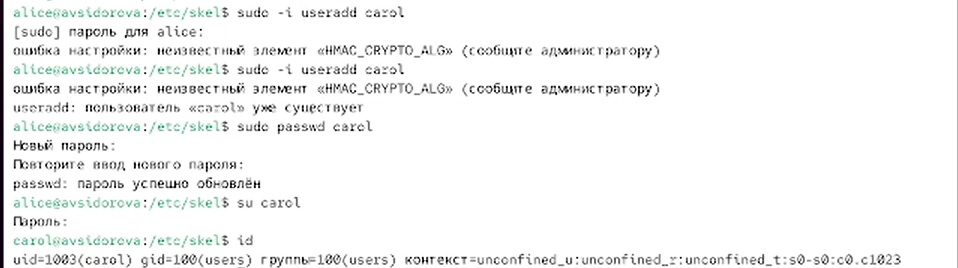

---
## Front matter
lang: ru-RU
title: Лабораторная работа №2
subtitle: Управление пользователями и группами
author:
  - Сидорова А.В.
institute:
  - Российский университет дружбы народов, Москва, Россия

## i18n babel
babel-lang: russian
babel-otherlangs: english

## Formatting pdf
toc: false
toc-title: Содержание
slide_level: 2
aspectratio: 169
section-titles: true
theme: metropolis
header-includes:
 - \metroset{progressbar=frametitle,sectionpage=progressbar,numbering=fraction}
---

# Информация

## Докладчик

:::::::::::::: {.columns align=center}
::: {.column width="70%"}

  * Сидорова Арина Валерьевна
  * студентка НПИбд-02-24
  * ст.б. 1132242912
  * Российский университет дружбы народов

:::
::::::::::::::

# Вводная часть

## Актуальность

- Администрирование пользователей и групп является задачей управления операционной системой. 
- Понимание принципов разграничения прав доступа необходимо для обеспечения безопасности, организации рабочего пространства и эффективного управления ресурсами.

## Объект и предмет исследования

### Объект исследования

- Процесс управления учётными записями и группами в операционной системе Linux

### Предмет исследования

- Команды и конфигурационные файлы, используемые для создания, модификации пользователей и групп

## Цели и задачи

- Получить практические навыки работы с учётными записями пользователей и группами в ОС Linux;
- Изучить переключение между учётными записями;
- Освоить создание пользователей и настройку их параметров;
- Изучить работу с группами пользователей;
- Научиться настраивать политики паролей и шаблоны домашних каталогов.

# Выполнение лабораторной работы

# Переключение учётных записей пользователей

## whoami,id

{#fig:001 width=70%}

Вернемся к учётной записи своего пользователя 

{#fig:002 width=70%}

## Просмотрим в безопасном режиме файл /etc/sudoers

sudo -i visudo 

{#fig:003 width=70%}

## Укажем в терминале : sudo -i EDITOR=mcedit visudo

- Visudo используется потому, что он проверяет синтаксис на ошибки перед сохранением, что предотвращает поломку файла и потерю прав sudo. Обычный редактор такой проверки не делает и может легко сделать систему неуправляемой из-за опечатки.
- Данная строка предоставляет всем пользователям, входящим в группу `wheel`, право выполнять любые команды от имени любого пользователя с помощью `sudo`. Группа `wheel` является стандартным механизмом для предоставления прав суперпользователя выделенной группе администраторов, а не отдельным учётным записям.

{#fig:004 width=70%}

## Создадим пользователя alice, входящего в группу wheel:

sudo -i useradd -G wheel alice

{#fig:005 width=70%}

{#fig:006 width=70%}

## Создадим пользователя bob и зададим пароль 

{#fig:007 width=70%}

Проверим в какие группы входит bob (Только в собственную bob)

{#fig:008 width=70%}

# Создание учётных записей пользователей

## Переключимся в терминале на учётную запись пользователя root

Откроем файл конфигурации /etc/login.defs для редактирования, используя,
например, vim 
Изменим несколько параметров. 

{#fig:009 width=70%}

{#fig:010 width=70%}

## Перейдем в каталог /etc/skel и создадим каталоги Pictures и Documents, Это позволит добавить эти каталоги по умолчанию во все домашние каталоги пользователей. 

{#fig:011 width=70%}

## Изменим содержимое файла .bashrc, добавив строку export EDITOR=/usr/bin/mceditor

Эта запись означает, что текстовый редактор vim или редактор mceditor будет уста-
новлен по умолчанию для инструментов, которые нуждаются в изменении текстовых
файлов 

{#fig:012 width=70%}

## Создадим пользователя carol и посмотрим в какую группу он входит

{#fig:013 width=70%}

## Убедимся, что каталоги Pictures и Documents были созданы в домашнем каталоге пользователя carol 

{#fig:014 width=70%}

Строка sudo cat /etc/shadow | grep carol, наличие означает, что для учётной записи carol установлен пароль, который требуется вводить для аутентификации в системе. 

{#fig:015 width=70%}

## Изменим свойства пароля carol.

В этой записи срок действия пароля истекает через 90 дней (-x 90). За три дня до
истечения срока действия пользователь получит предупреждение (-w 3). Пароль должен использоваться как минимум за 30 дней (-n 30) до того, как его можно будет изменить. Убедимся, что изменения произошли 

{#fig:016 width=70%}

Убедимся, что идентификатор alice существует во всех трёх файлах, а идентификатор carol существует не во всех трёх файлах 

{#fig:017 width=70%}

# Работа с группами

## Создадим две группы и добавим некоторых пользователей в эти группы. 

Находясь под учётной записью пользователя alice, создадим группы main и third
Используем usermod для добавления пользователей alice и bob в группу main,
Убедимся, что пользователь carol правильно добавлен в группу third

{#fig:018 width=70%}

```make
REVEALJS_THEME = beige 
```
# Результаты
В ходе лабораторной работы были успешно получены практические навыки по управлению пользователями и группами в ОС Linux

- Создание и модификация учётных записей;
- Разграничение прав доступа; 
- Управление членством в группах; 
- Настройка среды пользователя;
- Создание и модификация учётных записей.


:::

