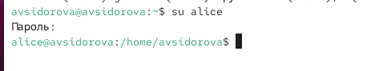
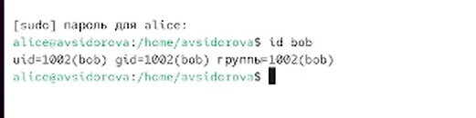
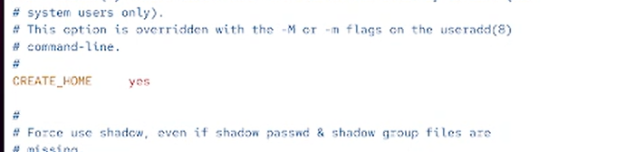
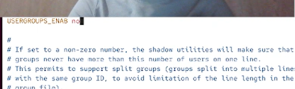
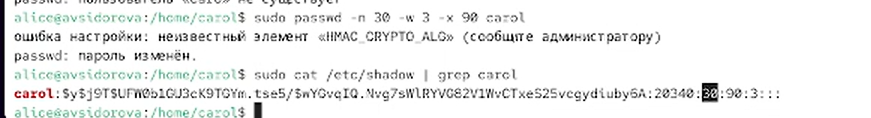
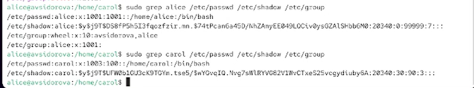

---
## Front matter
title: "Отчет по лабораторной работе №2"
subtitle: "Управление пользователями и группами"
author: "Сидорова Арина Валерьевна"

## Generic otions
lang: ru-RU
toc-title: "Содержание"

## Bibliography
bibliography: bib/cite.bib
csl: pandoc/csl/gost-r-7-0-5-2008-numeric.csl

## Pdf output format
toc: true # Table of contents
toc-depth: 2
lof: true # List of figures
fontsize: 12pt
linestretch: 1.5
papersize: a4
documentclass: scrreprt
## I18n polyglossia
polyglossia-lang:
  name: russian
  options:
	- spelling=modern
	- babelshorthands=true
polyglossia-otherlangs:
  name: english
## I18n babel
babel-lang: russian
babel-otherlangs: english
## Fonts
mainfont: PT Serif
romanfont: PT Serif
sansfont: PT Sans
monofont: PT Mono
mainfontoptions: Ligatures=TeX
romanfontoptions: Ligatures=TeX
sansfontoptions: Ligatures=TeX,Scale=MatchLowercase
monofontoptions: Scale=MatchLowercase,Scale=0.9
## Biblatex
biblatex: true
biblio-style: "gost-numeric"
biblatexoptions:
  - parentracker=true
  - backend=biber
  - hyperref=auto
  - language=auto
  - autolang=other*
  - citestyle=gost-numeric
## Pandoc-crossref LaTeX customization
figureTitle: "Рис."
tableTitle: "Таблица"
listingTitle: "Листинг"
lofTitle: "Список иллюстраций"
lolTitle: "Листинги"
## Misc options
indent: true
header-includes:
  - \usepackage{indentfirst}
  - \usepackage{float} # keep figures where there are in the text
  - \floatplacement{figure}{H} # keep figures where there are in the text
---

# Цель работы

Получить представление о работе с учётными записями пользователей и группами
пользователей в операционной системе типа Linux.

# Выполнение лабораторной работы

## Переключение учётных записей пользователей

Входим в систему как обычный пользователь и открываем терминал. Определим, какую учётную запись пользователя мы используем, введя команду whoami (учетная запись avsidorova)
Выведем на экран более подробную информацию, используя команду id. Вывели uid - id пользователя (1000), gid - id группы (1000). (рис. [-@fig:001]).

{#fig:001 width=70%}

Вернемся к учётной записи своего пользователя (рис. [-@fig:002]).

{#fig:002 width=70%}

Просмотрим в безопасном режиме файл /etc/sudoers, используя, например,
sudo -i visudo (рис. [-@fig:003])

{#fig:003 width=70%}

Укажем в терминале :
sudo -i EDITOR=mcedit visudo

Visudo используется потому, что он проверяет синтаксис на ошибки перед сохранением, что предотвращает поломку файла и потерю прав sudo. Обычный редактор такой проверки не делает и может легко сделать систему неуправляемой из-за опечатки.

Убедимся, что в открытом с помощью visudo файле присутствует строка
%wheel ALL=(ALL) ALL (рис. [-@fig:004])
Данная строка предоставляет всем пользователям, входящим в группу `wheel`, право выполнять любые команды от имени любого пользователя с помощью `sudo`. Группа `wheel` является стандартным механизмом для предоставления прав суперпользователя выделенной группе администраторов, а не отдельным учётным записям.

{#fig:004 width=70%}

Создадим пользователя alice, входящего в группу wheel:
sudo -i useradd -G wheel alice
Убедимся, что пользователь alice добавлен в группу wheel, введя
id alice (рис. [-@fig:005])

{#fig:005 width=70%}

Зададим пароль для пользователя alice, набрав
sudo -i passwd alice
Переключимся на учётную запись пользователя alice:
su alice (рис. [-@fig:006])

{#fig:006 width=70%}

Создадим пользователя bob и зададим пароль (рис. [-@fig:007])

{#fig:007 width=70%}

Проверим в какие группы входит bob (Только в собственную bob) (рис. [-@fig:008])

{#fig:008 width=70%}

## Создание учётных записей пользователей

Переключимся в терминале на учётную запись пользователя root: su
Откроем файл конфигурации /etc/login.defs для редактирования, используя,
например, vim 
Изменим несколько параметров. Параметр CREATE_HOME yes. (рис. [-@fig:009])

{#fig:009 width=70%}

Также установим параметр USERGROUPS_ENAB no (рис. [-@fig:010])

{#fig:010 width=70%}

Перейдем в каталог /etc/skel и создадим каталоги Pictures и Documents, Это позволит добавить эти каталоги по умолчанию во все домашние каталоги пользователей. (рис. [-@fig:011])

{#fig:011 width=70%}

Изменим содержимое файла .bashrc, добавив строку export EDITOR=/usr/bin/mceditor

Эта запись означает, что текстовый редактор vim или редактор mceditor будет уста-
новлен по умолчанию для инструментов, которые нуждаются в изменении текстовых
файлов (рис. [-@fig:012])

{#fig:012 width=70%}

Создадим пользователя carol и посмотрим в какую группу он входит (только в users) (рис. [-@fig:013])

{#fig:013 width=70%}

Убедимся, что каталоги Pictures и Documents были созданы в домашнем каталоге пользователя carol (рис. [-@fig:014])

{#fig:014 width=70%}

Строка sudo cat /etc/shadow | grep carol, наличие означает, что для учётной записи carol установлен пароль, который требуется вводить для аутентификации в системе. (рис. [-@fig:015])

{#fig:015 width=70%}

Изменим свойства пароля carol.В этой записи срок действия пароля истекает через 90 дней (-x 90). За три дня до
истечения срока действия пользователь получит предупреждение (-w 3). Пароль должен использоваться как минимум за 30 дней (-n 30) до того, как его можно будет изменить. Убедимся, что изменения произошли (рис. [-@fig:016])

{#fig:016 width=70%}

Убедимся, что идентификатор alice существует во всех трёх файлах, а идентификатор carol существует не во всех трёх файлах (рис. [-@fig:017])

{#fig:017 width=70%}

## Работа с группами

Создадим две группы и добавим некоторых пользователей в эти группы. 

Находясь под учётной записью пользователя alice, создадим группы main и third
Используем usermod для добавления пользователей alice и bob в группу main,
Убедимся, что пользователь carol правильно добавлен в группу third
Пользователю carol должна быть назначена основная группа с идентификатором
carol входит в следующие вторичные группы : users,third
Alice является участниками следующих групп : alice, wheel,main
bob является участником следующих групп : bob,main  (рис. [-@fig:018])

{#fig:018 width=70%}

# Выводы

Получили представление о работе с учётными записями пользователей и группами
пользователей в операционной системе типа Linux.

