---
## Front matter
lang: ru-RU
title: Лабораторная работа №3
subtitle: Настройка прав доступа
author:
  - Сидорова А.В.
institute:
  - Российский университет дружбы народов, Москва, Россия

## i18n babel
babel-lang: russian
babel-otherlangs: english

## Formatting pdf
toc: false
toc-title: Содержание
slide_level: 2
aspectratio: 169
section-titles: true
theme: metropolis
header-includes:
 - \metroset{progressbar=frametitle,sectionpage=progressbar,numbering=fraction}
---

# Информация

## Докладчик

:::::::::::::: {.columns align=center}
::: {.column width="70%"}

  * Сидорова Арина Валерьевна
  * студентка НПИбд-02-24
  * ст.б. 1132242912
  * Российский университет дружбы народов

:::
::::::::::::::

# Вводная часть

## Актуальность

Управление правами доступа к файлам и каталогам является фундаментальным аспектом информационной безопасности в многопользовательских операционных системах, к которым относятся все дистрибутивы Linux. Неправильная настройка прав может привести к утечке конфиденциальной информации, её повреждению или удалению.

## Объект и предмет исследования

### Объект исследования

- Механизмы управления правами доступа в операционной системе Linux.

### Предмет исследования

Практическая реализация разграничения прав доступа с использованием базовых разрешений 

## Цели и задачи

- Получение практических навыков настройки базовых и специальных прав доступа для групп пользователей в ОС Linux;
- На практике освоить управление базовыми разрешениями;
- Освоить управление специальными разрешениями;
- Освоить управление расширенными разрешениями;

# Выполнение лабораторной работы

# Управление базовыми разрешениями

## main,third

Откроем терминал с учетной записью root. В корневом каталоге создадим каталоги /data/main/ и /data/third. Проверим, кто является владельцем этих каталогов.

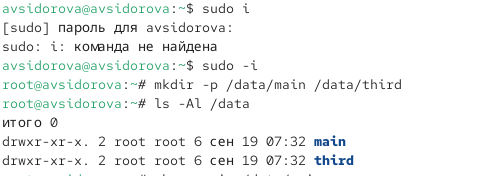{#fig:001 width=70%}

## Изменим владельцев

Изменим владельцев этих каталогов с root на main и third соответственно. 

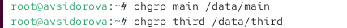{#fig:002 width=70%}

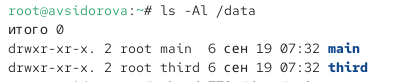{#fig:003 width=70%}

## Установим разрешения

Установим разрешения, позволяющие владельцам каталогов записывать файлы в эти каталоги и запрещающие доступ к содержимому каталогов всем другим пользователями группам. После этого проверим установленные права. 

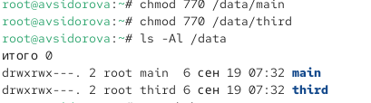{#fig:004 width=70%}

## emptyfile

Перейдем в другой терминал, под пользователем bob в каталоге /data/main создадим файл emptyfile. Создался файл под пользователем bob, так как у группы есть права доступа. Перейдем в каталог /data/third и создадим файл emptyfile,  нам отказано в доступе, так как группа не имеет прав

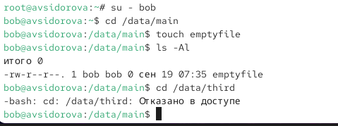{#fig:005 width=70%}

# Управление специальными разрешениями

## alice1, alice2

Откроем новый терминал под пользователем Alice. Перейдем в каталог /data/main и создадим два файла alice1, alice2

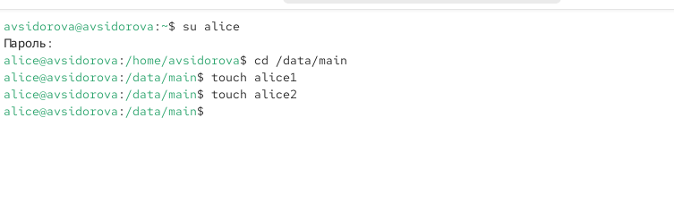{#fig:006 width=70%}

## bob1, bob2

Видим два файла, созданные пользователем alice. Попробуем удалить файлы, принадлежащие пользователю alice. Создадим два файла, которые будут принадлежать пользователю bob (bob1, bob2)

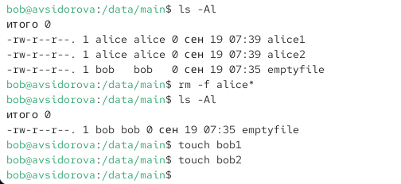{#fig:007 width=70%}

## chmod g+s o+t

В терминале под пользователем root установим для каталога /data/main бит идентификатора группы, а также stiky-бит для разделяемого (общего) каталога группы

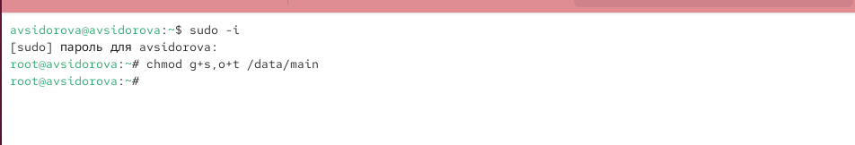{#fig:008 width=70%}

## alice3, alice4

В терминале под пользователем alice создайте в каталоге /data/main файлы alice3 и alice4. Теперь мы увидели, что два созданных файла принадлежат группе main, которая является группой-владельцем каталога /data/main

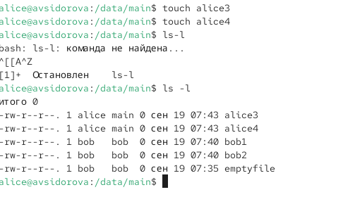{#fig:009 width=70%}

## rm -rf bob*

В терминале под пользователем alice попробуем удалить файлы, принадлежащие пользователю bob

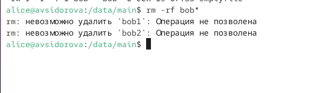{#fig:010 width=70%}


# Управление расширенными разрешениями с использованием списков ACL

## setfactl/getfactl

Установим права на чтение и выполнение в каталоге /data/main для группы third и права на чтение и выполнение для группы main в каталоге /data/third. Используем команду getfacl, чтобы убедиться в правильности установки разреше-
ний.

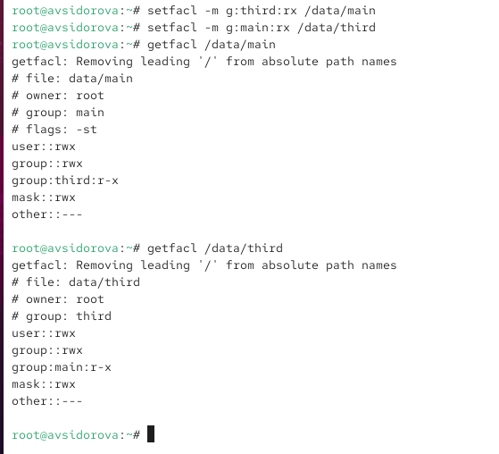{#fig:011 width=70%}

## newfile1

Создадим новый файл с именем newfile1 в каталоге /data/main и проверим текущие назначения полномочий (user - чтения и редактирование; group, other - чтение). Выполним аналогичные действия в /data/third 

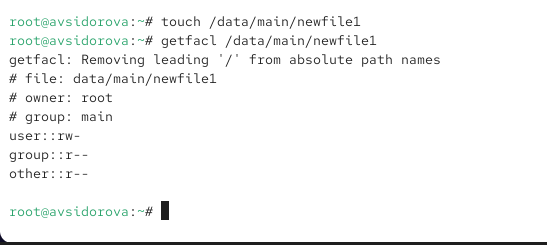{#fig:012 width=70%}

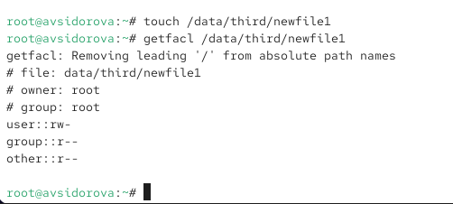{#fig:013 width=70%}

## ACL /data/main

Установим ACL по умолчанию для каталога /data/main. Добавим ACL по умолчанию для каталога /data/third. Убедимся, что настройки ACL работают, добавив новый файл в каталог /data/main.

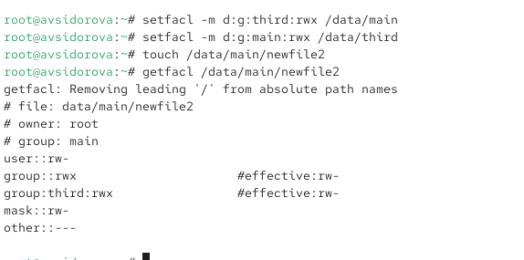{#fig:014 width=70%}

## ACL /data/third

Используем getfactl для проверки текущих назначений полномочий. Выполним аналогичные действия для каталога /data/third.

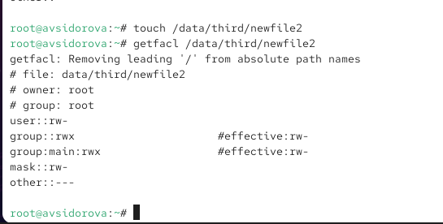{#fig:015 width=70%}

## Проверка полномочий

Для проверки полномочий группы third в каталоге /data/third войдем в другом терминале под учётной записью члена группы third.Проверим операции с файлами:
rm /data/main/newfile1 - Успешно
rm /data/main/newfile2 - Не хватает прав доступа
Проверим, возможно ли осуществить запись в файл:
echo "Hello, world" >> /data/main/newfile1 - Не хватает прав доступа
echo "Hello, world" >> /data/main/newfile2 - Успешно


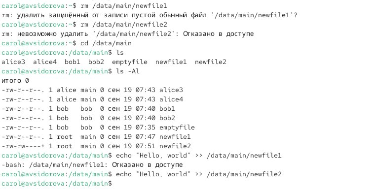{#fig:016 width=70%}


```make
REVEALJS_THEME = beige 
```
# Результаты
В ходе лабораторной работы были успешно получены практические навыки по управлению пользователями и группами в ОС Linux

- Базовые права доступа (chmod, chown, chgrp) являются основным и эффективным механизмом для разграничения доступа между тремя базовыми категориями: пользователем-владельцем, группой-владельцем и всеми остальными. ;
- Специальные атрибуты прав расширяют возможности базовой модели; 
- Расширенные списки доступа (ACL) являются мощным инструментом для реализации сложных политик разграничения прав; 
- Полученные навыки являются фундаментальными для дальнейшей деятельности в области системного администрирования и информационной безопасности.


:::

