---
## Front matter
title: "Отчет по лабораторной работе №3"
subtitle: "Настройка прав доступа"
author: "Сидорова Арина Валерьевна"

## Generic otions
lang: ru-RU
toc-title: "Содержание"

## Bibliography
bibliography: bib/cite.bib
csl: pandoc/csl/gost-r-7-0-5-2008-numeric.csl

## Pdf output format
toc: true # Table of contents
toc-depth: 2
lof: true # List of figures
fontsize: 12pt
linestretch: 1.5
papersize: a4
documentclass: scrreprt
## I18n polyglossia
polyglossia-lang:
  name: russian
  options:
	- spelling=modern
	- babelshorthands=true
polyglossia-otherlangs:
  name: english
## I18n babel
babel-lang: russian
babel-otherlangs: english
## Fonts
mainfont: PT Serif
romanfont: PT Serif
sansfont: PT Sans
monofont: PT Mono
mainfontoptions: Ligatures=TeX
romanfontoptions: Ligatures=TeX
sansfontoptions: Ligatures=TeX,Scale=MatchLowercase
monofontoptions: Scale=MatchLowercase,Scale=0.9
## Biblatex
biblatex: true
biblio-style: "gost-numeric"
biblatexoptions:
  - parentracker=true
  - backend=biber
  - hyperref=auto
  - language=auto
  - autolang=other*
  - citestyle=gost-numeric
## Pandoc-crossref LaTeX customization
figureTitle: "Рис."
tableTitle: "Таблица"
listingTitle: "Листинг"
lofTitle: "Список иллюстраций"
lolTitle: "Листинги"
## Misc options
indent: true
header-includes:
  - \usepackage{indentfirst}
  - \usepackage{float} # keep figures where there are in the text
  - \floatplacement{figure}{H} # keep figures where there are in the text
---

# Цель работы

Получение навыков настройки базовых и специальных прав доступа для групп пользователей в операционной системе типа Linux

# Выполнение лабораторной работы

## Управление базовыми разрешениями

Откроем терминал с учетной записью root. В корневом каталоге создадим каталоги /data/main/ и /data/third. Проверим, кто является владельцем этих каталогов. (рис. [-@fig:001]).

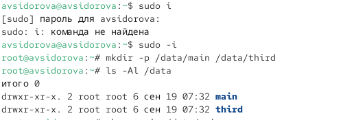{#fig:001 width=70%}

Изменим владельцев этих каталогов с root на main и third соответственно. (рис. [-@fig:002]).

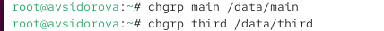{#fig:002 width=70%}

Посмотрим, кто является владельцем этих каталогов (рис. [-@fig:003])

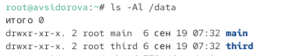{#fig:003 width=70%}

Установим разрешения, позволяющие владельцам каталогов записывать файлы в эти каталоги и запрещающие доступ к содержимому каталогов всем другим пользователями группам. После этого проверим установленные права. (рис. [-@fig:004])

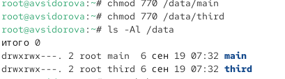{#fig:004 width=70%}

Перейдем в другой терминал, под пользователем bob в каталоге /data/main создадим файл emptyfile. Создался файл под пользователем bob, так как у группы есть права доступа. Перейдем в каталог /data/third и создадим файл emptyfile,  нам отказано в доступе, так как группа не имеет прав. (рис. [-@fig:005])

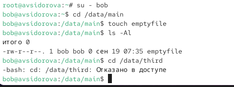{#fig:005 width=70%}

## Управление специальными разрешениями

Откроем новый терминал под пользователем Alice. Перейдем в каталог /data/main и создадим два файла alice1, alice2  (рис. [-@fig:006])

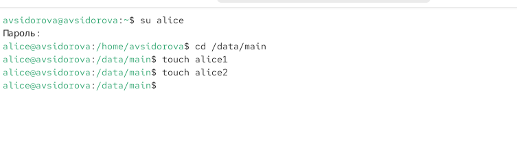{#fig:006 width=70%}

Видим два файла, созданные пользователем alice. Попробуем удалить файлы, принадлежащие пользователю alice. Создадим два файла, которые будут принадлежать пользователю bob (bob1, bob2) (рис. [-@fig:007])

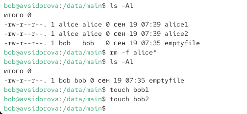{#fig:007 width=70%}

В терминале под пользователем root установим для каталога /data/main бит идентификатора группы, а также stiky-бит для разделяемого (общего) каталога группы (рис. [-@fig:008])

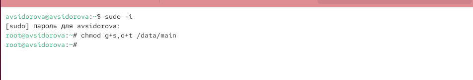{#fig:008 width=70%}

В терминале под пользователем alice создайте в каталоге /data/main файлы alice3 и alice4. Теперь мы увидели, что два созданных файла принадлежат группе main, которая является группой-владельцем каталога /data/main (рис. [-@fig:009])

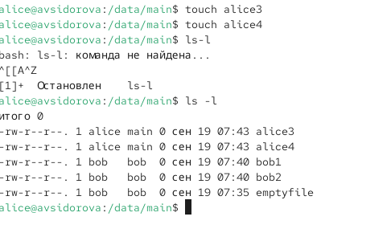{#fig:009 width=70%}

В терминале под пользователем alice попробуем удалить файлы, принадлежащие пользователю bob (Не получилось) (рис. [-@fig:010])

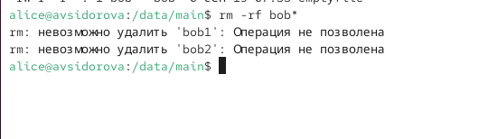{#fig:010 width=70%}

## Управление расширенными разрешениями с использованием списков ACL

Установим права на чтение и выполнение в каталоге /data/main для группы third и права на чтение и выполнение для группы main в каталоге /data/third. Используем команду getfacl, чтобы убедиться в правильности установки разреше-
ний. (рис. [-@fig:011])

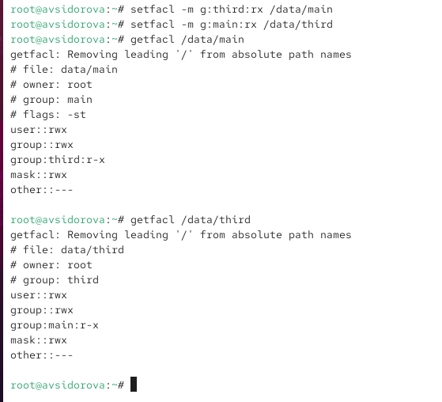{#fig:011 width=70%}

Создадим новый файл с именем newfile1 в каталоге /data/main и проверим текущие назначения полномочий (user - чтения и редактирование; group, other - чтение). (рис. [-@fig:012])

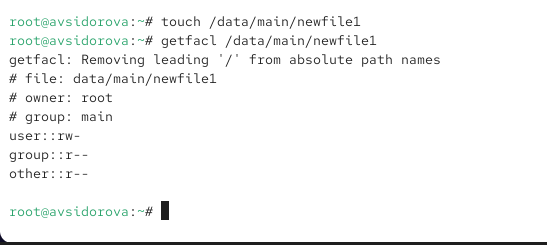{#fig:012 width=70%}

Выполним аналогичные действия в /data/third (рис. [-@fig:013])

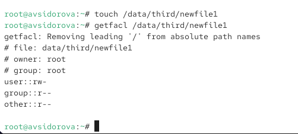{#fig:013 width=70%}

Установим ACL по умолчанию для каталога /data/main. Добавим ACL по умолчанию для каталога /data/third. Убедимся, что настройки ACL работают, добавив новый файл в каталог /data/main. (рис. [-@fig:014])

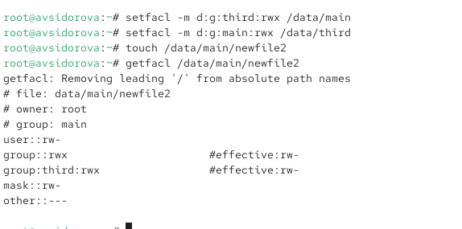{#fig:014 width=70%}

Используем getfactl для проверки текущих назначений полномочий. Выполним аналогичные действия для каталога /data/third. (рис. [-@fig:015])

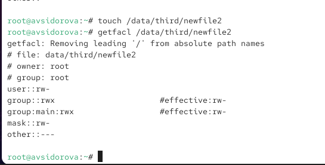{#fig:015 width=70%}

Для проверки полномочий группы third в каталоге /data/third войдем в другом терминале под учётной записью члена группы third.Проверим операции с файлами:
rm /data/main/newfile1 - Успешно
rm /data/main/newfile2 - Не хватает прав доступа
Проверим, возможно ли осуществить запись в файл:
echo "Hello, world" >> /data/main/newfile1 - Не хватает прав доступа
echo "Hello, world" >> /data/main/newfile2 - Успешно (рис. [-@fig:016])

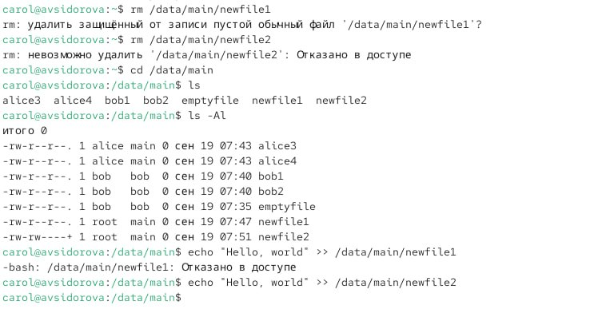{#fig:016 width=70%}

# Выводы

Получение навыки настройки базовых и специальных прав доступа для групп пользователей в операционной системе типа Linux

