---
## Front matter
lang: ru-RU
title: Лабораторная работа №5
subtitle: Управление системными службами
author:
  - Сидорова А.В.
institute:
  - Российский университет дружбы народов, Москва, Россия

## i18n babel
babel-lang: russian
babel-otherlangs: english

## Formatting pdf
toc: false
toc-title: Содержание
slide_level: 2
aspectratio: 169
section-titles: true
theme: metropolis
header-includes:
 - \metroset{progressbar=frametitle,sectionpage=progressbar,numbering=fraction}
---

# Информация

## Докладчик

:::::::::::::: {.columns align=center}
::: {.column width="70%"}

  * Сидорова Арина Валерьевна
  * студентка НПИбд-02-24
  * ст.б. 1132242912
  * Российский университет дружбы народов

:::
::::::::::::::

# Вводная часть

## Актуальность

Systemd — стандарт управления службами в современных Linux-системах. Навыки работы с ним необходимы для администрирования серверов, контейнеров и облачных инфраструктур.Полученные навыки позволяют эффективно администрировать системы, обеспечивать их безопасность и оперативно устранять неисправности.

## Объект и предмет исследования

### Объект исследования

-  Система инициализации systemd и управление системными службами в ОС Linux.  

### Предмет исследования

- Юниты systemd, их конфигурация, зависимости, конфликты и методы управления.  


## Цели и задачи

1. Освоить основные операции управления службами: запуск, остановка, проверка статуса, добавление и удаление из автозапуска.  
2. Изучить механизмы разрешения конфликтов между юнитами systemd на примере firewalld и iptables.  
3. Приобрести навыки работы с изолируемыми целями (targets) и настройки цели по умолчанию.  

# Выполнение лабораторной работы

## Управление сервисами

Получены права администратора с помощью команды su -. 

Проверен статус службы vsftpd — служба не установлена. 

Установлена служба vsftpd с помощью команды dnf -y install vsftpd. 

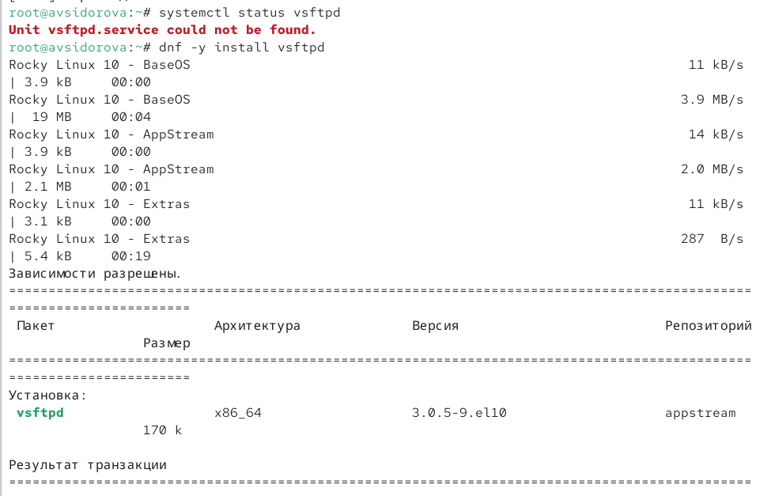{#fig:001 width=70%}

## Служба запущена и проверен её статус — служба активна, но не включена в автозапуск.

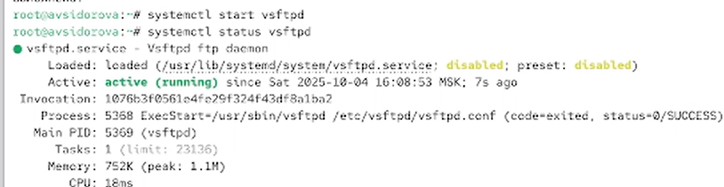{#fig:002 width=70%}

## Служба добавлена в автозапуск (systemctl enable vsftpd)

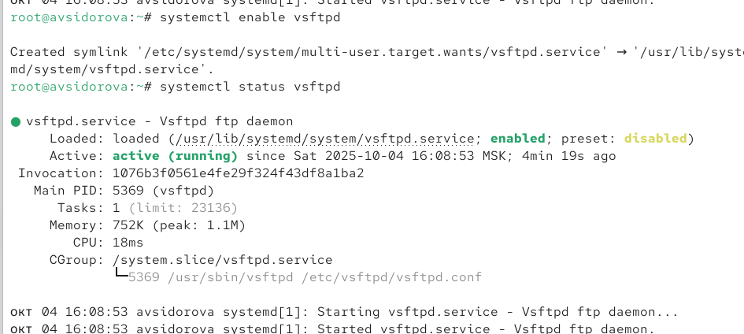{#fig:003 width=70%}

## затем отключена (systemctl disable vsftpd).

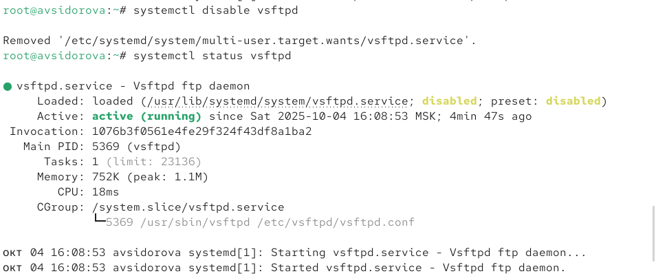{#fig:004 width=70%}

## Проверено содержимое каталога /etc/systemd/system/multi-user.target.wants — символической ссылки нет. Служба снова включена в автозапуск. Создана символическая ссылка в multi-user.target.wants. Проверка статуса подтверждает, что служба теперь enabled.  

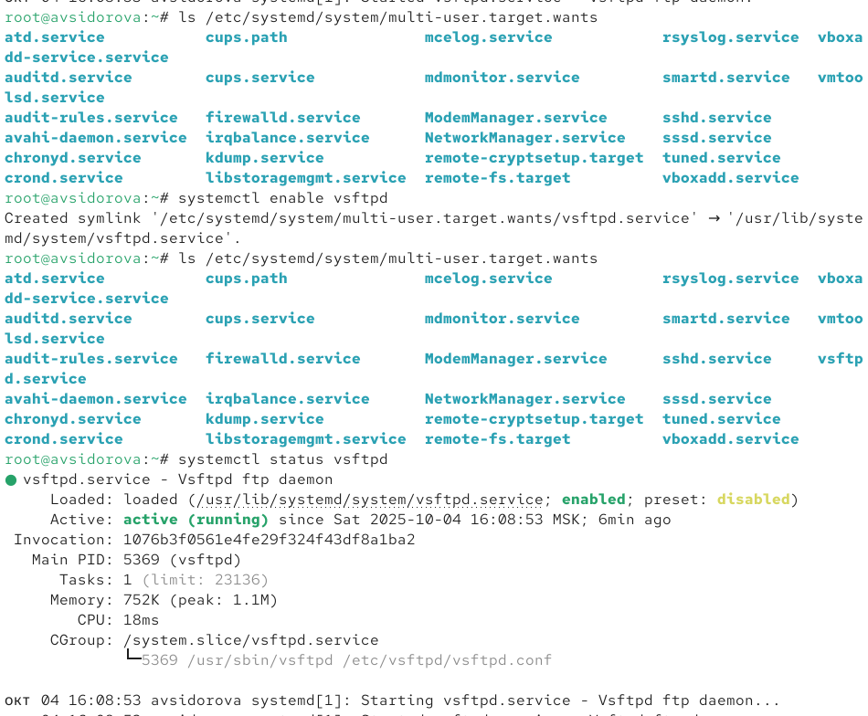{#fig:005 width=70%}

## Выведем на экран список зависимостей юнита: 

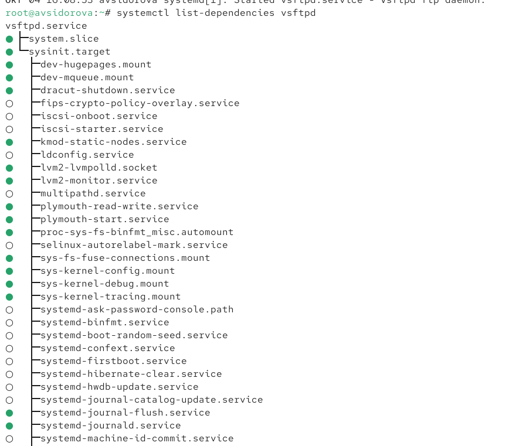{#fig:006 width=70%}

## Выведем на экран список юнитов, которые зависят от данного юнита:

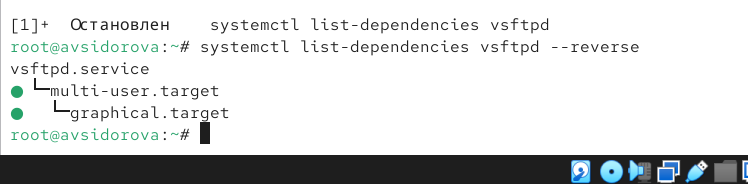{#fig:007 width=70%}

## Конфликты юнитов

Установлен пакет iptables*.

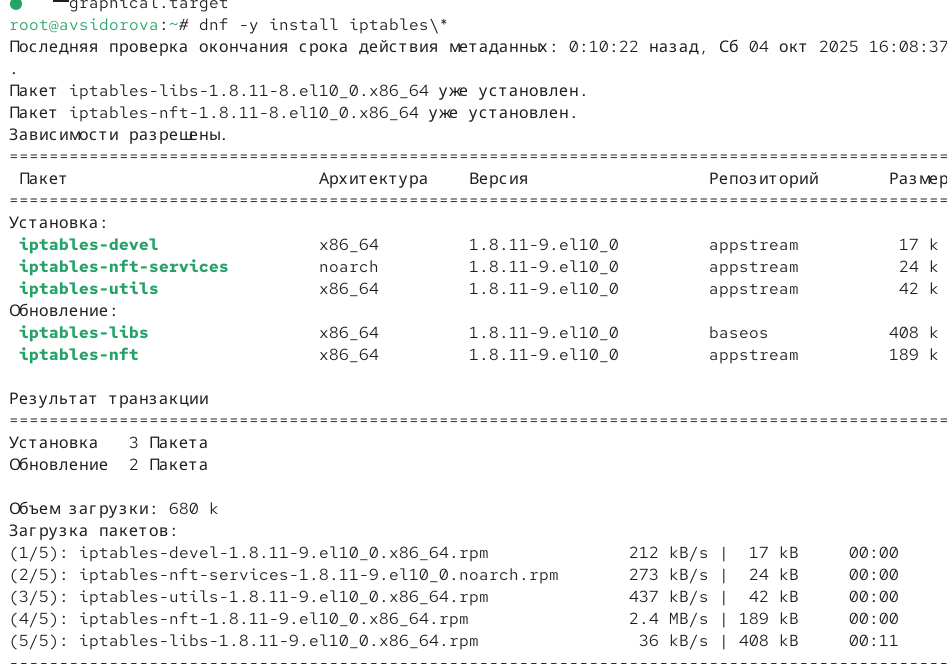{#fig:008 width=70%}

## Проверены статусы firewalld и iptables — обе службы изначально неактивны. 

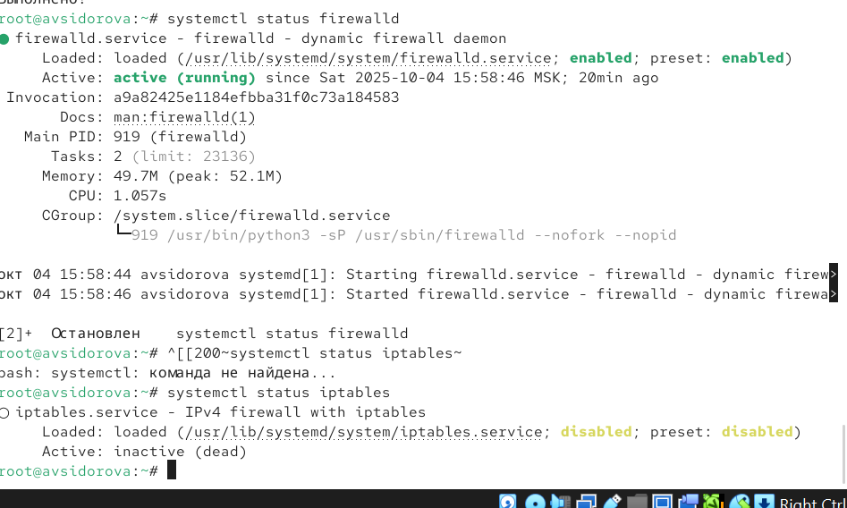{#fig:009 width=70%}

## Попытка одновременного запуска привела к деактивации одной из служб (взаимное исключение).  

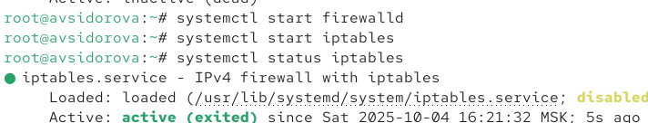{#fig:010 width=70%}

## Проанализированы файлы юнитов:  
- В firewalld.service указано Conflicts=iptables.service ip6tables.service.  

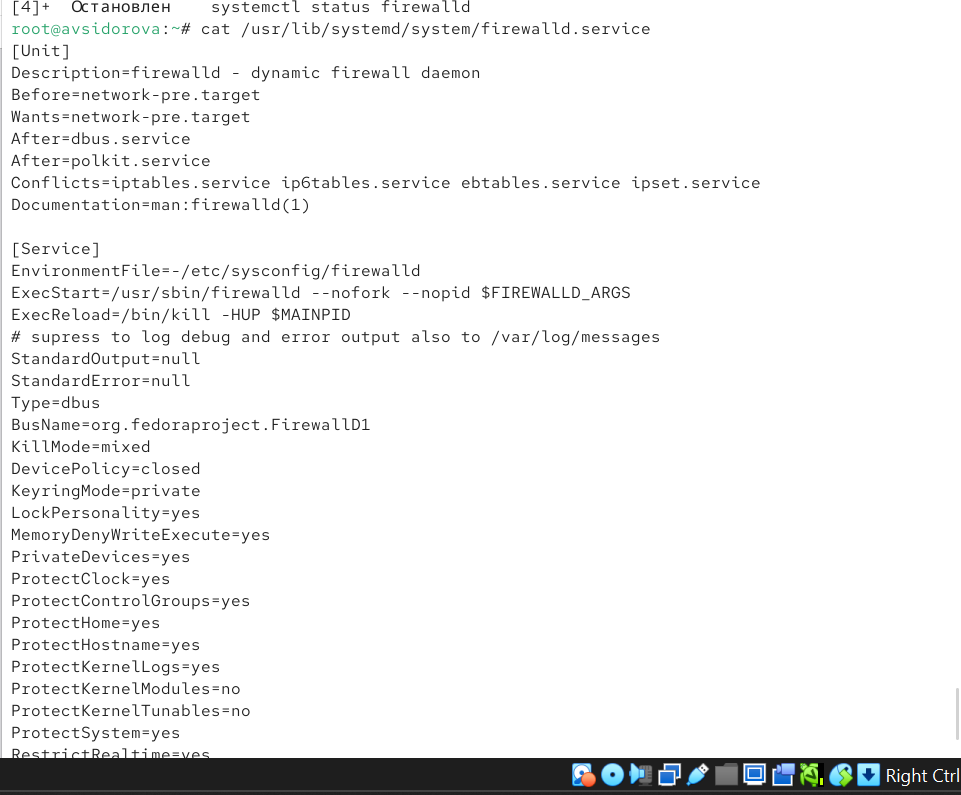{#fig:011 width=70%}  

## - В iptables.service указано Conflicts=firewalld.service.  
Это гарантирует, что службы не могут работать одновременно.  

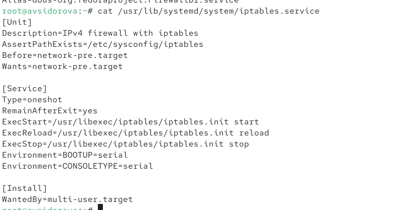{#fig:012 width=70%}

##  Служба iptables остановлена и замаскирована (systemctl mask iptables). Создана символическая ссылка на /dev/null. Проверка наличия ссылки. Попытка запуска замаскированной службы завершилась ошибкой.  
 
 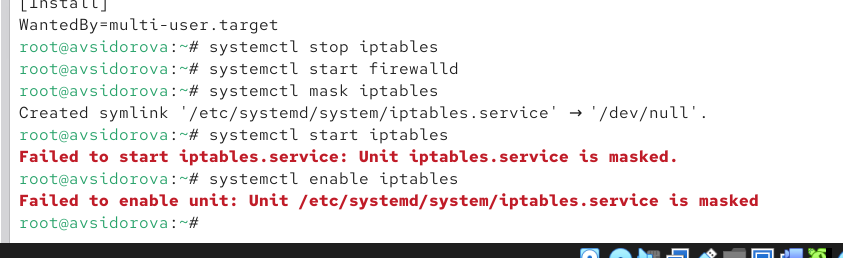{#fig:013 width=70%}

## Изолируемые цели

Перейдем в каталог systemd и найдем список всех целей, которые можно изолировать:
cd /usr/lib/systemd/system
grep Isolate *.target 

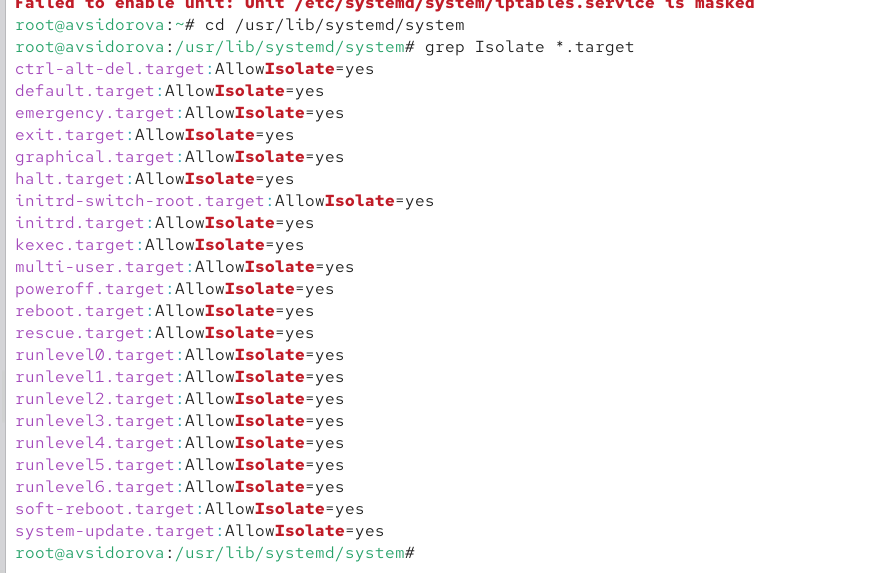{#fig:014 width=70%}

## Переключим операционную систему в режим восстановления:
systemctl isolate rescue.target

При этом необходимо ввести пароль root на консоли сервера для входа в систему.
Перезапустим операционную систему следующим образом:
systemctl isolate reboot.target 

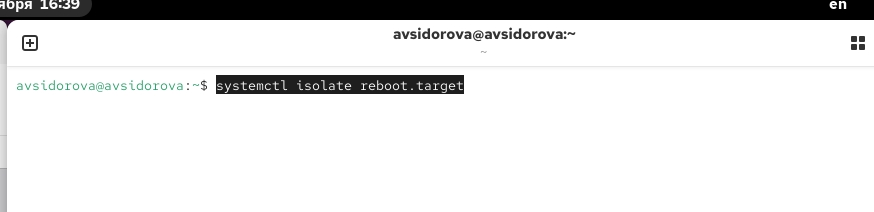{#fig:015 width=70%}

## Цель по умолчанию

Получим полномочия администратора. Выведем на экран цель, установленную по
умолчанию:
systemctl get-default
Для установки цели по умолчанию используется команда
systemctl set-default
Например, для запуска по умолчанию текстового режима введем
systemctl set-default multi-user.target
Для запуска по умолчанию графического режима введем
systemctl set-default graphical.target
Вновь перегрузим систему командой reboot. Убедимся, что система загрузилась в графическом режиме. 

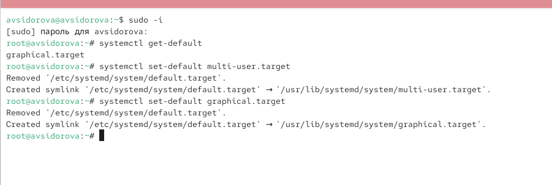{#fig:016 width=70%}

```make
REVEALJS_THEME = beige 
```
# Результаты

1. Освоено управление службами: установка, запуск, настройка автозагрузки (vsftpd).  
2. Изучены конфликты юнитов: анализ и разрешение конфликтов (firewalld vs iptables), маскирование служб.  
3. Работа с целями: переключение между multi-user.target и graphical.target, использование rescue.target.  
4. Анализ зависимостей: команды list-dependencies для диагностики взаимодействия служб.


:::

