---
## Front matter
title: "Отчет по лабораторной работе №5"
subtitle: "Управление системными службами"
author: "Сидорова Арина Валерьевна"

## Generic otions
lang: ru-RU
toc-title: "Содержание"

## Bibliography
bibliography: bib/cite.bib
csl: pandoc/csl/gost-r-7-0-5-2008-numeric.csl

## Pdf output format
toc: true # Table of contents
toc-depth: 2
lof: true # List of figures
fontsize: 12pt
linestretch: 1.5
papersize: a4
documentclass: scrreprt
## I18n polyglossia
polyglossia-lang:
  name: russian
  options:
	- spelling=modern
	- babelshorthands=true
polyglossia-otherlangs:
  name: english
## I18n babel
babel-lang: russian
babel-otherlangs: english
## Fonts
mainfont: PT Serif
romanfont: PT Serif
sansfont: PT Sans
monofont: PT Mono
mainfontoptions: Ligatures=TeX
romanfontoptions: Ligatures=TeX
sansfontoptions: Ligatures=TeX,Scale=MatchLowercase
monofontoptions: Scale=MatchLowercase,Scale=0.9
## Biblatex
biblatex: true
biblio-style: "gost-numeric"
biblatexoptions:
  - parentracker=true
  - backend=biber
  - hyperref=auto
  - language=auto
  - autolang=other*
  - citestyle=gost-numeric
## Pandoc-crossref LaTeX customization
figureTitle: "Рис."
tableTitle: "Таблица"
listingTitle: "Листинг"
lofTitle: "Список иллюстраций"
lolTitle: "Листинги"
## Misc options
indent: true
header-includes:
  - \usepackage{indentfirst}
  - \usepackage{float} # keep figures where there are in the text
  - \floatplacement{figure}{H} # keep figures where there are in the text
---

# Цель работы

Получить навыки управления системными службами операционной системы посредством systemd.

# Выполнение лабораторной работы

## Управление сервисами

Получены права администратора с помощью команды su -. 

Проверен статус службы vsftpd — служба не установлена. 

Установлена служба vsftpd с помощью команды dnf -y install vsftpd. (рис. [-@fig:001]) 

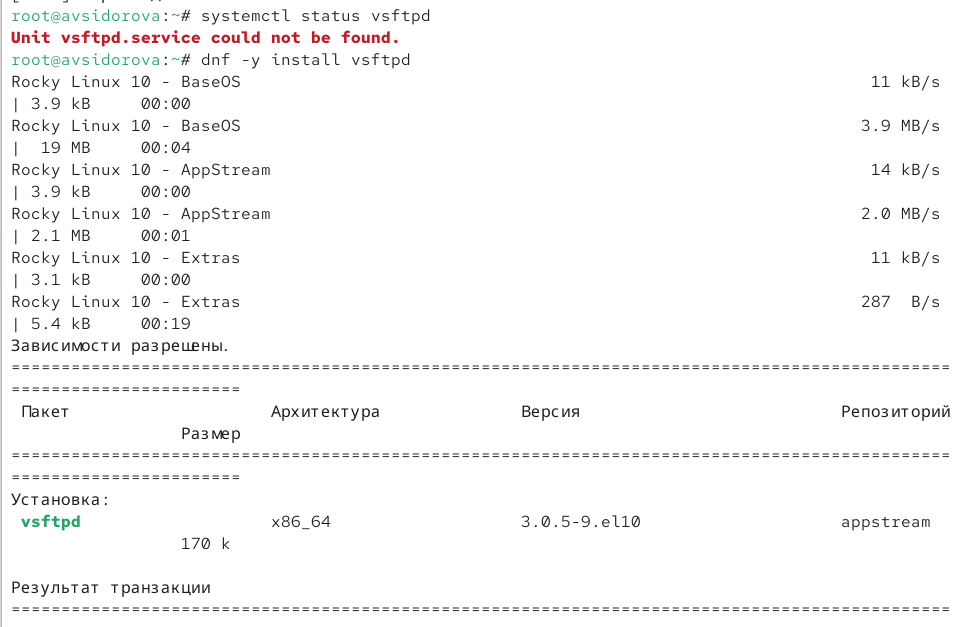{#fig:001 width=70%}

Служба запущена и проверен её статус — служба активна, но не включена в автозапуск.  (рис. [-@fig:002])

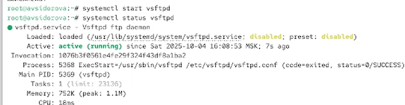{#fig:002 width=70%}

 Служба добавлена в автозапуск (systemctl enable vsftpd)  (рис. [-@fig:003])

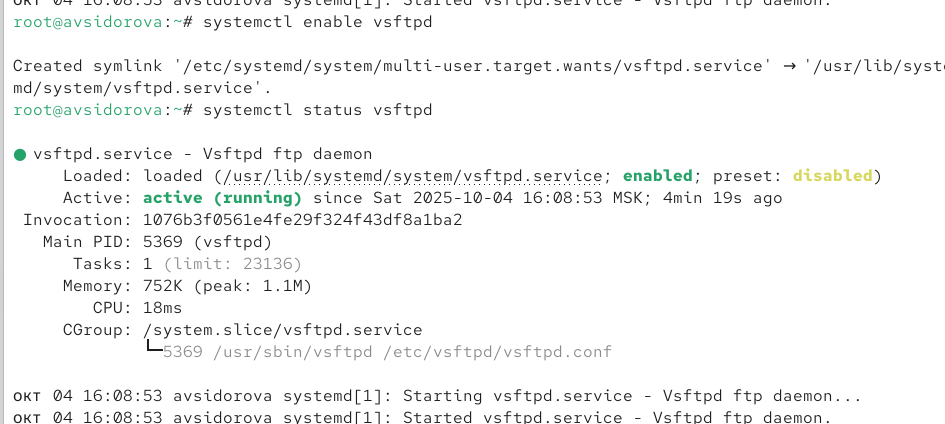{#fig:003 width=70%}

затем отключена (systemctl disable vsftpd).(рис. [-@fig:004])

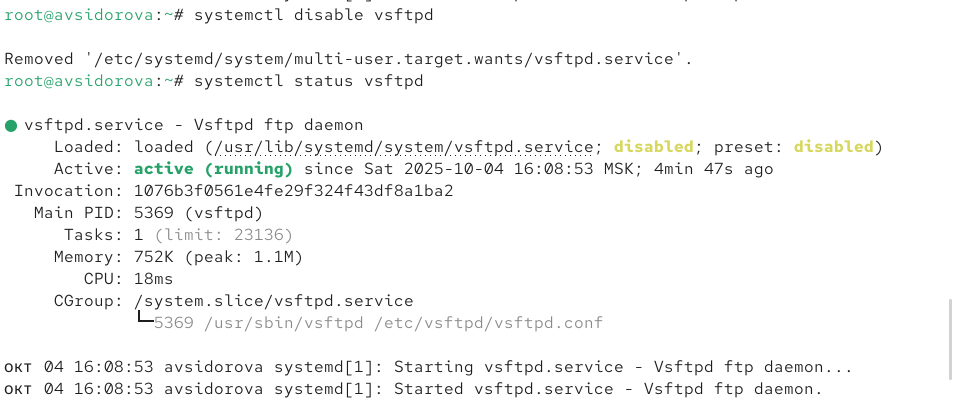{#fig:004 width=70%}

Проверено содержимое каталога /etc/systemd/system/multi-user.target.wants — символической ссылки нет. Служба снова включена в автозапуск. Создана символическая ссылка в multi-user.target.wants. Проверка статуса подтверждает, что служба теперь enabled.  (рис. [-@fig:005])

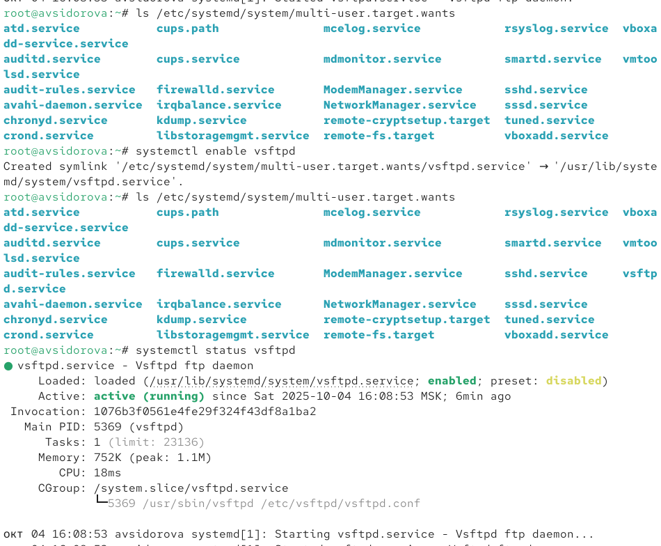{#fig:005 width=70%}

Выведем на экран список зависимостей юнита: (рис. [-@fig:006])

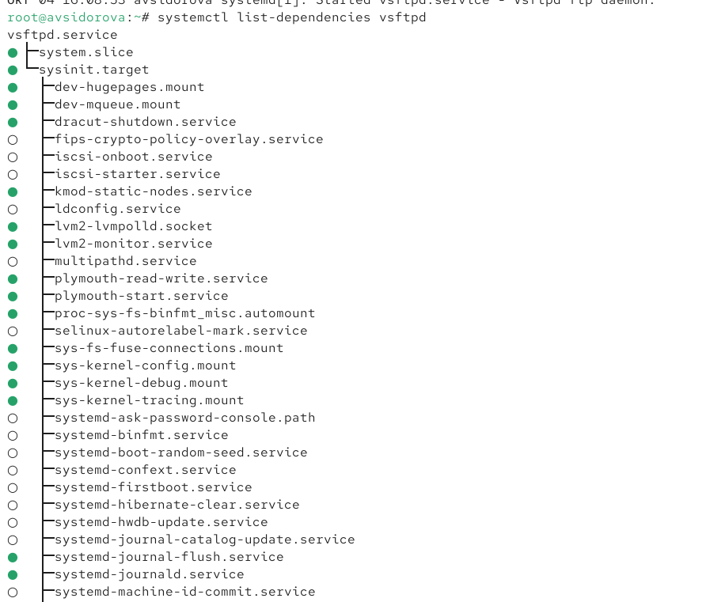{#fig:006 width=70%}

Выведем на экран список юнитов, которые зависят от данного юнита: (рис. [-@fig:007])

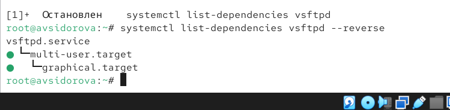{#fig:007 width=70%}

## Конфликты юнитов

Установлен пакет iptables*.  (рис. [-@fig:008])

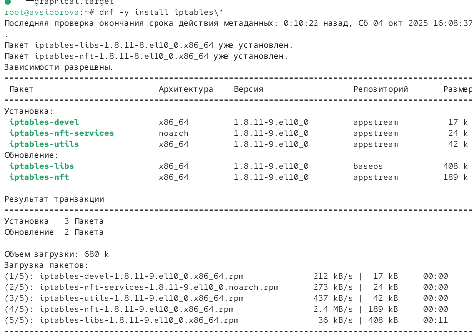{#fig:008 width=70%}

Проверены статусы firewalld и iptables — обе службы изначально неактивны.  (рис. [-@fig:009])

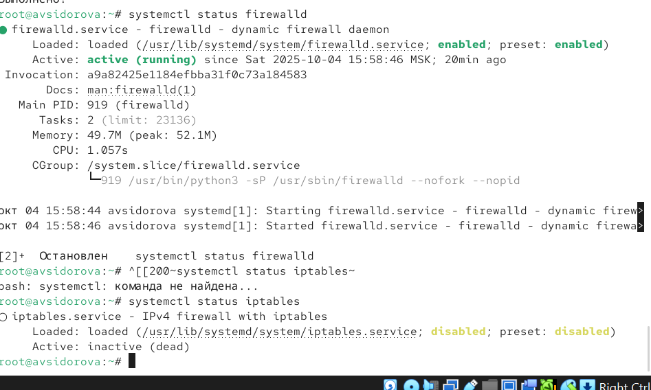{#fig:009 width=70%}

Попытка одновременного запуска привела к деактивации одной из служб (взаимное исключение).  (рис. [-@fig:010])

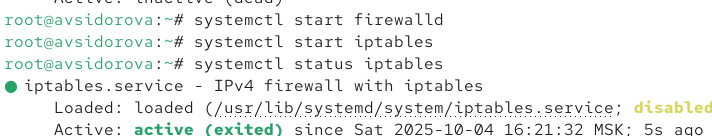{#fig:010 width=70%}

Проанализированы файлы юнитов:  
- В firewalld.service указано Conflicts=iptables.service ip6tables.service.  (рис. [-@fig:011])

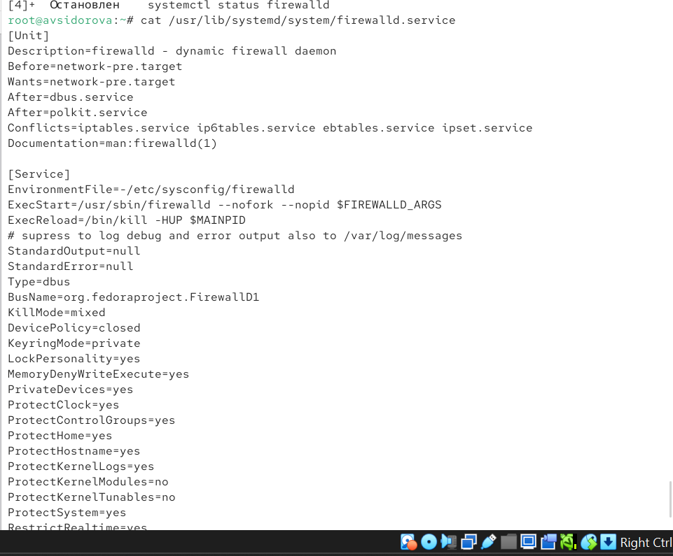{#fig:011 width=70%}  

- В iptables.service указано Conflicts=firewalld.service.  (рис. [-@fig:012])
Это гарантирует, что службы не могут работать одновременно.  

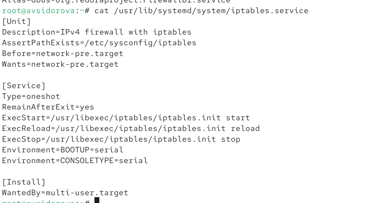{#fig:012 width=70%}

 Служба iptables остановлена и замаскирована (systemctl mask iptables). Создана символическая ссылка на /dev/null. Проверка наличия ссылки. Попытка запуска замаскированной службы завершилась ошибкой.  (рис. [-@fig:013])

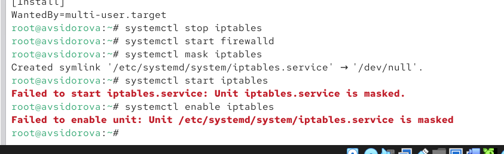{#fig:013 width=70%}

## Изолируемые цели

Перейдем в каталог systemd и найдем список всех целей, которые можно изолировать:
cd /usr/lib/systemd/system
grep Isolate *.target (рис. [-@fig:014])

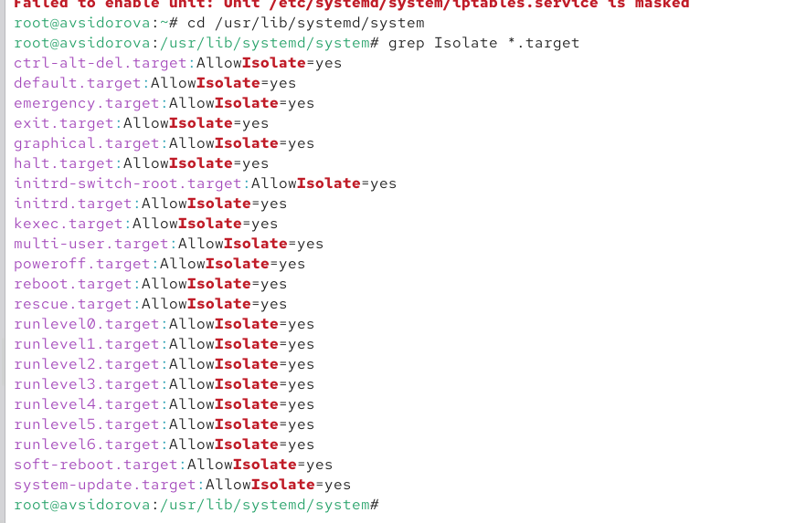{#fig:014 width=70%}

Переключим операционную систему в режим восстановления:
systemctl isolate rescue.target

При этом необходимо ввести пароль root на консоли сервера для входа в систему.
Перезапустим операционную систему следующим образом:
systemctl isolate reboot.target (рис. [-@fig:015])

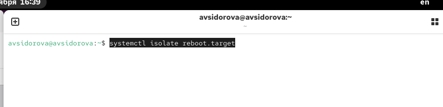{#fig:015 width=70%}

## Цель по умолчанию

Получим полномочия администратора. Выведем на экран цель, установленную по
умолчанию:
systemctl get-default
Для установки цели по умолчанию используется команда
systemctl set-default
Например, для запуска по умолчанию текстового режима введем
systemctl set-default multi-user.target
Для запуска по умолчанию графического режима введем
systemctl set-default graphical.target
Вновь перегрузим систему командой reboot. Убедимся, что система загрузилась в графическом режиме. (рис. [-@fig:016])

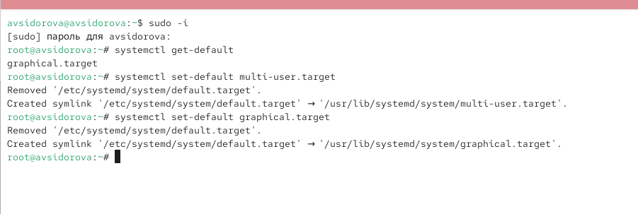{#fig:016 width=70%}

# Выводы

Получили навыки управления системными службами операционной системы посредством systemd.

