---
## Front matter
lang: ru-RU
title: Лабораторная работа №6
subtitle: Управление процессами
author:
  - Сидорова А.В.
institute:
  - Российский университет дружбы народов, Москва, Россия

## i18n babel
babel-lang: russian
babel-otherlangs: english

## Formatting pdf
toc: false
toc-title: Содержание
slide_level: 2
aspectratio: 169
section-titles: true
theme: metropolis
header-includes:
 - \metroset{progressbar=frametitle,sectionpage=progressbar,numbering=fraction}
---

# Информация

## Докладчик

:::::::::::::: {.columns align=center}
::: {.column width="70%"}

  * Сидорова Арина Валерьевна
  * студентка НПИбд-02-24
  * ст.б. 1132242912
  * Российский университет дружбы народов

:::
::::::::::::::

# Вводная часть

## Актуальность

Управление процессами — ключевой навык администратора операционных систем, необходимый для эффективного распределения ресурсов, контроля выполнения программ и обеспечения стабильности системы.

## Объект и предмет исследования

### Объект исследования

-  Процессы и задания в операционной системе Linux.

### Предмет исследования

- Методы и инструменты управления процессами (команды jobs, nice, renice, kill, nohup и др.).


## Цели и задачи

1. Получить практические навыки управления процессами и заданиями в операционной системе Linux.
2. Освоить команды для просмотра и управления процессами (ps, top, kill, jobs, fg, bg).  
3. Научиться управлять приоритетами процессов (nice, renice).  
4. Изучить механизмы фонового выполнения и завершения процессов.  
5. Выполнить задания по управлению заданиями и процессами.

# Выполнение лабораторной работы

## Управление заданиями

##  Получим полномочия администратора
Введем jobs
Мы увидим три задания, которые мы только что запустили. Первые два имеют со-
стояние Running, а последнее задание в настоящее время находится в состоянии
Stopped.
Для продолжения выполнения задания 3 в фоновом режиме введем
bg 3
С помощью команды jobs посмотрим изменения в статусе заданий. 

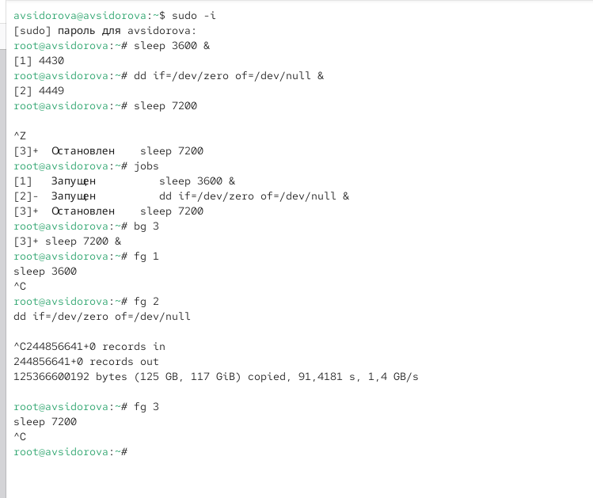{#fig:001 width=70%}

##  Для перемещения задания 1 на передний план 

Введем Ctrl + c , чтобы отменить задание 1. С помощью команды jobs посмотрим
изменения в статусе заданий. Проделаем то же самое для отмены заданий 2 и 3.

## Откроем второй терминал и под учётной записью своего пользователя введем в нём:

dd if=/dev/zero of=/dev/null &. 

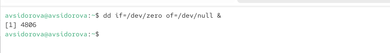{#fig:002 width=70%}


## На другом терминале под учётной записью своего пользователя запустим

мы увидим, что задание dd всё ещё запущено. Для мыхода из top используем q .

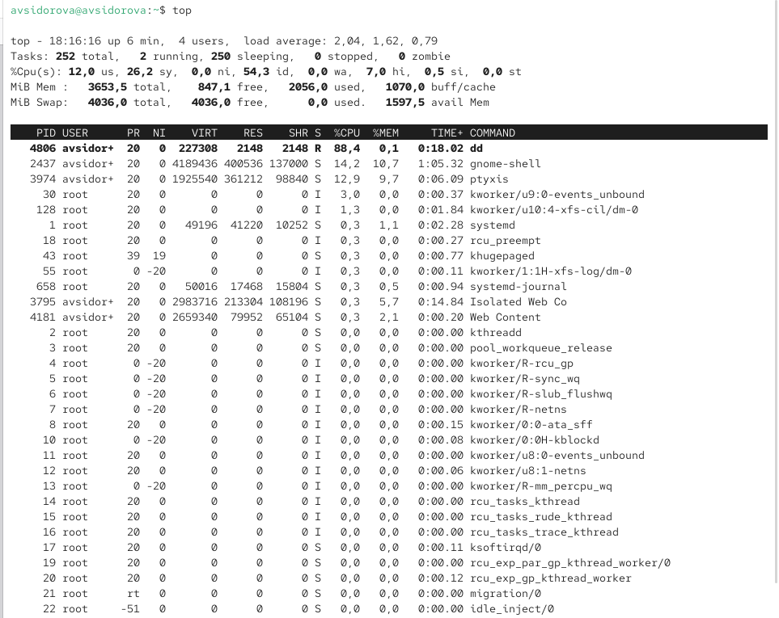{#fig:003 width=70%}

## Вновь запустим top и в нём используем k , чтобы убить задание dd. После этого мыйдем из top. 

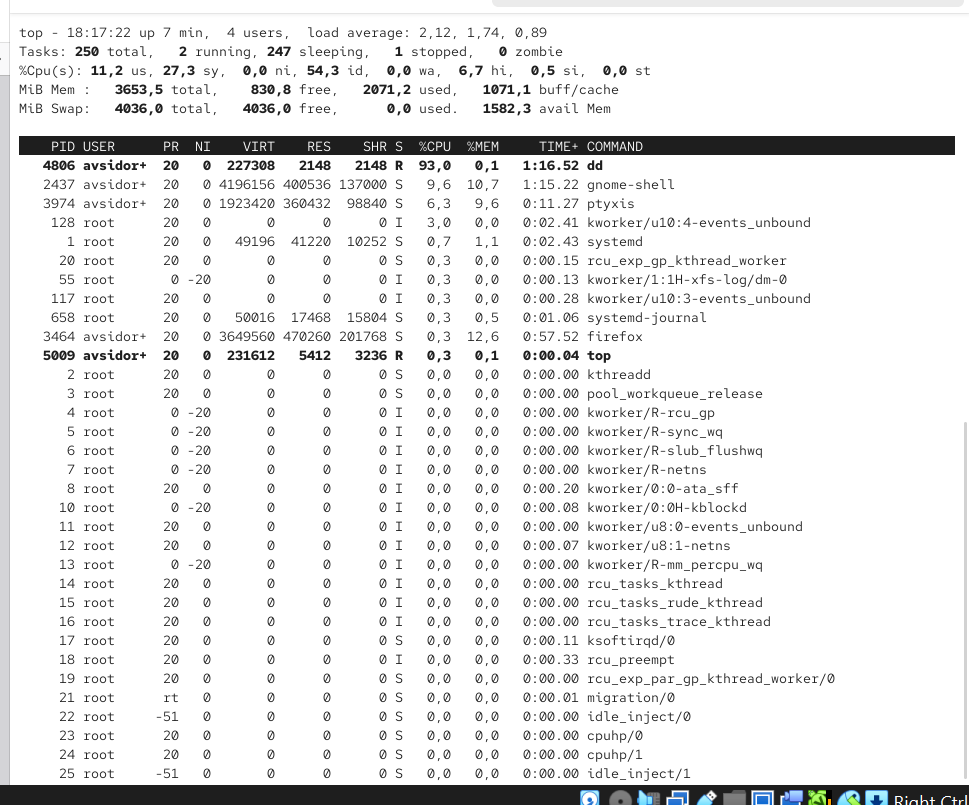{#fig:004 width=70%}


## Управление процессами

## Введем следующие команды:

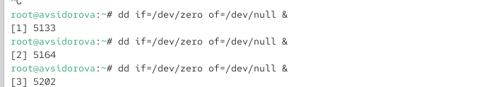{#fig:005 width=70%}

## Это показывает все строки, в которых есть букмы dd. 

Запущенные процессы dd идут последними. 

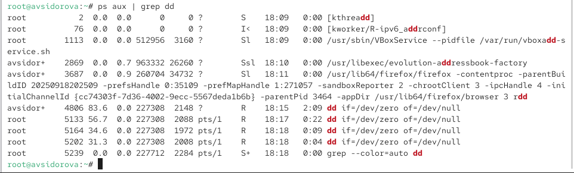{#fig:006 width=70%}

## Используем PID одного из процессов dd, чтобы изменить приоритет. 

Используем renice -n 5 <PID> 

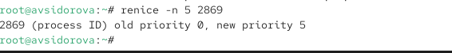{#fig:007 width=70%}

## Введем 
Параметр -B5 показывает соответствующие запросу строки, включая пять строк до
этого. Поскольку ps fax показывает иерархию отношений между процессами, мы
также увидем оболочку, из которой были запущены все процессы dd, и её PID. 

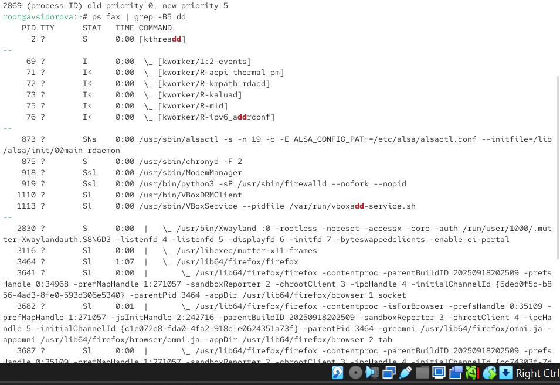{#fig:008 width=70%}


## Найдем PID корневой оболочки, из которой были запущены процессы dd, 
мы увидим, что наша корневая оболочка закрылась, а вместе с ней и все процессы dd. Остановка родительского процесса — простой и удобный способ остановить все его дочерние процессы. 

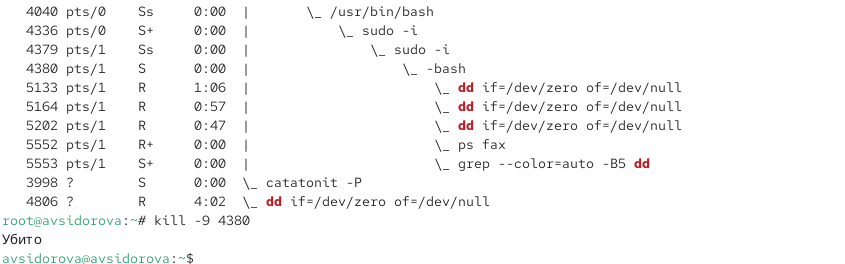{#fig:009 width=70%}

# Самостоятельная работа

## Задание 1

## 1. Запустим команду
dd if=/dev/zero of=/dev/null
трижды как фоновое задание.  

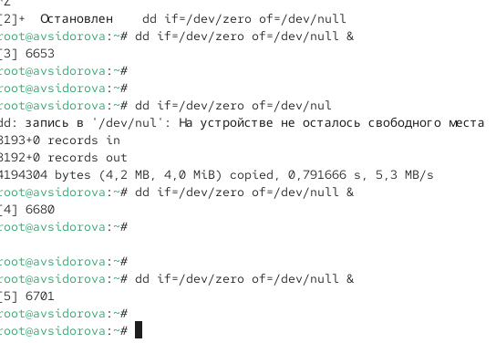{#fig:010 width=70%}

## 2. Увеличим приоритет одной из этих команд, используя значение приоритета −5.

## 3. Изменим приоритет того же процесса ещё раз, но используем на этот раз значение
−15. Разница в значении приоритетов  

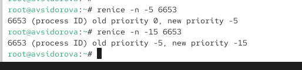{#fig:011 width=70%}

## 4. Завершим все процессы dd, которые мы запустили. 

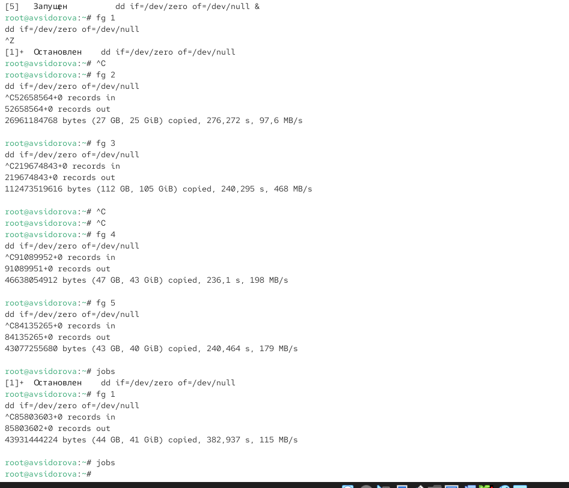{#fig:012 width=70%}

## Задание 2

## 1. Запустим программу yes в фоновом режиме с подавлением потока вывода. 

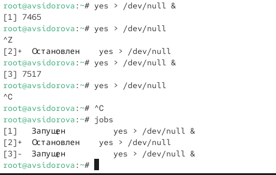{#fig:013 width=70%}

## 2. Запустим программу yes на переднем плане с подавлением потока вывода. 
Приостановим выполнение программы. Заново запустим программу yes с теми же
параметрами, затем завершим её выполнение. 

##3. Запустим программу yes на переднем плане без подавления потока вывода.
Приостановим выполнение программы. Заново запустим программу yes с теми же
параметрами, затем завершим её выполнение.

## 4. Проверим состояния заданий, воспользовавшись командой jobs. 

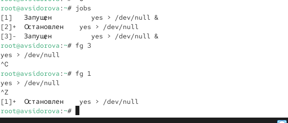{#fig:014 width=70%}

## 5. Переведем процесс, который у нас выполняется в фоновом режиме, на передний план, затем остановим его.

## 6. Переведем любой наш процесс с подавлением потока вывода в фономый режим. 

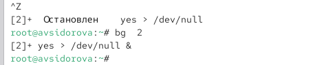{#fig:015 width=70%}

## 7. Проверим состояния заданий, воспользовавшись командой jobs. 
Обратим внимание, что процесс стал выполняющимся (Running) в фоновом режиме. 

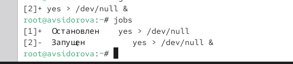{#fig:016 width=70%}

## 8. Запустим процесс в фоновом режиме таким образом, чтобы он продолжил свою работу даже после отключения от терминала. 

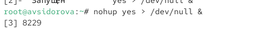{#fig:017 width=70%}

## 10. Получим информацию о запущенных в операционной системе процессах с помощью утилиты top.  

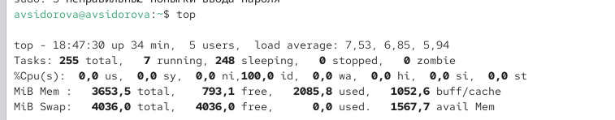{#fig:018 width=70%}

## 11. Запустим ещё три программы yes в фоновом режиме с подавлением потока вывода. 

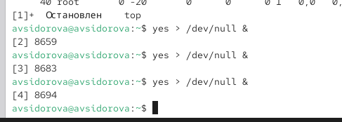{#fig:019 width=70%}

## 12. Убье два процесса: для одного используем его PID, а для другого — его идентификатор конкретного задания. 

{#fig:020 width=70%}

## 14. Запустим ещё несколько программ yes в фоновом режиме с подавлением потока вывода.

15. Завершим их работу одновременно, используя команду killall. 

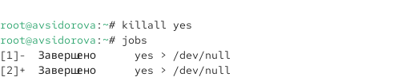{#fig:021 width=70%}

## 16. Запустим программу yes в фоновом режиме с подавлением потока вывода. 

Используя утилиту nice, запустим программу yes с теми же параметрами и с приоритетом,
большим на 5. Сравним абсолютные и относимльные приоритеты у этих двух про-
цессов. Используя утилиту renice, изменим приоритет у одного из потоков yes таким обра-
зом, чтобы у обоих потоков приоритеты были равны. 

{#fig:022 width=70%}


# Результаты

- Освоены команды ps, jobs, fg, bg, kill, nice, renice, nohup.  
- Выполнено управление заданиями: запуск, остановка, перевод между фоном и передним планом.  
- Изменены приоритеты процессов, завершены процессы через PID и имя.  
- Запущены фоновые процессы, устойчивые к разрыву сессии (nohup).

```make
REVEALJS_THEME = beige 
```

:::

