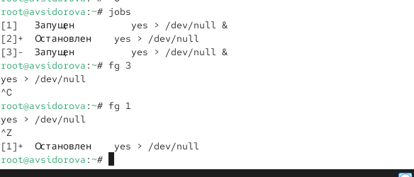

---
## Front matter
title: "Отчет по лабораторной работе №6"
subtitle: "Управление процессами"
author: "Сидорова Арина Валерьевна"

## Generic otions
lang: ru-RU
toc-title: "Содержание"

## Bibliography
bibliography: bib/cite.bib
csl: pandoc/csl/gost-r-7-0-5-2008-numeric.csl

## Pdf output format
toc: true # Table of contents
toc-depth: 2
lof: true # List of figures
fontsize: 12pt
linestretch: 1.5
papersize: a4
documentclass: scrreprt
## I18n polyglossia
polyglossia-lang:
  name: russian
  options:
	- spelling=modern
	- babelshorthands=true
polyglossia-otherlangs:
  name: english
## I18n babel
babel-lang: russian
babel-otherlangs: english
## Fonts
mainfont: PT Serif
romanfont: PT Serif
sansfont: PT Sans
monofont: PT Mono
mainfontoptions: Ligatures=TeX
romanfontoptions: Ligatures=TeX
sansfontoptions: Ligatures=TeX,Scale=MatchLowercase
monofontoptions: Scale=MatchLowercase,Scale=0.9
## Biblatex
biblatex: true
biblio-style: "gost-numeric"
biblatexoptions:
  - parentracker=true
  - backend=biber
  - hyperref=auto
  - language=auto
  - autolang=other*
  - citestyle=gost-numeric
## Pandoc-crossref LaTeX customization
figureTitle: "Рис."
tableTitle: "Таблица"
listingTitle: "Листинг"
lofTitle: "Список иллюстраций"
lolTitle: "Листинги"
## Misc options
indent: true
header-includes:
  - \usepackage{indentfirst}
  - \usepackage{float} # keep figures where there are in the text
  - \floatplacement{figure}{H} # keep figures where there are in the text
---

# Цель работы

Получить намыки управления процессами операционной системы.

# выполнение лабораторной работы

## Управление заданиями

1. Получим полномочия администратора
2. Введем следующие команды:
sleep 3600 &
dd if=/dev/zero of=/dev/null &
sleep 7200

4. Введем
jobs
Мы увидим три задания, которые мы только что запустили. Пермые два имеют со-
стояние Running, а последнее задание в настоящее время находится в состоянии
Stopped.

5. Для продолжения мыполнения задания 3 в фоновом режиме введем
bg 3
С помощью команды jobs посмотрим изменения в статусе заданий. (рис. [-@fig:001]) 

{#fig:001 width=70%}

6. Для перемещения задания 1 на передний план введем
fg 1

7. Введем Ctrl + c , чтобы отменить задание 1. С помощью команды jobs посмотрим
изменения в статусе заданий.

8. Проделаем то же самое для отмены заданий 2 и 3.

9. Откроем второй терминал и под учётной записью своего пользователя введем в нём:
dd if=/dev/zero of=/dev/null &. (рис. [-@fig:002]) 

{#fig:002 width=70%}

10. Введем exit, чтобы закрыть второй терминал.

11. На другом терминале под учётной записью своего пользователя запустим
top

мы увидим, что задание dd всё ещё запущено. Для мыхода из top используем q .(рис. [-@fig:003]) 

{#fig:003 width=70%}

12. Вновь запустим top и в нём используем k , чтобы убить задание dd. После этого
мыйдем из top. (рис. [-@fig:004]) 

{#fig:004 width=70%}

## Управление процессами

1. Получим полномочия администратора
su -
2. Введем следующие команды:
dd if=/dev/zero of=/dev/null &
dd if=/dev/zero of=/dev/null &
dd if=/dev/zero of=/dev/null & (рис. [-@fig:005]) 

{#fig:005 width=70%}

3. Введем
ps aux | grep dd
Это показывает все строки, в которых есть букмы dd. Запущенные процессы dd идут
последними. (рис. [-@fig:006]) 

{#fig:006 width=70%}

4. Используем PID одного из процессов dd, чтобы изменить приоритет. Используем
renice -n 5 <PID> (рис. [-@fig:007]) 

{#fig:007 width=70%}

5. Введем
ps fax | grep -B5 dd 
Параметр -B5 показывает соответствующие запросу строки, включая пять строк до
этого. Поскольку ps fax показывает иерархию отношений между процессами, мы
также увидем оболочку, из которой были запущены все процессы dd, и её PID. (рис. [-@fig:008]) 

{#fig:008 width=70%}

6. Найдем PID корневой оболочки, из которой были запущены процессы dd, и введем
kill -9 <PID>
(заменив <PID> на значение PID оболочки). мы увидим, что наша корневая оболочка
закрылась, а вместе с ней и все процессы dd. Остановка родительского процесса —
простой и удобный способ остановить все его дочерние процессы. (рис. [-@fig:009]) 

{#fig:009 width=70%}

# Самостоятельная работа

## Задание 1
1. Запустим команду
dd if=/dev/zero of=/dev/null
трижды как фоновое задание.  (рис. [-@fig:010]) 

{#fig:010 width=70%}

2. Увеличим приоритет одной из этих команд, используя значение приоритета −5.

3. Изменим приоритет того же процесса ещё раз, но используем на этот раз значение
−15. Разница в значении приоритетов  (рис. [-@fig:011]) 

{#fig:011 width=70%}

4. Завершим все процессы dd, которые мы запустили. (рис. [-@fig:012]) 

{#fig:012 width=70%}

## Задание 2

1. Запустим программу yes в фоновом режиме с подавлением потока вывода. (рис. [-@fig:013]) 

{#fig:013 width=70%}

2. Запустим программу yes на переднем плане с подавлением потока вывода. При-
остановим выполнение программы. Заново запустим программу yes с теми же
параметрами, затем завершим её выполнение. 

3. Запустим программу yes на переднем плане без подавления потока вывода. При-
остановим выполнение программы. Заново запустим программу yes с теми же
параметрами, затем завершим её выполнение.

4. Проверим состояния заданий, воспользовавшись командой jobs. (рис. [-@fig:014]) 

{#fig:014 width=70%}

5. Переведем процесс, который у нас выполняется в фоновом режиме, на передний
план, затем остановим его.

6. Переведем любой наш процесс с подавлением потока вывода в фономый режим. (рис. [-@fig:015]) 

{#fig:015 width=70%}

7. Проверим состояния заданий, воспользовавшись командой jobs. Обратим внимание,
что процесс стал выполняющимся (Running) в фоновом режиме. (рис. [-@fig:016]) 

{#fig:016 width=70%}

8. Запустим процесс в фоновом режиме таким образом, чтобы он продолжил свою
работу даже после отключения от терминала. (рис. [-@fig:017]) 

{#fig:017 width=70%}

9. Закроем окно и заново запустим консоль. Убедимся, что процесс продолжил свою
работу.

10. Получим информацию о запущенных в операционной системе процессах с помощью
утилиты top. (рис. [-@fig:018]) 

{#fig:018 width=70%}

11. Запустим ещё три программы yes в фоновом режиме с подавлением потока вывода. (рис. [-@fig:019]) 

{#fig:019 width=70%}

12. Убеем два процесса: для одного используем его PID, а для другого — его идентифи-
катор конкретного задания. (рис. [-@fig:020]) 

{#fig:020 width=70%}

13. Попробуем послать сигнал 1 (SIGHUP) процессу, запущенному с помощью nohup,
и обычному процессу.

14. Запустим ещё несколько программ yes в фоновом режиме с подавлением потока
вывода.

15. Завершим их работу одновременно, используя команду killall. (рис. [-@fig:021]) 

{#fig:021 width=70%}

16. Запустим программу yes в фоновом режиме с подавлением потока вывода. Используя
утилиту nice, запустим программу yes с теми же параметрами и с приоритетом,
большим на 5. Сравним абсолютные и относимльные приоритеты у этих двух про-
цессов.

17. Используя утилиту renice, изменим приоритет у одного из потоков yes таким обра-
зом, чтобы у обоих потоков приоритеты были равны. (рис. [-@fig:022]) 

{#fig:022 width=70%}

# Ответы на контрольные вопросы

1. jobs  
2. Ctrl+Z, затем bg  
3. Ctrl+C  
4. Использовать kill или killall из другой сессии.  
5. ps fax или pstree  
6. renice -n -5 1234 (требуются права суперпользователя)  
7. killall dd  
8. killall mycommand  
9. Нажать k, ввести PID процесса.  
10. nice -n -10 command (с учетом прав доступа).

# выводы

Получили намыки управления процессами операционной системы.

