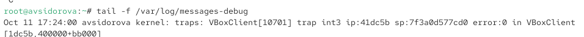

---
## Front matter
lang: ru-RU
title: Лабораторная работа №7
subtitle: Управление журналами событий в системе
author:
  - Сидорова А.В.
institute:
  - Российский университет дружбы народов, Москва, Россия

## i18n babel
babel-lang: russian
babel-otherlangs: english

## Formatting pdf
toc: false
toc-title: Содержание
slide_level: 2
aspectratio: 169
section-titles: true
theme: metropolis
header-includes:
 - \metroset{progressbar=frametitle,sectionpage=progressbar,numbering=fraction}
---

# Информация

## Докладчик

:::::::::::::: {.columns align=center}
::: {.column width="70%"}

  * Сидорова Арина Валерьевна
  * студентка НПИбд-02-24
  * ст.б. 1132242912
  * Российский университет дружбы народов

:::
::::::::::::::

# Вводная часть

## Актуальность

Управление системными журналами (логами) является важнейшей задачей системного администратора для обеспечения мониторинга, диагностики проблем, аудита безопасности и анализа производительности операционной системы.

## Объект и предмет исследования

### Объект исследования

-  Система журналирования событий в операционной системе Linux.

### Предмет исследования

-  Механизмы и инструменты управления системными журналами (rsyslog, journald, journalctl).

## Цели и задачи

**Цель:**
Получить практические навыки работы с системой журналирования событий в Linux, включая настройку rsyslog и работу с journalctl.

**Задачи:**

1. Освоить мониторинг журналов событий в реальном времени.
2. Научиться настраивать правила фильтрации и перенаправления сообщений в rsyslog.
3. Получить навыки работы с утилитой journalctl для просмотра и фильтрации журналов systemd.
4. Настроить постоянное хранение журналов journald.

# Выполнение лабораторной работы

## Мониторинг журнала системных событий в реальном времени

## На второй вкладке терминала запустим мониторинг системных событий в реальном времени.  

{#fig:001 width=70%}

## В третьей вкладке терминала вернемся к учётной записи своего пользователя (достаточно нажать Ctrl + d ) 

попробуем получить полномочия администратора, но введем неправильный пароль. Обратим внимание, что во второй вкладке терминала с мониторингом событий или ничего не отобразится, или появится сообщение «FAILED SU (to root) username ...». Отображаемые на экране сообщения также фиксируются в файле /var/log/messages. 

## В третьей вкладке терминала из оболочки пользователя введем logger hello  

{#fig:002 width=70%}

##Во второй вкладке терминала с мониторингом остановим трассировку файла сообщений мониторинга реального времени

используя Ctrl + c . Затем запустим мониторинг сообщений безопасности (последние 20 строк соответствующего файла
логов). Мы увидите сообщения, которые ранее были зафиксированы во время ошибки авторизации при вводе команды su. 

{#fig:003 width=70%}

## Изменение правил rsyslog.conf

## В первой вкладке терминала установим Apache 

{#fig:004 width=70%}

## После окончания процесса установки запустим веб-службу 

{#fig:005 width=70%}

## Во второй вкладке терминала посмотрим журнал сообщений об ошибках веб-службы  

{#fig:006 width=70%}

## В третьей вкладке терминала получим полномочия администратора и в файле конфигурации /etc/httpd/conf/httpd.conf в конце добавим строку 

{#fig:007 width=70%}

Здесь local0 — local7 — это «настраиваемые» средства (объекты), которые syslog предоставляет пользователю для регистрации событий приложения в системном журнале.

## В каталоге /etc/rsyslog.d создадим файл мониторинга событий веб-службы:  

{#fig:008 width=70%}

## Открыв его на редактирование, пропишем в нём  

{#fig:009 width=70%}

Эта строка позволит отправлять все сообщения, получаемые для объекта local1 (который теперь используется службой httpd), в файл /var/log/httpd-error.log.

## Перейдем в первую вкладку терминала и перезагрузим конфигурацию rsyslogd и веб-службу:  

{#fig:010 width=70%}

Все сообщения об ошибках веб-службы теперь будут записаны в файл /var/log/httpd-error.log, что можно наблюдать или в режиме реального времени, используя команду tail с соответствующими параметрами, или непосредственно просматривая указанный файл.

## В третьей вкладке терминала создадим отдельный файл конфигурации для мониторинга отладочной информации: 

{#fig:011 width=70%}

## В первой вкладке терминала снова перезапустим rsyslogd:  

{#fig:012 width=70%}

## Во второй вкладке терминала запустим мониторинг отладочной информации:  

{#fig:013 width=70%}

## В третьей вкладке терминала введем: 

{#fig:014 width=70%}

## В терминале с мониторингом посмотрим сообщение отладки. 

## Использование journalctl

## Во второй вкладке терминала посмотрим содержимое журнала с событиями с момента последнего запуска системы:

journalctl 

{#fig:015 width=70%}

## Просмотр содержимого журнала без использования пейджера:

journalctl --no-pager  

{#fig:016 width=70%}

##  Режим просмотра журнала в реальном времени:

journalctl -f
Используем Ctrl + c для прерывания просмотра. 

{#fig:017 width=70%}

## Для использования фильтрации просмотра конкретных параметров журнала введем

journalctl и дважды нажмите клавишу Tab .

Просмотрим события для UID0:
journalctl _UID=0 

{#fig:018 width=70%}

## Для отображения последних 20 строк журнала введем

journalctl -n 20  

{#fig:019 width=70%}

##  Для просмотра только сообщений об ошибках введем

journalctl -p err 

{#fig:020 width=70%}

## Для просмотра всех сообщений со вчерашнего дня введем

journalctl --since yesterday 

{#fig:021 width=70%}

## Используем

journalctl --since yesterday -p err  

{#fig:022 width=70%}

## Для детальной информации используем

journalctl -o verbose 

{#fig:023 width=70%}

## Для просмотра дополнительной информации о модуле sshd введем

journalctl _SYSTEMD_UNIT=sshd.service  

{#fig:024 width=70%}

## Постоянный журнал journald

Запустим терминал и получим полномочия администратора.
Создадим каталог для хранения записей журнала
Скорректируем права доступа для каталога /var/log/journal, чтобы journald смог записывать в него информацию
Для принятия изменений необходимо или перезагрузить систему 
Журнал systemd теперь постоянный. Мы хотим видеть сообщения журнала с момента последней перезагрузки, используем journalctl -b 

{#fig:025 width=70%}

# Результаты

- Освоены команды tail -f, logger для мониторинга и генерации логов.
- Настроен перенос логов веб-сервиса Apache в отдельный файл через rsyslog.
- Созданы пользовательские правила фильтрации для rsyslog.
- Освоена работа с journalctl для просмотра, фильтрации и анализа журналов.
- Настроено постоянное хранение журналов systemd-journald.

:::

