---
## Front matter
title: "Отчет по лабораторной работе №7"
subtitle: "Управление журналами событий в системе"
author: "Сидорова Арина Валерьевна"

## Generic otions
lang: ru-RU
toc-title: "Содержание"

## Bibliography
bibliography: bib/cite.bib
csl: pandoc/csl/gost-r-7-0-5-2008-numeric.csl

## Pdf output format
toc: true # Table of contents
toc-depth: 2
lof: true # List of figures
fontsize: 12pt
linestretch: 1.5
papersize: a4
documentclass: scrreprt
## I18n polyglossia
polyglossia-lang:
  name: russian
  options:
	- spelling=modern
	- babelshorthands=true
polyglossia-otherlangs:
  name: english
## I18n babel
babel-lang: russian
babel-otherlangs: english
## Fonts
mainfont: PT Serif
romanfont: PT Serif
sansfont: PT Sans
monofont: PT Mono
mainfontoptions: Ligatures=TeX
romanfontoptions: Ligatures=TeX
sansfontoptions: Ligatures=TeX,Scale=MatchLowercase
monofontoptions: Scale=MatchLowercase,Scale=0.9
## Biblatex
biblatex: true
biblio-style: "gost-numeric"
biblatexoptions:
  - parentracker=true
  - backend=biber
  - hyperref=auto
  - language=auto
  - autolang=other*
  - citestyle=gost-numeric
## Pandoc-crossref LaTeX customization
figureTitle: "Рис."
tableTitle: "Таблица"
listingTitle: "Листинг"
lofTitle: "Список иллюстраций"
lolTitle: "Листинги"
## Misc options
indent: true
header-includes:
  - \usepackage{indentfirst}
  - \usepackage{float} # keep figures where there are in the text
  - \floatplacement{figure}{H} # keep figures where there are in the text
---

# Цель работы

Получить навыки работы с журналами мониторинга различных событий в системе.

# Выполнение лабораторной работы

## Мониторинг журнала системных событий в реальном времени

Запустим три вкладки терминала и в каждом из них получим полномочия администратора. 

На второй вкладке терминала запустим мониторинг системных событий в реальном времени.  (рис. [-@fig:001]) 

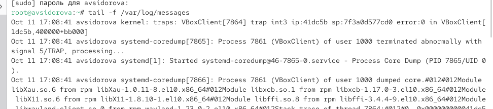{#fig:001 width=70%}

В третьей вкладке терминала вернемся к учётной записи своего пользователя (достаточно нажать Ctrl + d ) и попробуем получить полномочия администратора, но введем неправильный пароль. Обратим внимание, что во второй вкладке терминала с мониторингом событий или ничего не отобразится, или появится сообщение «FAILED SU (to root) username ...». Отображаемые на экране сообщения также фиксируются в файле /var/log/messages. 

В третьей вкладке терминала из оболочки пользователя введем logger hello  (рис. [-@fig:002]) 

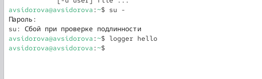{#fig:002 width=70%}

Во второй вкладке терминала с мониторингом остановим трассировку файла сообщений мониторинга реального времени, используя Ctrl + c . Затем запустим мониторинг сообщений безопасности (последние 20 строк соответствующего файла
логов). Мы увидите сообщения, которые ранее были зафиксированы во время ошибки авторизации при вводе команды su.  (рис. [-@fig:003]) 

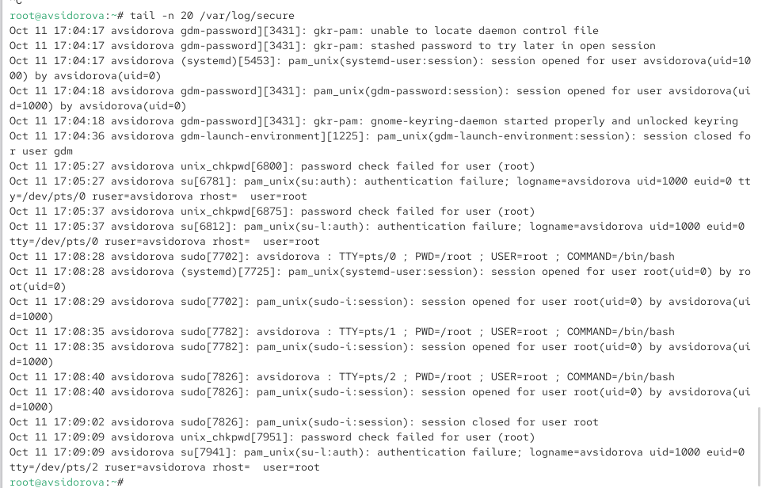{#fig:003 width=70%}

## Изменение правил rsyslog.conf

В первой вкладке терминала установим Apache (рис. [-@fig:004]) 

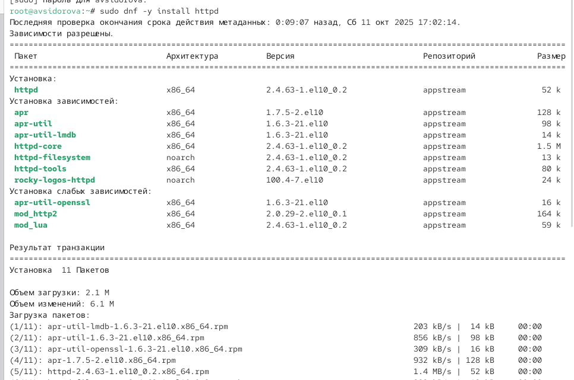{#fig:004 width=70%}

После окончания процесса установки запустим веб-службу (рис. [-@fig:005]) 

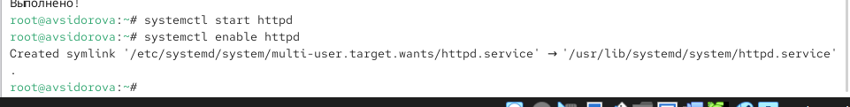{#fig:005 width=70%}

Во второй вкладке терминала посмотрим журнал сообщений об ошибках веб-службы (рис. [-@fig:006]) 

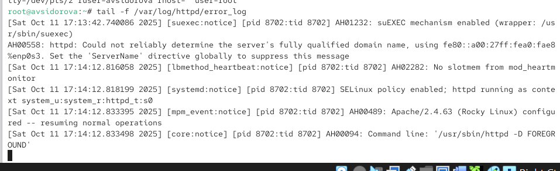{#fig:006 width=70%}

В третьей вкладке терминала получим полномочия администратора и в файле конфигурации /etc/httpd/conf/httpd.conf в конце добавим строку (рис. [-@fig:007]) 

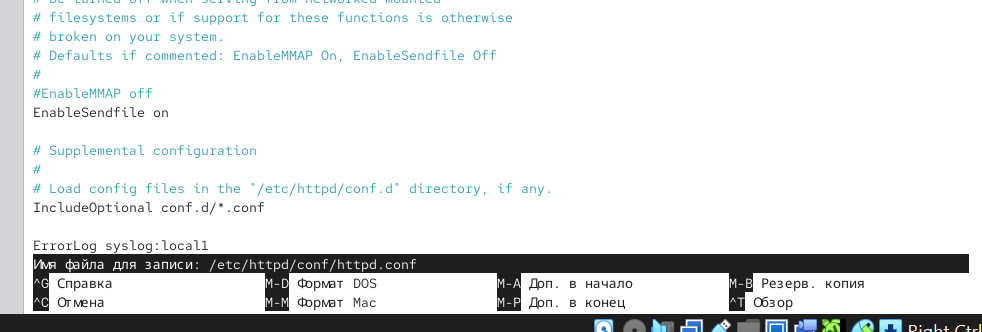{#fig:007 width=70%}

Здесь local0 — local7 — это «настраиваемые» средства (объекты), которые syslog предоставляет пользователю для регистрации событий приложения в системном журнале.

В каталоге /etc/rsyslog.d создадим файл мониторинга событий веб-службы: (рис. [-@fig:008]) 

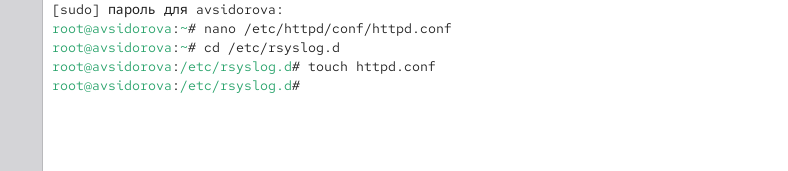{#fig:008 width=70%}

Открыв его на редактирование, пропишем в нём (рис. [-@fig:009]) 

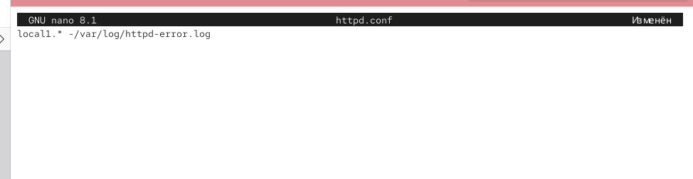{#fig:009 width=70%}

Эта строка позволит отправлять все сообщения, получаемые для объекта local1 (который теперь используется службой httpd), в файл /var/log/httpd-error.log.

Перейдем в первую вкладку терминала и перезагрузим конфигурацию rsyslogd и веб-службу: (рис. [-@fig:010]) 

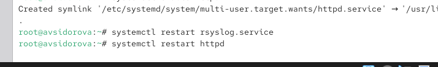{#fig:010 width=70%}

Все сообщения об ошибках веб-службы теперь будут записаны в файл /var/log/httpd-error.log, что можно наблюдать или в режиме реального времени, используя команду tail с соответствующими параметрами, или непосредственно просматривая указанный файл.

В третьей вкладке терминала создадим отдельный файл конфигурации для мониторинга отладочной информации: (рис. [-@fig:011]) 

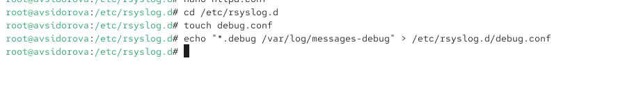{#fig:011 width=70%}

В первой вкладке терминала снова перезапустим rsyslogd: (рис. [-@fig:012]) 

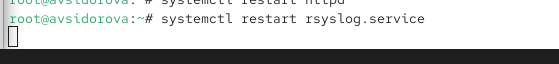{#fig:012 width=70%}

Во второй вкладке терминала запустим мониторинг отладочной информации: (рис. [-@fig:013]) 

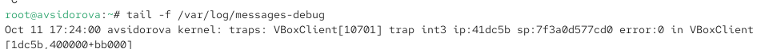{#fig:013 width=70%}

В третьей вкладке терминала введем: (рис. [-@fig:014]) 

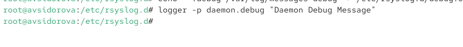{#fig:014 width=70%}

В терминале с мониторингом посмотрим сообщение отладки. 

## Использование journalctl

Во второй вкладке терминала посмотрим содержимое журнала с событиями с момента последнего запуска системы:
journalctl  (рис. [-@fig:015]) 

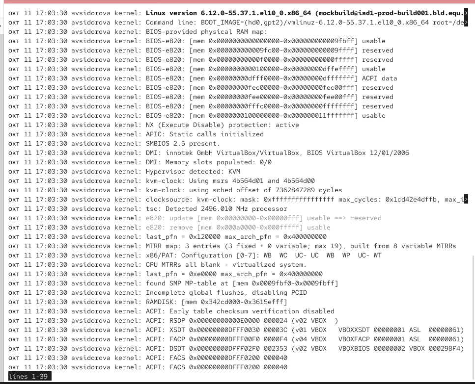{#fig:015 width=70%}

Просмотр содержимого журнала без использования пейджера:
journalctl --no-pager (рис. [-@fig:016]) 

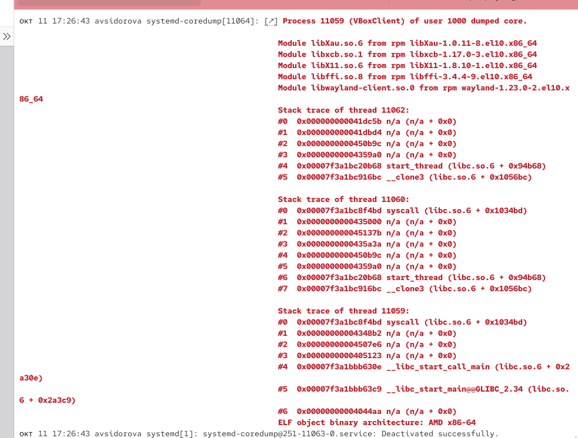{#fig:016 width=70%}

Режим просмотра журнала в реальном времени:
journalctl -f
Используем Ctrl + c для прерывания просмотра. (рис. [-@fig:017]) 

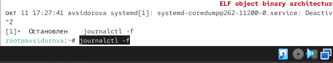{#fig:017 width=70%}

Для использования фильтрации просмотра конкретных параметров журнала введем
journalctl и дважды нажмите клавишу Tab .

Просмотрим события для UID0:
journalctl _UID=0 (рис. [-@fig:018]) 

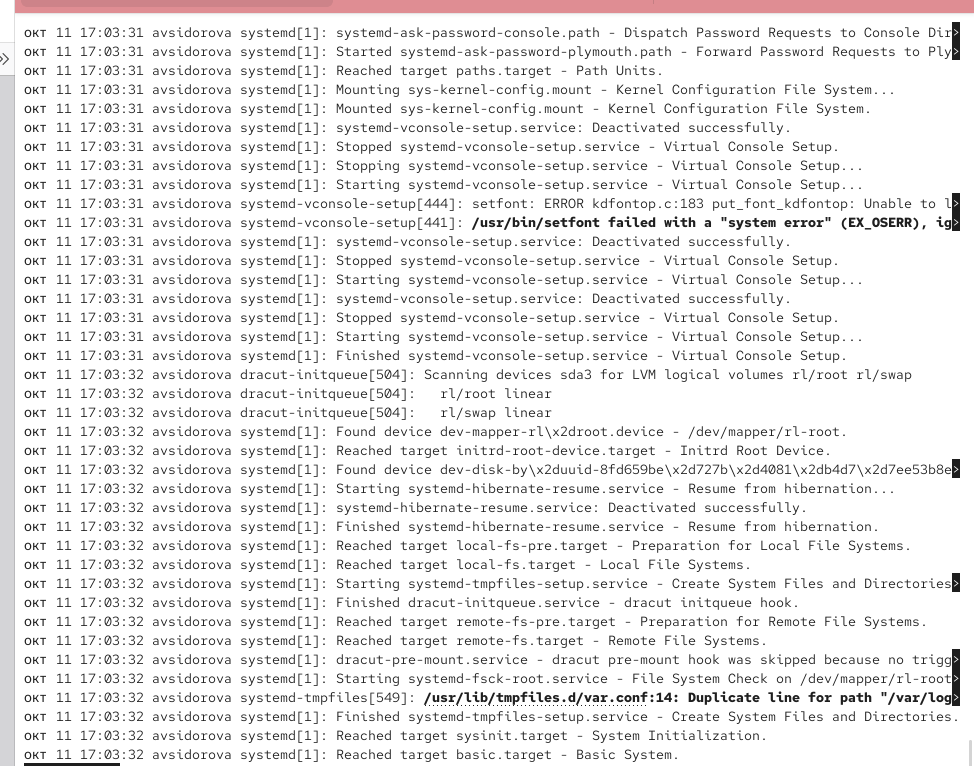{#fig:018 width=70%}

Для отображения последних 20 строк журнала введем
journalctl -n 20 (рис. [-@fig:019]) 

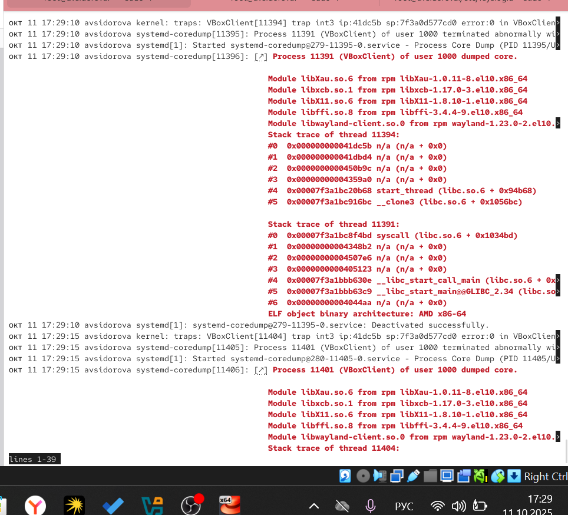{#fig:019 width=70%}

Для просмотра только сообщений об ошибках введем
journalctl -p err (рис. [-@fig:020]) 

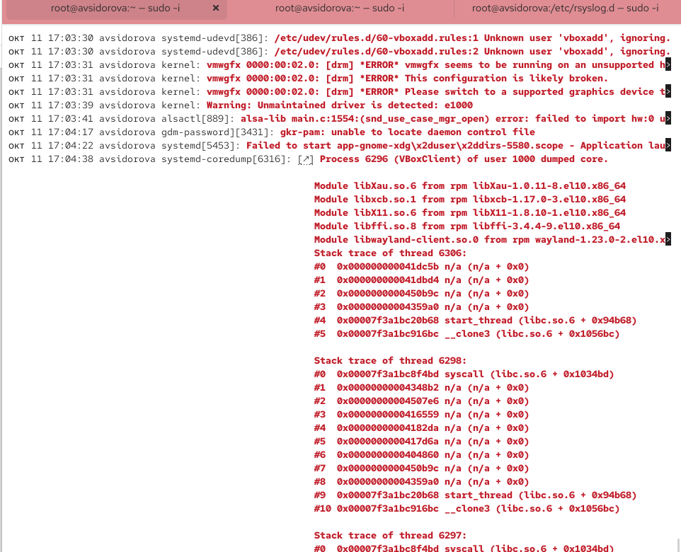{#fig:020 width=70%}

Для просмотра всех сообщений со вчерашнего дня введем
journalctl --since yesterday (рис. [-@fig:021]) 

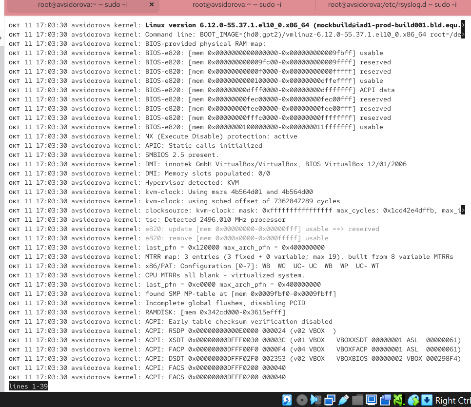{#fig:021 width=70%}

Используем
journalctl --since yesterday -p err (рис. [-@fig:022]) 

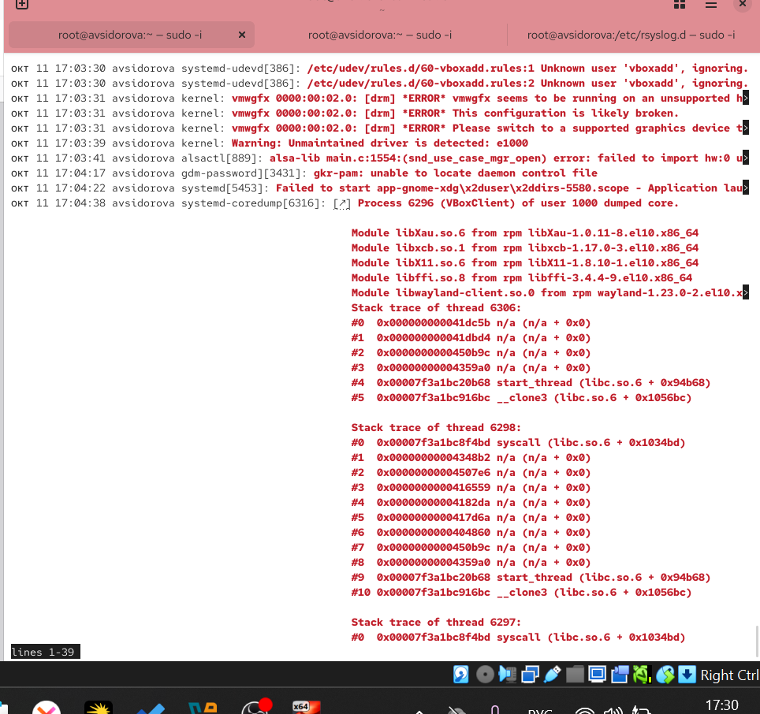{#fig:022 width=70%}

Для детальной информации используем
journalctl -o verbose (рис. [-@fig:023]) 

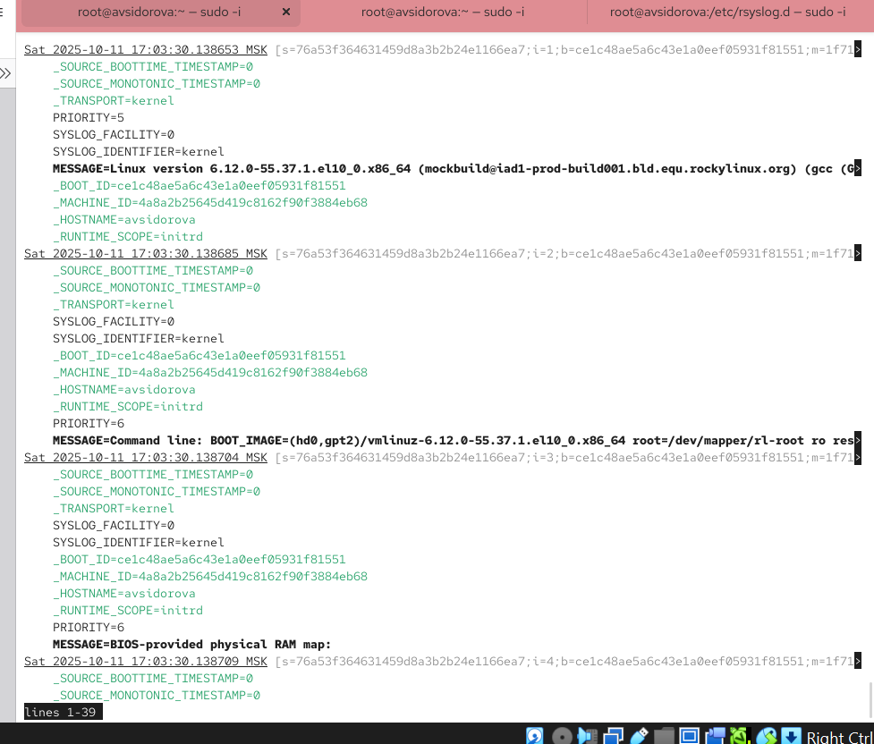{#fig:023 width=70%}

Для просмотра дополнительной информации о модуле sshd введем
journalctl _SYSTEMD_UNIT=sshd.service (рис. [-@fig:024]) 

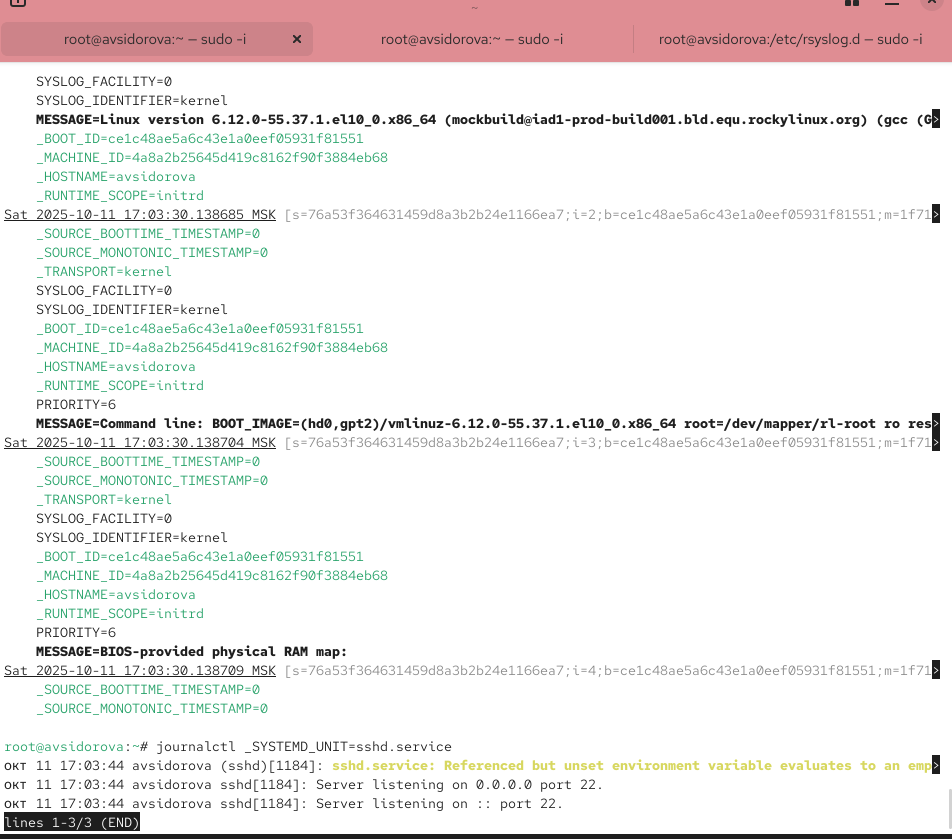{#fig:024 width=70%}

## Постоянный журнал journald

Запустим терминал и получим полномочия администратора.
Создадим каталог для хранения записей журнала
Скорректируем права доступа для каталога /var/log/journal, чтобы journald смог записывать в него информацию
Для принятия изменений необходимо или перезагрузить систему 
Журнал systemd теперь постоянный. Мы хотим видеть сообщения журнала с момента последней перезагрузки, используем journalctl -b (рис. [-@fig:025]) 

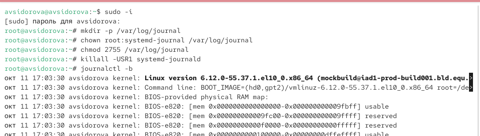{#fig:025 width=70%}

# Ответы на контрольные вопросы

1. /etc/rsyslog.conf и файлы в /etc/rsyslog.d/
2. /var/log/secure
3. Зависит от настройки logrotate, обычно - еженедельно.
4. *.info /var/log/messages.info
5. journalctl -f или tail -f /var/log/имя_файла
6. journalctl _PID=1 --since "09:00" --until "15:00"
7. journalctl -b
8. Создать каталог /var/log/journal, назначить права chown root:systemd-journal /var/log/journal, chmod 2755 /var/log/journal и перезапустить systemd-journald.

# Выводы

Получили навыки работы с журналами мониторинга различных событий в системе.

