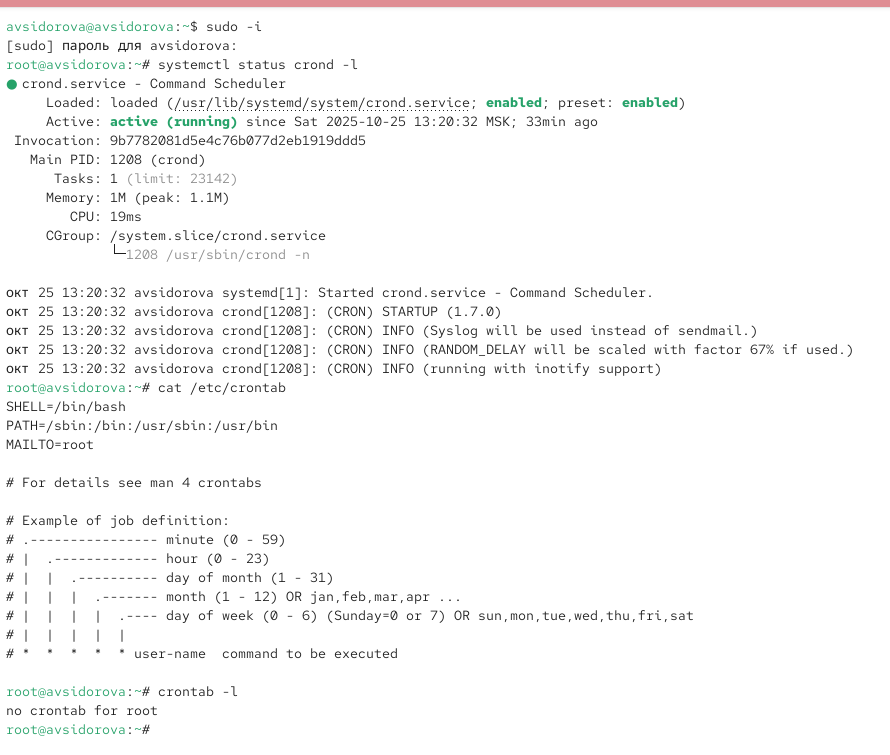
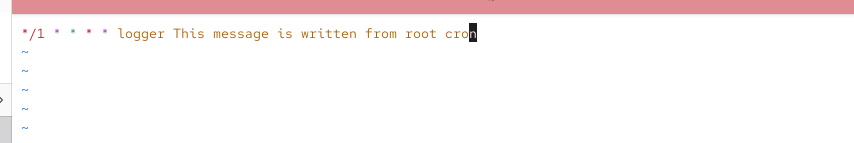
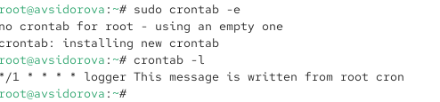
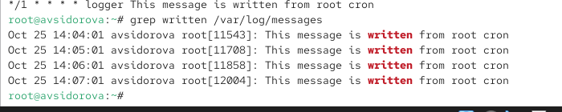
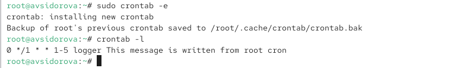
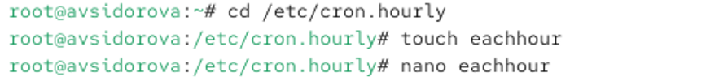
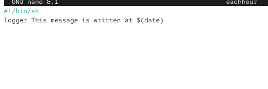
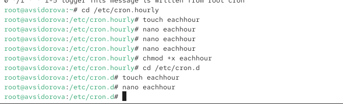
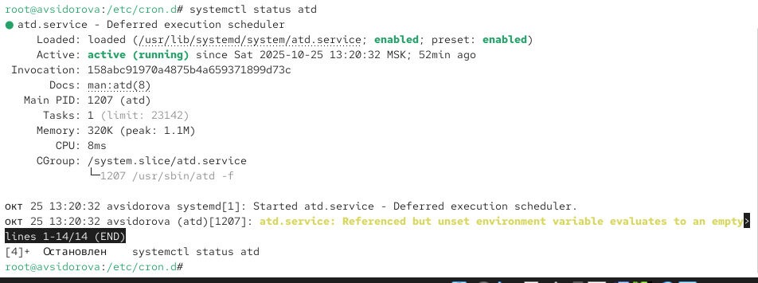
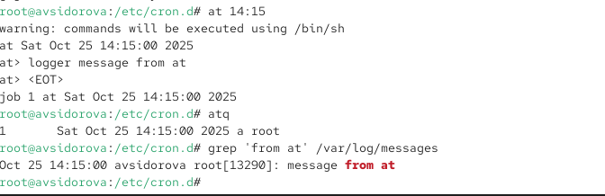

---
## Front matter
lang: ru-RU
title: Лабораторная работа №8
subtitle: Планировщики событий
author:
  - Сидорова А.В.
institute:
  - Российский университет дружбы народов, Москва, Россия

## i18n babel
babel-lang: russian
babel-otherlangs: english

## Formatting pdf
toc: false
toc-title: Содержание
slide_level: 2
aspectratio: 169
section-titles: true
theme: metropolis
header-includes:
 - \metroset{progressbar=frametitle,sectionpage=progressbar,numbering=fraction}
---

# Информация

## Докладчик

:::::::::::::: {.columns align=center}
::: {.column width="70%"}

  * Сидорова Арина Валерьевна
  * студентка НПИбд-02-24
  * ст.б. 1132242912
  * Российский университет дружбы народов

:::
::::::::::::::

# Вводная часть

## Актуальность

Автоматизация выполнения задач по расписанию является неотъемлемой частью администрирования операционных систем, позволяя обеспечивать регулярное обслуживание, резервное копирование и выполнение рутинных операций без вмешательства администратора.

## Объект и предмет исследования

### Объект исследования

-  Системы планирования заданий в операционной системе Linux.

### Предмет исследования

-  Демоны crond и atd, их конфигурационные файлы и утилиты управления.

## Цели и задачи

**Цель:**
Получить практические навыки работы с планировщиками заданий cron и at в операционной системе Linux.

**Задачи:**

1. Освоить настройку регулярных заданий с помощью демона crond.
2. Научиться планировать одноразовые задания с помощью демона atd.
3. Изучить форматы записи расписаний и различные способы организации заданий.
4. Получить навыки управления заданиями через системные каталоги и пользовательские расписания.

# Выполнение лабораторной работы

## Планирование задач с помощью cron

## Посмотрим статус демона crond:
systemctl status crond -l

Посмотрим содержимое файла конфигурации /etc/crontab:
cat /etc/crontab

Посмотрим список заданий в расписании:
crontab -l
Ничего не отобразится, так как расписание ещё не задано. 

{#fig:001 width=70%}

## Откроем файл расписания на редактирование:

{#fig:002 width=70%}

## Посмотрим список заданий в расписании:
crontab -l
В расписании должна появиться запись о запланированном событии. 

{#fig:003 width=70%}

## Не выключая систему, через некоторое время (2–3 минуты) просмотрим журнал системных событий:
grep written /var/log/messages
В отчёте отразим результат. 

{#fig:004 width=70%}

## Изменим запись в расписании crontab на следующую:
0 */1 * * 1-5 logger This message is written from root cron 
Посмотрим список заданий в расписании: crontab -l 

{#fig:005 width=70%}

## Перейдем в каталог /etc/cron.hourly и создайте в нём файл сценария с именем eachhour:
cd /etc/cron.hourly
touch eachhour 

{#fig:006 width=70%}

## Откроем файл eachhour для редактирования и пропишем в нём следующий скрипт (запись сообщения в системный журнал):
#!/bin/sh
logger This message is written at $(date) 

{#fig:007 width=70%}

Сделаем файл сценария eachhour исполняемым:
chmod +x eachhour

## Теперь перейдем в каталог /etc/crond.d и создадим в нём файл с расписанием eachhour:
cd /etc/cron.d
touch eachhour 

{#fig:008 width=70%}

## Откроем этот файл для редактирования и поместим в него следующее содержимое:
11 * * * * root logger This message is written from /etc/cron.d 

{#fig:009 width=70%}

## Планирование заданий с помощью at

Проверим, что служба atd загружена и включена:
systemctl status atd 

{#fig:010 width=70%}

## Зададим выполнение команды logger message from at в 14:15

Затем введем
logger message from at
Используем Ctrl + d , чтобы закрыть оболочку.

Убедимся, что задание действительно запланировано:
atq
С помощью команды grep 'from at' /var/log/messages посмотрим, появилось ли соответствующее сообщение в лог-файле в указанное нами время. 

{#fig:011 width=70%}

# Результаты

- Настроено регулярное задание в crontab с записью в системный журнал.
- Создан исполняемый скрипт в каталоге /etc/cron.hourly.
- Настроено системное задание через /etc/cron.d.
- Запланировано одноразовое задание с помощью at.
- Освоены команды crontab -e, crontab -l, at, atq.

:::

