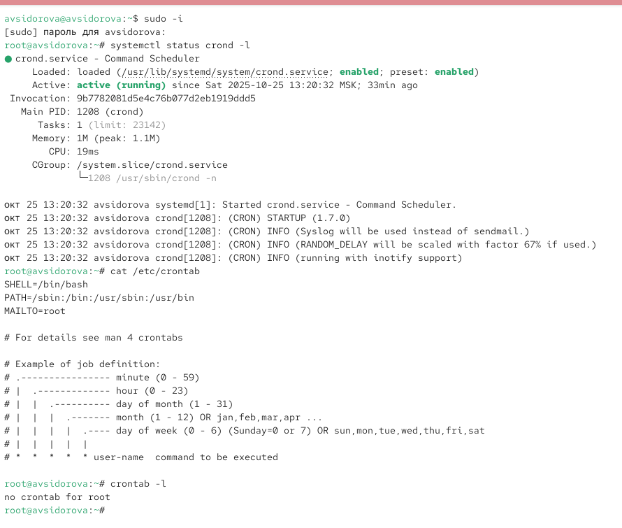
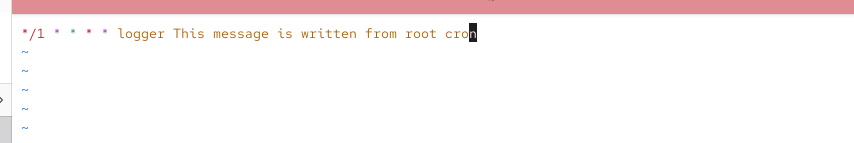
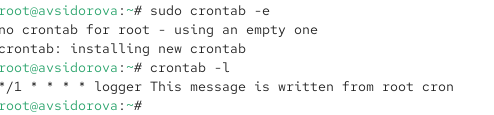
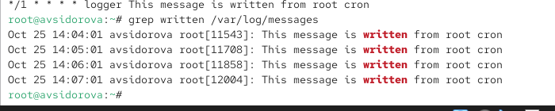
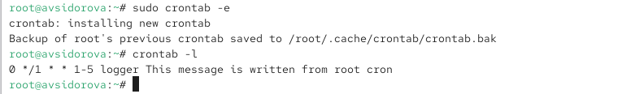
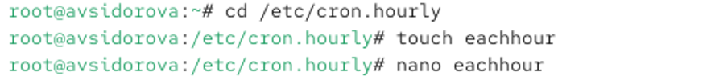
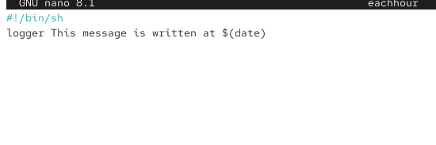
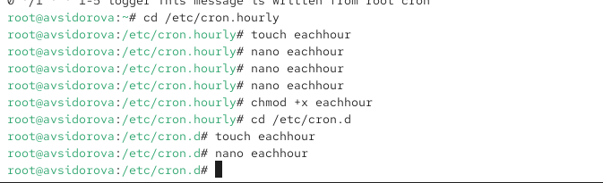
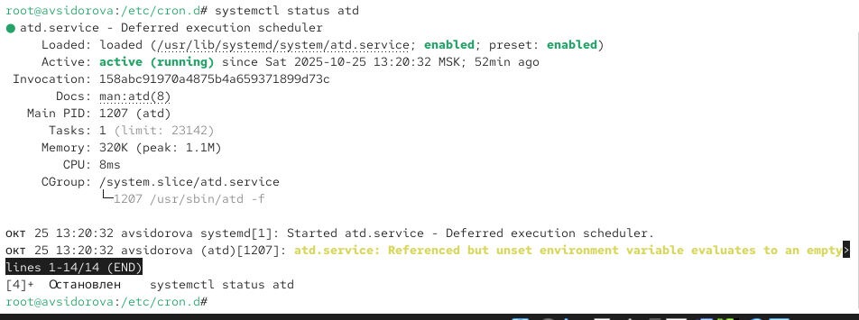
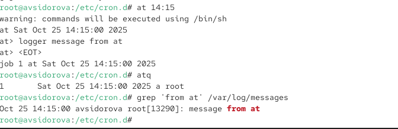

---
## Front matter
title: "Отчет по лабораторной работе №8"
subtitle: "Планировщики событий"
author: "Сидорова Арина Валерьевна"

## Generic otions
lang: ru-RU
toc-title: "Содержание"

## Bibliography
bibliography: bib/cite.bib
csl: pandoc/csl/gost-r-7-0-5-2008-numeric.csl

## Pdf output format
toc: true # Table of contents
toc-depth: 2
lof: true # List of figures
fontsize: 12pt
linestretch: 1.5
papersize: a4
documentclass: scrreprt
## I18n polyglossia
polyglossia-lang:
  name: russian
  options:
	- spelling=modern
	- babelshorthands=true
polyglossia-otherlangs:
  name: english
## I18n babel
babel-lang: russian
babel-otherlangs: english
## Fonts
mainfont: PT Serif
romanfont: PT Serif
sansfont: PT Sans
monofont: PT Mono
mainfontoptions: Ligatures=TeX
romanfontoptions: Ligatures=TeX
sansfontoptions: Ligatures=TeX,Scale=MatchLowercase
monofontoptions: Scale=MatchLowercase,Scale=0.9
## Biblatex
biblatex: true
biblio-style: "gost-numeric"
biblatexoptions:
  - parentracker=true
  - backend=biber
  - hyperref=auto
  - language=auto
  - autolang=other*
  - citestyle=gost-numeric
## Pandoc-crossref LaTeX customization
figureTitle: "Рис."
tableTitle: "Таблица"
listingTitle: "Листинг"
lofTitle: "Список иллюстраций"
lolTitle: "Листинги"
## Misc options
indent: true
header-includes:
  - \usepackage{indentfirst}
  - \usepackage{float} # keep figures where there are in the text
  - \floatplacement{figure}{H} # keep figures where there are in the text
---

# Цель работы

Получение навыков работы с планировщиками событий cron и at.

# Выполнение лабораторной работы

## Планирование задач с помощью cron

Запустим терминал и получим полномочия администратора:
su -

Посмотрим статус демона crond:
systemctl status crond -l

Посмотрим содержимое файла конфигурации /etc/crontab:
cat /etc/crontab

Посмотрим список заданий в расписании:
crontab -l
Ничего не отобразится, так как расписание ещё не задано. (рис. [-@fig:001]) 

{#fig:001 width=70%}

Откроем файл расписания на редактирование:
crontab -e
Команда запустит интерфейс редактора (по умолчанию используется vi). Добавим следующую строку в файл расписания (запись сообщения в системный журнал), используя Ins для перехода в vi в режим ввода:
*/1 * * * * logger This message is written from root cron
Закроем сеанс редактирования vi и сохраним изменения, используя команду vi (рис. [-@fig:002]) 

{#fig:002 width=70%}

Посмотрим список заданий в расписании:
crontab -l
В расписании должна появиться запись о запланированном событии. (рис. [-@fig:003]) 

{#fig:003 width=70%}

Не выключая систему, через некоторое время (2–3 минуты) просмотрим журнал системных событий:
grep written /var/log/messages
В отчёте отразим результат. (рис. [-@fig:004]) 

{#fig:004 width=70%}

Изменим запись в расписании crontab на следующую:
0 */1 * * 1-5 logger This message is written from root cron 
Посмотрим список заданий в расписании: crontab -l (рис. [-@fig:005]) 

{#fig:005 width=70%}

Перейдем в каталог /etc/cron.hourly и создайте в нём файл сценария с именем
eachhour:
cd /etc/cron.hourly
touch eachhour (рис. [-@fig:006]) 

{#fig:006 width=70%}

Откроем файл eachhour для редактирования и пропишем в нём следующий скрипт (запись сообщения в системный журнал):
#!/bin/sh
logger This message is written at $(date) (рис. [-@fig:007]) 

{#fig:007 width=70%}

Сделаем файл сценария eachhour исполняемым:
chmod +x eachhour

Теперь перейдем в каталог /etc/crond.d и создадим в нём файл с расписанием eachhour:
cd /etc/cron.d
touch eachhour (рис. [-@fig:008]) 

{#fig:008 width=70%}

Откроем этот файл для редактирования и поместим в него следующее содержимое:
11 * * * * root logger This message is written from /etc/cron.d (рис. [-@fig:009]) 

{#fig:009 width=70%}

## Планирование заданий с помощью at

Запустим терминал и получим полномочия администратора:
su -

Проверим, что служба atd загружена и включена:
systemctl status atd (рис. [-@fig:010]) 

{#fig:010 width=70%}

Зададим выполнение команды logger message from at в 9:30 (или замените на любое другое время, когда вы работаете над этим упражнением). Для этого введите at 9:30
Затем введем
logger message from at
Используем Ctrl + d , чтобы закрыть оболочку.

Убедимся, что задание действительно запланировано:
atq
С помощью команды grep 'from at' /var/log/messages посмотрим, появилось ли соответствующее сообщение в лог-файле в указанное нами время. (рис. [-@fig:011]) 

{#fig:011 width=70%}

# Ответы на контрольные вопросы

1. 0 0 */14 * * команда или через каталог cron.weekly со скриптом
2. 0 2 1,15 * * команда
3. */2 * * * * команда
4. 0 0 19 9 * команда
5. 0 0 * 9 4 команда
6. crontab -u alice -e
7. Добавить пользователя bob в файл /etc/cron.deny
8. Использовать anacron или настроить повторение задания с запасом времени
9. atq или at -l

# Выводы

Получили навыки работы с планировщиками событий cron и at.

