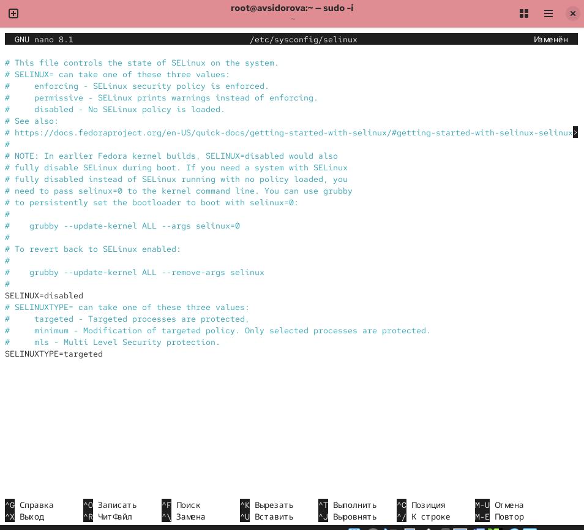

---
## Front matter
lang: ru-RU
title: Лабораторная работа №8
subtitle: Планировщики событий
author:
  - Сидорова А.В.
institute:
  - Российский университет дружбы народов, Москва, Россия

## i18n babel
babel-lang: russian
babel-otherlangs: english

## Formatting pdf
toc: false
toc-title: Содержание
slide_level: 2
aspectratio: 169
section-titles: true
theme: metropolis
header-includes:
 - \metroset{progressbar=frametitle,sectionpage=progressbar,numbering=fraction}
---

# Информация

## Докладчик

:::::::::::::: {.columns align=center}
::: {.column width="70%"}

  * Сидорова Арина Валерьевна
  * студентка НПИбд-02-24
  * ст.б. 1132242912
  * Российский университет дружбы народов

:::
::::::::::::::

# Вводная часть

## Актуальность

SELinux является критически важным компонентом безопасности современных Linux-систем, обеспечивающим мандатный контроль доступа для защиты от несанкционированных действий и ограничения последствий потенциальных уязвимостей.

## Объект и предмет исследования

### Объект исследования

-  Система принудительного контроля доступа SELinux в операционной системе Linux.

### Предмет исследования

-  Механизмы управления контекстами безопасности, режимами работы и политиками доступа SELinux.

## Цели и задачи

**Цель:**
Получить практические навыки работы с системой безопасности SELinux, включая управление режимами работы, контекстами безопасности и политиками доступа.

**Задачи:**

1. Освоить управление режимами работы SELinux (Enforcing, Permissive, Disabled).
2. Научиться восстанавливать контексты безопасности файлов и каталогов.
3. Получить навыки настройки контекстов безопасности для нестандартных расположений служб.
4. Изучить работу с переключателями (boolean) SELinux.

# Выполнение лабораторной работы

## Управление режимами SELinux

Просмотрим текущую информацию о состоянии SELinux: sestatus -v  Посмотрим, в каком режиме работает SELinux:
getenforce Изменим режим работы SELinux на разрешающий setenforce 0 и снова введем getenforce 

{#fig:001 width=70%}

## В файле /etc/sysconfig/selinux с помощью редактора установим SELINUX=disabled

{#fig:002 width=70%}

## Посмотрим статус SELinux: getenforce SELinux теперь отключён. 

Попробуем переключить режим работы SELinux:
setenforce 1
Мы не можем переключаться между отключённым и принудительным режимом без перезагрузки системы. 

{#fig:003 width=70%}

## Откроем файл /etc/sysconfig/selinux с помощью редактора и установим:
SELINUX=enforcing
Перезагрузим систему. 

{#fig:004 width=70%}

## После перезагрузки в терминале с полномочиями администратора просмотрим текущую информацию о состоянии SELinux:
sestatus -v 

{#fig:005 width=70%}

## Использование restorecon для восстановления контекста безопасности

Посмотрим контекст безопасности файла /etc/hosts. У файла есть метка контекста net_conf_t.

Скопируем файл /etc/hosts в домашний каталог. Проверим контекст файла ~/hosts.

Поскольку копирование считается созданием нового файла, то параметр контекста в файле ~/hosts, расположенном в домашнем каталоге, станет admin_home_t.

Попытаемся перезаписать существующий файл hosts из домашнего каталога в каталог /etc: mv ~/hosts /etc Убедимся, что тип контекста по-прежнему установлен на admin_home_t.

Исправим контекст безопасности. 

Убедимся, что тип контекста изменился:
ls -Z /etc/hosts

## Для массового исправления контекста безопасности на файловой системе введем

touch /.autorelabel  

{#fig:006 width=70%}

## Настройка контекста безопасности для нестандартного расположения файлов веб-сервера

Установим необходимое программное обеспечение 

{#fig:007 width=70%}

## Создадим новое хранилище для файлов web-сервера

Создадим файл index.html в каталоге с контентом веб-сервера и поместим в файл следующий текст:
Welcome to my web-server  

{#fig:008 width=70%}

## В файле /etc/httpd/conf/httpd.conf закомментируем строку

Затем в этом же файле ниже закомментирем раздел

{#fig:009 width=70%}

##  Запустим веб-сервер и службу httpd:

systemctl start httpd
systemctl enable httpd 

{#fig:010 width=70%}

##  В терминале под учётной записью своего пользователя при обращении к веб-серверу

в текстовом браузере lynx:
lynx http://localhost
 
Мы увидим веб-страницу Red Hat по умолчанию, а не содержимое только что созданного файла index.html.

{#fig:011 width=70%}

## В терминале с полномочиями администратора применим новую метку контекста

к /web:
semanage fcontext -a -t httpd_sys_content_t "/web(/.*)?"

Восстановим контекст безопасности:
restorecon -R -v /web 

{#fig:012 width=70%}

## В терминале под учётной записью своего пользователя снова обратимся к веб-серверу:

lynx http://localhost
На экране отображена запись «Welcome to my web-server». 

{#fig:013 width=70%}

## Работа с переключателями SELinux

Посмотрим список переключателей SELinux для службы ftp.

Для службы ftpd_anon посмотрим список переключателей:
semanage boolean -l | grep ftpd_anon

Изменим текущее значение переключателя для службы ftpd_anon_write с off на
on:
setsebool ftpd_anon_write on

## Повторно посмотрм список переключателей SELinux для службы ftpd_anon_write:

getsebool ftpd_anon_write

Посмотрим список переключателей:
semanage boolean -l | grep ftpd_anon
Обратим внимание, что настройка времени выполнения включена, но постоянная настройка по-прежнему отключена.

##  Изменим постоянное значение переключателя для службы ftpd_anon_write с off на on:

setsebool -P ftpd_anon_write on

Посмотрим список переключателей:
semanage boolean -l | grep ftpd_anon  

{#fig:014 width=70%}

# Результаты

- Освоено переключение между режимами SELinux с помощью setenforce и редактирования конфигурационных файлов.
- Применена команда restorecon для восстановления корректных контекстов безопасности.
- Настроен контекст httpd_sys_content_t для нестандартного каталога веб-сервера /web.
- Освоено управление переключателями SELinux через setsebool и semanage boolean.
- Получены навыки диагностики проблем с помощью утилит sestatus, getenforce, ls -Z.

:::

