---
## Front matter
title: "Отчет по лабораторной работе №9"
subtitle: "Управление SELinux"
author: "Сидорова Арина Валерьевна"

## Generic otions
lang: ru-RU
toc-title: "Содержание"

## Bibliography
bibliography: bib/cite.bib
csl: pandoc/csl/gost-r-7-0-5-2008-numeric.csl

## Pdf output format
toc: true # Table of contents
toc-depth: 2
lof: true # List of figures
fontsize: 12pt
linestretch: 1.5
papersize: a4
documentclass: scrreprt
## I18n polyglossia
polyglossia-lang:
  name: russian
  options:
	- spelling=modern
	- babelshorthands=true
polyglossia-otherlangs:
  name: english
## I18n babel
babel-lang: russian
babel-otherlangs: english
## Fonts
mainfont: PT Serif
romanfont: PT Serif
sansfont: PT Sans
monofont: PT Mono
mainfontoptions: Ligatures=TeX
romanfontoptions: Ligatures=TeX
sansfontoptions: Ligatures=TeX,Scale=MatchLowercase
monofontoptions: Scale=MatchLowercase,Scale=0.9
## Biblatex
biblatex: true
biblio-style: "gost-numeric"
biblatexoptions:
  - parentracker=true
  - backend=biber
  - hyperref=auto
  - language=auto
  - autolang=other*
  - citestyle=gost-numeric
## Pandoc-crossref LaTeX customization
figureTitle: "Рис."
tableTitle: "Таблица"
listingTitle: "Листинг"
lofTitle: "Список иллюстраций"
lolTitle: "Листинги"
## Misc options
indent: true
header-includes:
  - \usepackage{indentfirst}
  - \usepackage{float} # keep figures where there are in the text
  - \floatplacement{figure}{H} # keep figures where there are in the text
---

# Цель работы

Получить навыки работы с контекстом безопасности и политиками SELinux.

# Выполнение лабораторной работы

## Управление режимами SELinux

Просмотрим текущую информацию о состоянии SELinux:
sestatus -v 

Посмотрим, в каком режиме работает SELinux:
getenforce

Изменим режим работы SELinux на разрешающий 
setenforce 0
и снова введем
getenforce (рис. [-@fig:001]) 

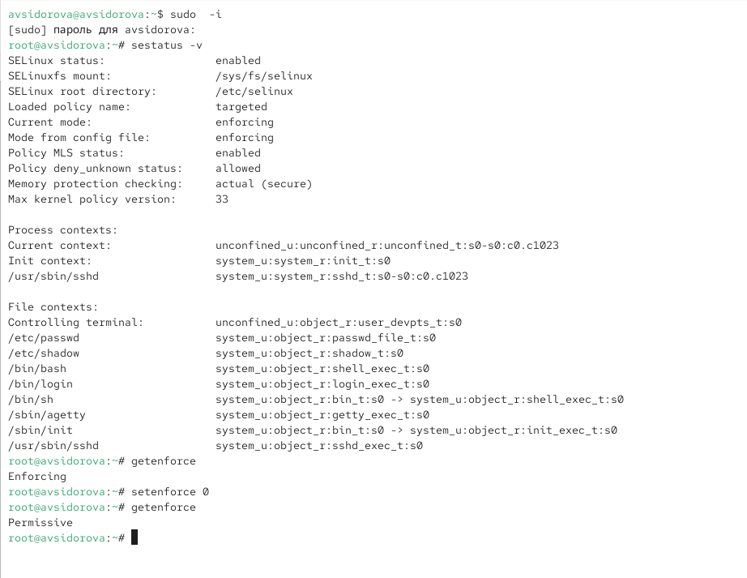{#fig:001 width=70%}

В файле /etc/sysconfig/selinux с помощью редактора установим
SELINUX=disabled
Перезагрузим систему (рис. [-@fig:002]) 

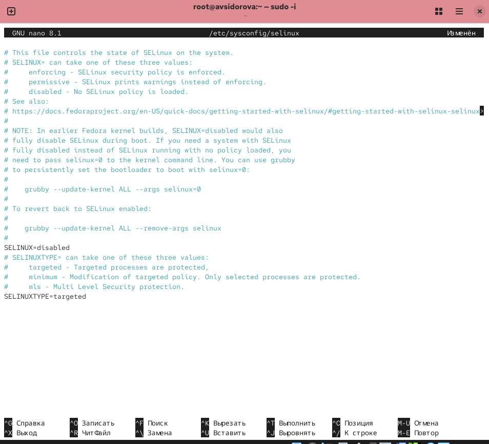{#fig:002 width=70%}

Посмотрим статус SELinux:
getenforce
SELinux теперь отключён. 

Попробуем переключить режим работы SELinux:
setenforce 1
Мы не можем переключаться между отключённым и принудительным режимом без перезагрузки системы. (рис. [-@fig:003]) 

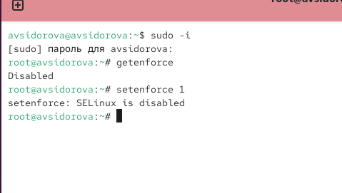{#fig:003 width=70%}

Откроем файл /etc/sysconfig/selinux с помощью редактора и установим:
SELINUX=enforcing
Перезагрузим систему. (рис. [-@fig:004]) 

{#fig:004 width=70%}

После перезагрузки в терминале с полномочиями администратора просмотрим текущую информацию о состоянии SELinux:
sestatus -v (рис. [-@fig:005]) 

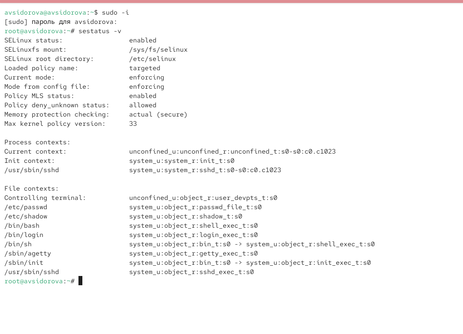{#fig:005 width=70%}

## Использование restorecon для восстановления контекста безопасности

Посмотрим контекст безопасности файла /etc/hosts. У файла есть метка контекста net_conf_t.

Скопируем файл /etc/hosts в домашний каталог. Проверим контекст файла ~/hosts.

Поскольку копирование считается созданием нового файла, то параметр контекста в файле ~/hosts, расположенном в домашнем каталоге, станет admin_home_t.

Попытаемся перезаписать существующий файл hosts из домашнего каталога в каталог /etc: mv ~/hosts /etc Убедимся, что тип контекста по-прежнему установлен на admin_home_t.

Исправим контекст безопасности. 

Убедимся, что тип контекста изменился:
ls -Z /etc/hosts

Для массового исправления контекста безопасности на файловой системе введем
touch /.autorelabel (рис. [-@fig:006]) 

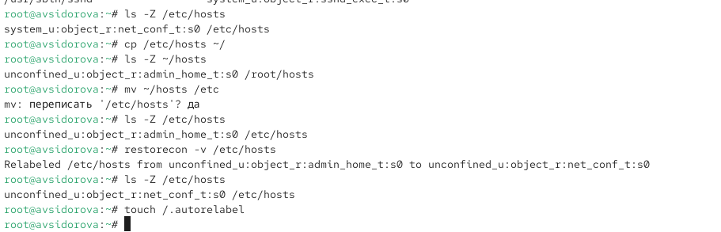{#fig:006 width=70%}

## Настройка контекста безопасности для нестандартного расположения файлов веб-сервера

Установим необходимое программное обеспечение (рис. [-@fig:007]) 

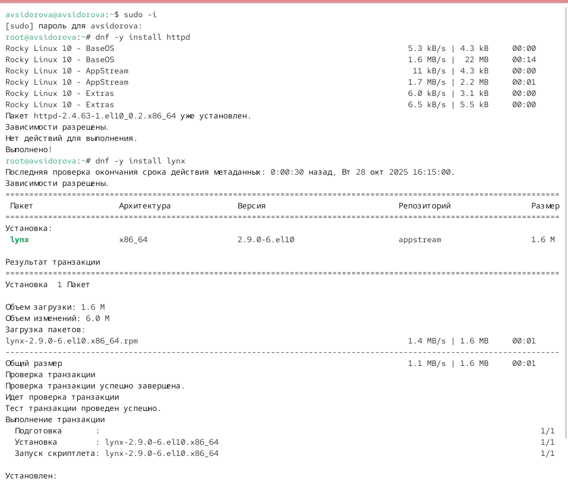{#fig:007 width=70%}

Создадим новое хранилище для файлов web-сервера

Создадим файл index.html в каталоге с контентом веб-сервера и поместим в файл следующий текст:
Welcome to my web-server (рис. [-@fig:008]) 

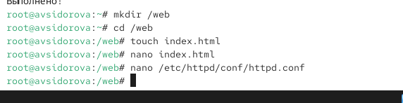{#fig:008 width=70%}

В файле /etc/httpd/conf/httpd.conf закомментируем строку
DocumentRoot "/var/www/html" и ниже добавим строку
DocumentRoot "/web"
Затем в этом же файле ниже закомментирем раздел
<Directory "/var/www">
AllowOverride None
Require all granted
</Directory>
и добавим следующий раздел, определяющий правила доступа:
<Directory "/web">
AllowOverride None
Require all granted
</Directory>  (рис. [-@fig:009]) 

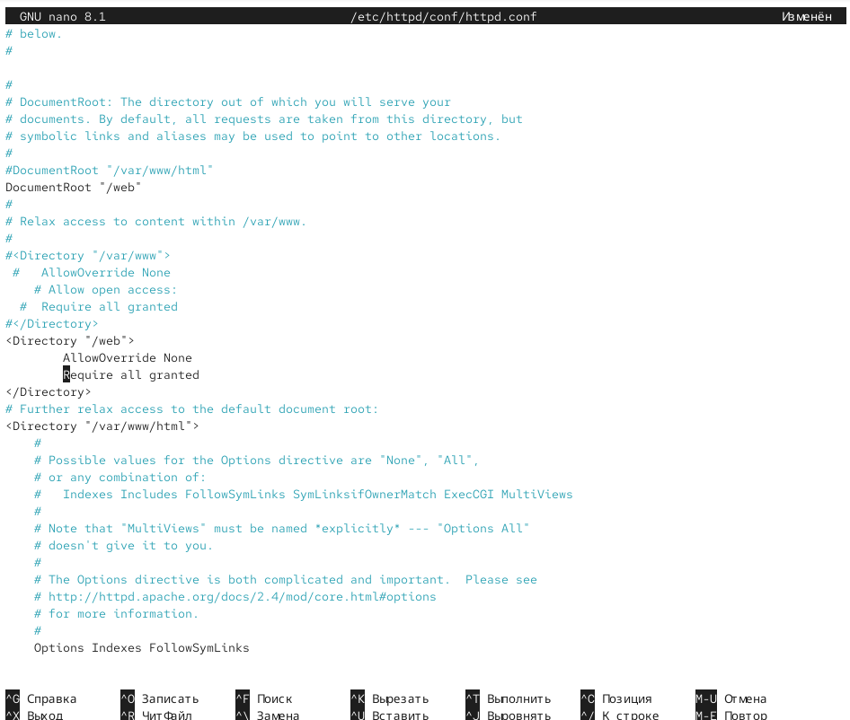{#fig:009 width=70%}

Запустим веб-сервер и службу httpd:
systemctl start httpd
systemctl enable httpd (рис. [-@fig:010]) 

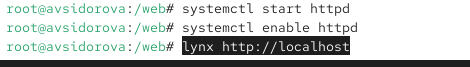{#fig:010 width=70%}

В терминале под учётной записью своего пользователя при обращении к веб-серверу
в текстовом браузере lynx:
lynx http://localhost
 
Мы увидим веб-страницу Red Hat по умолчанию, а не содержимое только что созданного файла index.html. (рис. [-@fig:011]) 

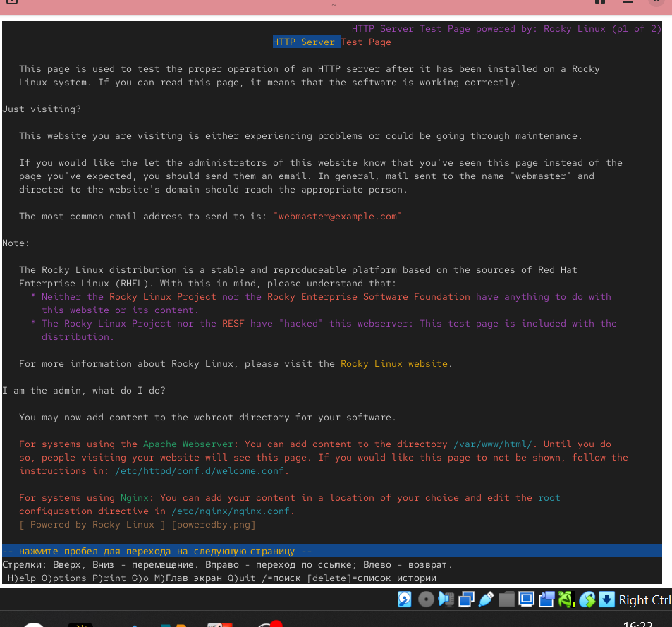{#fig:011 width=70%}

В терминале с полномочиями администратора применим новую метку контекста
к /web:
semanage fcontext -a -t httpd_sys_content_t "/web(/.*)?"

Восстановим контекст безопасности:
restorecon -R -v /web (рис. [-@fig:012]) 

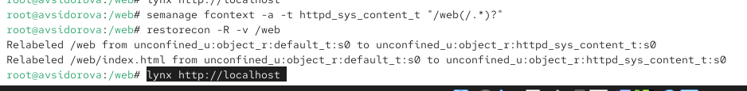{#fig:012 width=70%}

В терминале под учётной записью своего пользователя снова обратимся к веб-серверу:
lynx http://localhost
На экране отображена запись «Welcome to my web-server». (рис. [-@fig:013]) 

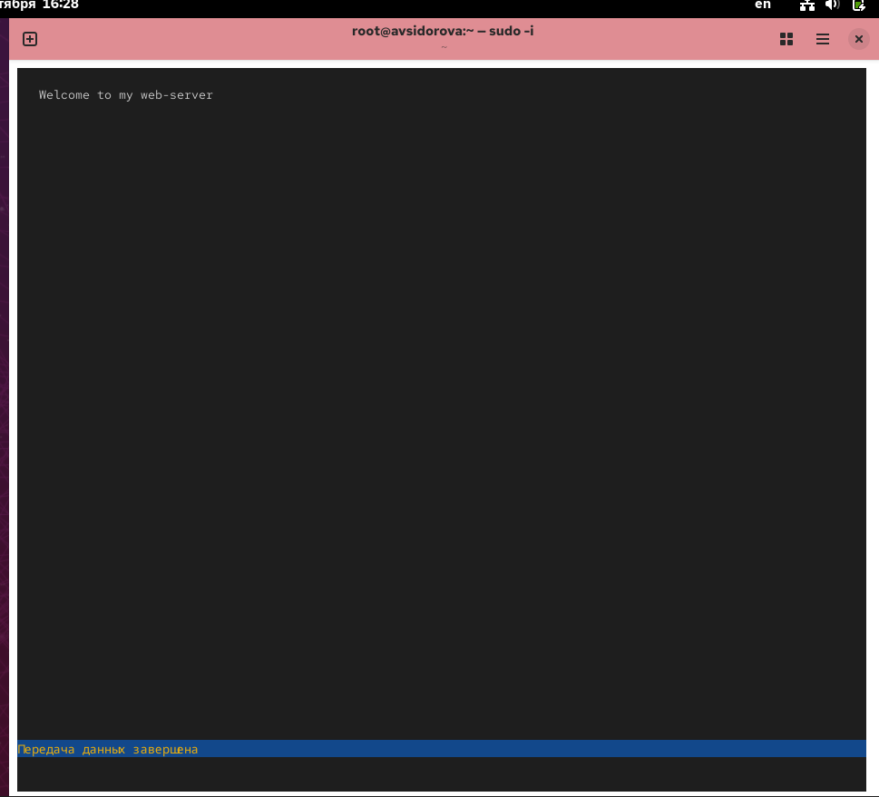{#fig:013 width=70%}

## Работа с переключателями SELinux

Посмотрим список переключателей SELinux для службы ftp.

Для службы ftpd_anon посмотрим список переключателей:
semanage boolean -l | grep ftpd_anon

Изменим текущее значение переключателя для службы ftpd_anon_write с off на
on:
setsebool ftpd_anon_write on

Повторно посмотрм список переключателей SELinux для службы ftpd_anon_write:
getsebool ftpd_anon_write

Посмотрим список переключателей:
semanage boolean -l | grep ftpd_anon
Обратим внимание, что настройка времени выполнения включена, но постоянная настройка по-прежнему отключена.

Изменим постоянное значение переключателя для службы ftpd_anon_write с off на on:
setsebool -P ftpd_anon_write on

Посмотрим список переключателей:
semanage boolean -l | grep ftpd_anon  (рис. [-@fig:014]) 

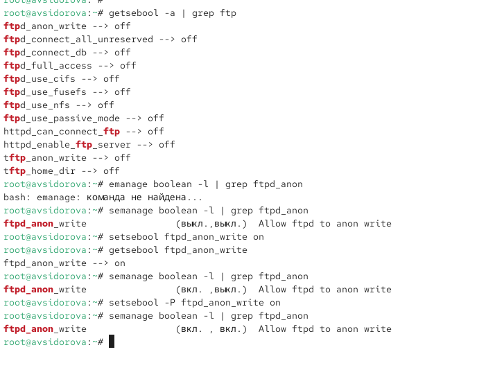{#fig:014 width=70%}

# Ответы на контрольные вопросы

1. setenforce 0
2. getsebool -a
3. setroubleshoot или setroubleshoot-server
4. semanage fcontext -a -t httpd_sys_content_t "/web(/.*)?" затем restorecon -R /web
5. /etc/selinux/config (параметр SELINUX=disabled)
6. /var/log/audit/audit.log и /var/log/messages
7. semanage boolean -l | grep ftp или getsebool -a | grep ftp
8. Временно перевести SELinux в режим Permissive (setenforce 0) и проверить работу службы

# Выводы

Получили навыки работы с контекстом безопасности и политиками SELinux.

