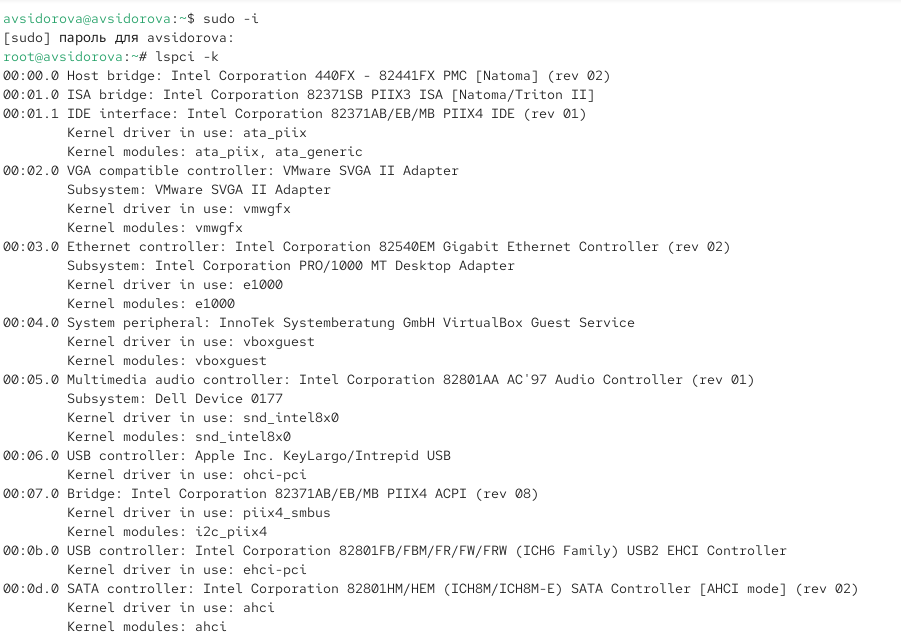
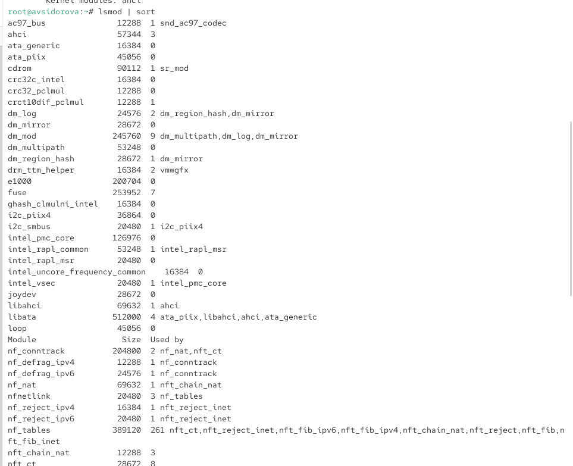
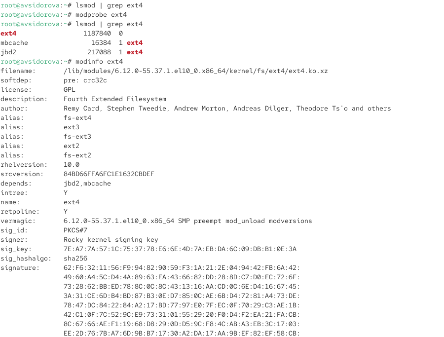
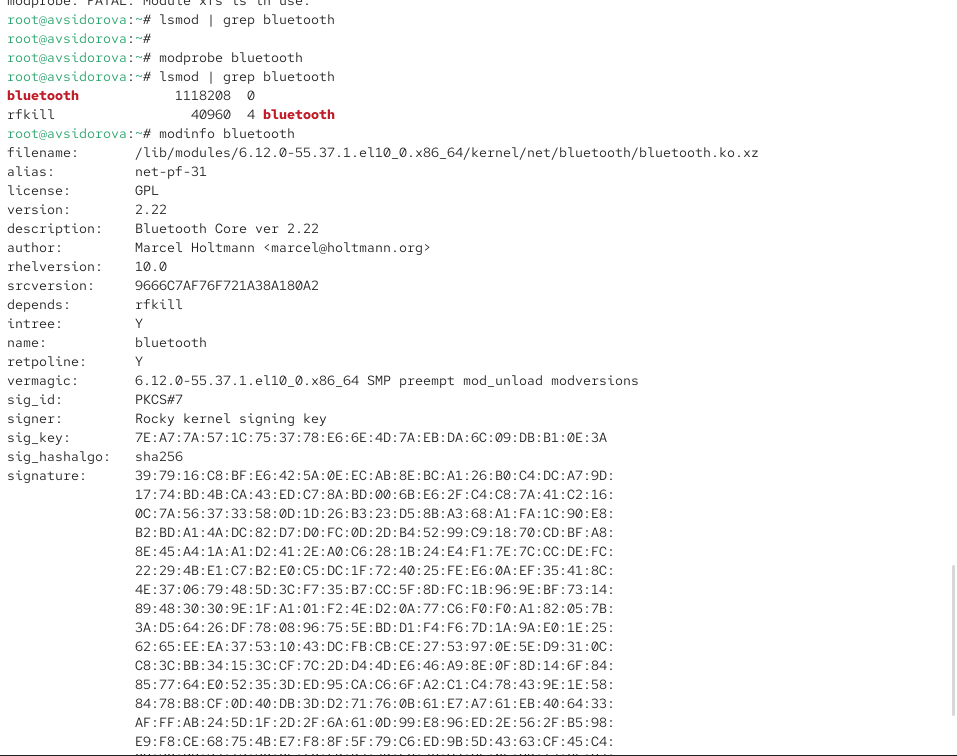
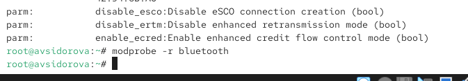
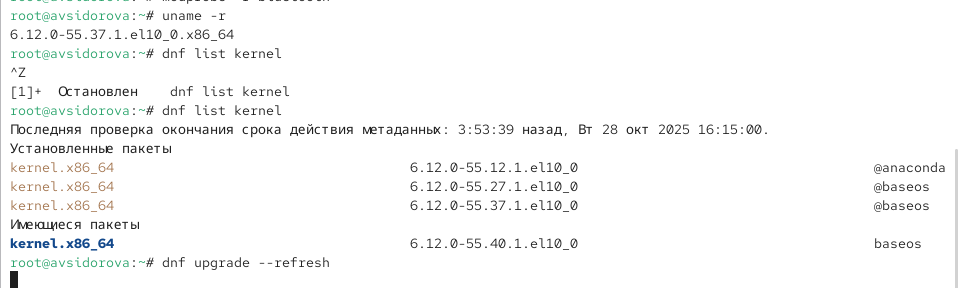
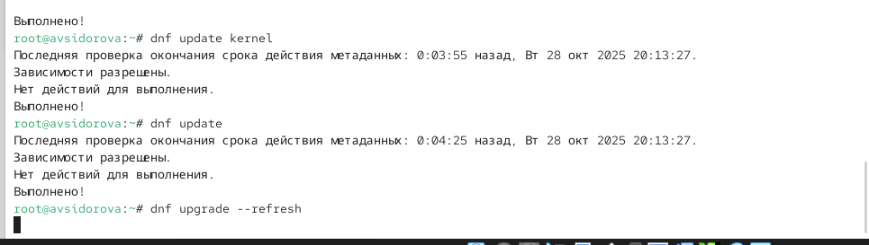
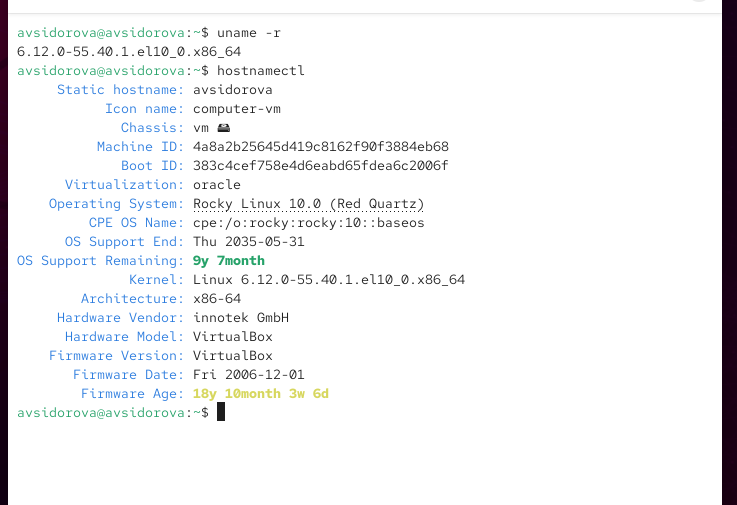

---
## Front matter
lang: ru-RU
title: Лабораторная работа №10
subtitle: Основы работы с модулями ядра операционной системы
author:
  - Сидорова А.В.
institute:
  - Российский университет дружбы народов, Москва, Россия

## i18n babel
babel-lang: russian
babel-otherlangs: english

## Formatting pdf
toc: false
toc-title: Содержание
slide_level: 2
aspectratio: 169
section-titles: true
theme: metropolis
header-includes:
 - \metroset{progressbar=frametitle,sectionpage=progressbar,numbering=fraction}
---

# Информация

## Докладчик

:::::::::::::: {.columns align=center}
::: {.column width="70%"}

  * Сидорова Арина Валерьевна
  * студентка НПИбд-02-24
  * ст.б. 1132242912
  * Российский университет дружбы народов

:::
::::::::::::::

# Вводная часть

## Актуальность

SELinux является критически важным компонентом безопасности современных Linux-систем, обеспечивающим мандатный контроль доступа для защиты от несанкционированных действий и ограничения последствий потенциальных уязвимостей.

## Объект и предмет исследования

### Объект исследования

-  Модули ядра операционной системы Linux.

### Предмет исследования

-  Механизмы загрузки, выгрузки и управления модулями ядра, а также процесс обновления ядра системы.

## Цели и задачи

**Цель:**
Получить практические навыки работы с утилитами управления модулями ядра операционной системы.

**Задачи:**

1. Освоить основные команды управления модулями ядра (lsmod, modprobe, modinfo).
2. Научиться загружать и выгружать модули ядра.
3. Изучить работу с параметрами модулей ядра.
4. Получить навыки обновления ядра операционной системы

# Выполнение лабораторной работы

## Управление модулями ядра из командной строки

Смотрим, какие устройства имеются в нашей системе и какие модули ядра с ними
связаны:
lspci -k 

{#fig:001 width=70%}

## Смотрим, какие модули ядра загружены:
lsmod | sort 

{#fig:002 width=70%}

## Проверяем, загружен ли модуль ext4:
lsmod | grep ext4 

Загружаем модуль ядра ext4:
modprobe ext4  

{#fig:003 width=70%}

## Убеждаемся, что модуль загружен, посмотрев список загруженных модулей:
lsmod | grep ext4

Смотрим информацию о модуле ядра ext4:
modinfo ext4 

Обращаем внимание, что у этого модуля нет параметров. :
modprobe -r ext4

Возможно, команду потребуется ввести несколько раз. :
modprobe -r xfs   

{#fig:004 width=70%}

## Загрузка модулей ядра с параметрами

Запускаем терминал и получаем полномочия администратора.
Проверяем, загружен ли модуль bluetooth:
lsmod | grep bluetooth

Загружаем модуль ядра bluetooth:
modprobe bluetooth

Смотрим список модулей ядра, отвечающих за работу с Bluetooth:
lsmod | grep bluetooth 

Смотрим информацию о модуле bluetooth:
modinfo bluetooth  

{#fig:005 width=70%}

##  В отчёте поясняем, какие параметры могут быть установлены для работы этого модуля.

Выгружаем модуль ядра bluetooth:
modprobe -r bluetooth  

{#fig:006 width=70%}

## Обновление ядра системы

Смотрим версию ядра, используемую в операционной системе:
uname -r

Выводим на экран список пакетов, относящихся к ядру операционной системы:
dnf list kernel

## Обновляем систему, чтобы убедиться, что все существующие пакеты обновлены, так

как это важно при установке/обновлении ядер Linux и избежания конфликтов:
dnf upgrade --refresh  

{#fig:007 width=70%}

## Обновляем ядро операционной системы, а затем саму операционную систему:

dnf update kernel
dnf update
dnf upgrade --refresh 

{#fig:008 width=70%}

## Перегружаем систему. При загрузке выбираем новое ядро.

Смотрим версию ядра, используемую в операционной системы:
uname -r
hostnamectl  

{#fig:009 width=70%}

# Результаты

- Освоены команды lsmod, modprobe, modinfo для управления модулями ядра.
- Выполнена загрузка и выгрузка модулей ext4 и bluetooth.
- Изучена информация о параметрах модулей ядра.
- Проведено обновление ядра операционной системы с последующей проверкой версии.
- Получены навыки диагностики связанных устройств и модулей через lspci -k.

:::

