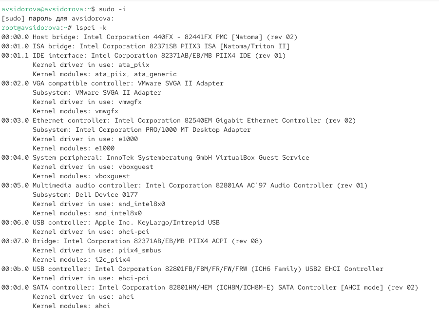
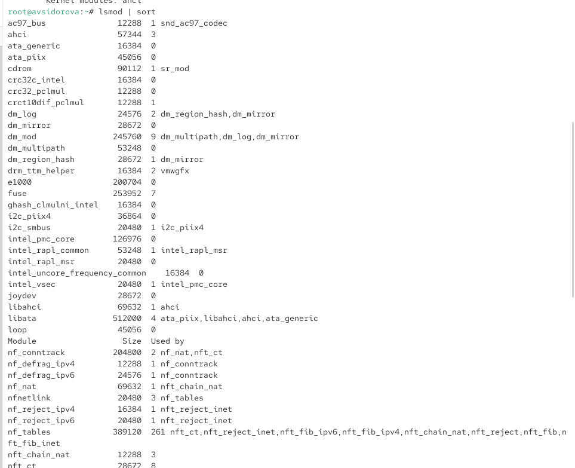
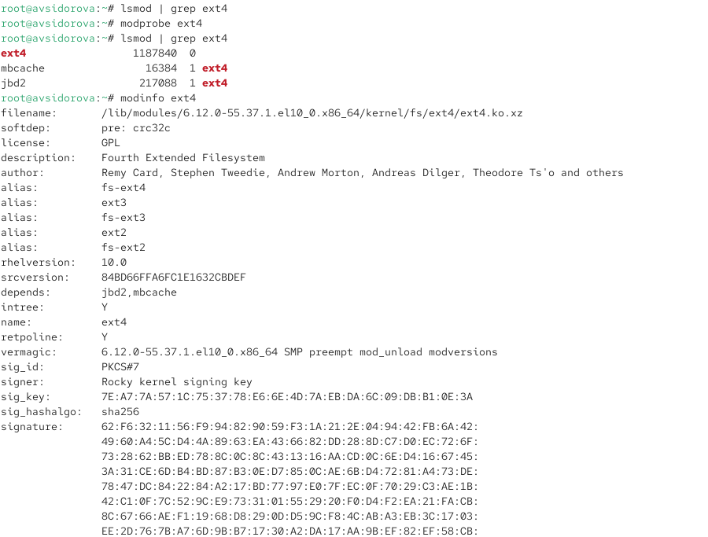
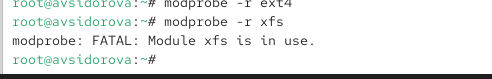
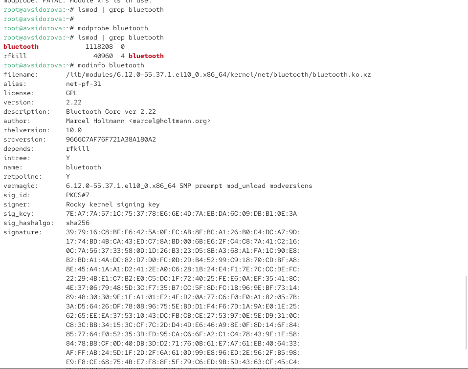
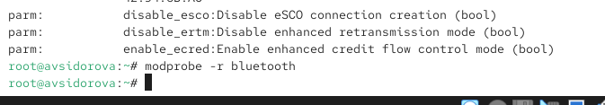
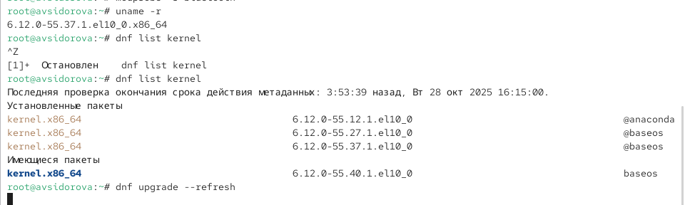
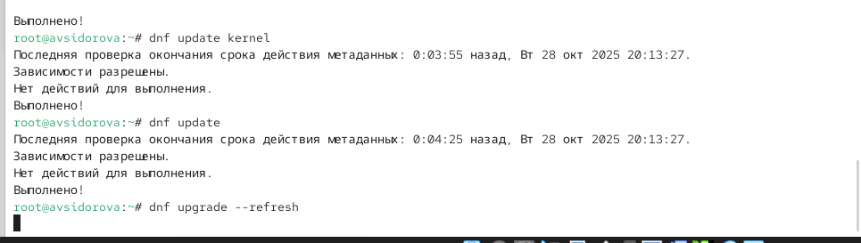
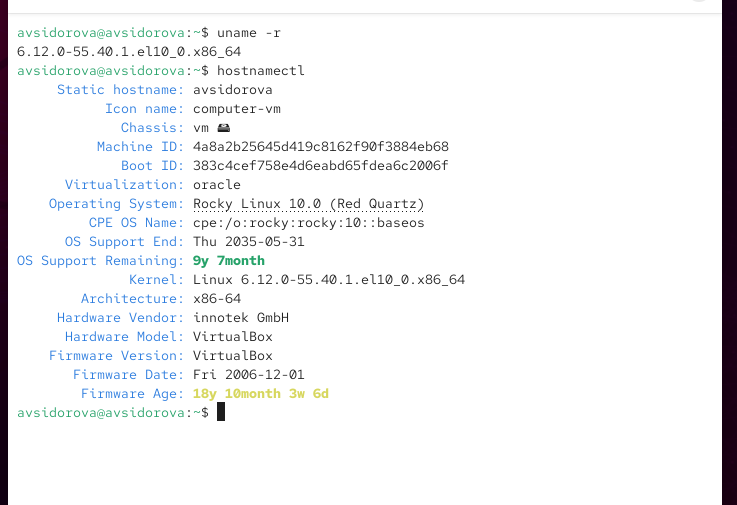

---
## Front matter
title: "Отчет по лабораторной работе №10"
subtitle: "Основы работы с модулями ядра операционной системы"
author: "Сидорова Арина Валерьевна"

## Generic otions
lang: ru-RU
toc-title: "Содержание"

## Bibliography
bibliography: bib/cite.bib
csl: pandoc/csl/gost-r-7-0-5-2008-numeric.csl

## Pdf output format
toc: true # Table of contents
toc-depth: 2
lof: true # List of figures
fontsize: 12pt
linestretch: 1.5
papersize: a4
documentclass: scrreprt
## I18n polyglossia
polyglossia-lang:
  name: russian
  options:
	- spelling=modern
	- babelshorthands=true
polyglossia-otherlangs:
  name: english
## I18n babel
babel-lang: russian
babel-otherlangs: english
## Fonts
mainfont: PT Serif
romanfont: PT Serif
sansfont: PT Sans
monofont: PT Mono
mainfontoptions: Ligatures=TeX
romanfontoptions: Ligatures=TeX
sansfontoptions: Ligatures=TeX,Scale=MatchLowercase
monofontoptions: Scale=MatchLowercase,Scale=0.9
## Biblatex
biblatex: true
biblio-style: "gost-numeric"
biblatexoptions:
  - parentracker=true
  - backend=biber
  - hyperref=auto
  - language=auto
  - autolang=other*
  - citestyle=gost-numeric
## Pandoc-crossref LaTeX customization
figureTitle: "Рис."
tableTitle: "Таблица"
listingTitle: "Листинг"
lofTitle: "Список иллюстраций"
lolTitle: "Листинги"
## Misc options
indent: true
header-includes:
  - \usepackage{indentfirst}
  - \usepackage{float} # keep figures where there are in the text
  - \floatplacement{figure}{H} # keep figures where there are in the text
---

# Цель работы

Получить навыки работы с утилитами управления модулями ядра операционной системы.

# Выполнение лабораторной работы

## Управление модулями ядра из командной строки

Смотрим, какие устройства имеются в нашей системе и какие модули ядра с ними
связаны:
lspci -k (рис. [-@fig:001]) 

{#fig:001 width=70%}

Смотрим, какие модули ядра загружены:
lsmod | sort (рис. [-@fig:002]) 

{#fig:002 width=70%}

Проверяем, загружен ли модуль ext4:
lsmod | grep ext4 

Загружаем модуль ядра ext4:
modprobe ext4 (рис. [-@fig:003]) 

{#fig:003 width=70%}

Убеждаемся, что модуль загружен, посмотрев список загруженных модулей:
lsmod | grep ext4

Смотрим информацию о модуле ядра ext4:
modinfo ext4 

Обращаем внимание, что у этого модуля нет параметров.
modprobe -r ext4

Возможно, команду потребуется ввести несколько раз. 
modprobe -r xfs  (рис. [-@fig:004]) 

{#fig:004 width=70%}

Обращаем внимание, что мы получаем сообщение об ошибке, поскольку модуль ядра
в данный момент используется.

## Загрузка модулей ядра с параметрами

Запускаем терминал и получаем полномочия администратора.
Проверяем, загружен ли модуль bluetooth:
lsmod | grep bluetooth

Загружаем модуль ядра bluetooth:
modprobe bluetooth

Смотрим список модулей ядра, отвечающих за работу с Bluetooth:
lsmod | grep bluetooth 

Смотрим информацию о модуле bluetooth:
modinfo bluetooth (рис. [-@fig:005]) 

{#fig:005 width=70%}

В отчёте поясняем, какие параметры могут быть установлены для работы этого модуля.
Выгружаем модуль ядра bluetooth:
modprobe -r bluetooth (рис. [-@fig:006]) 

{#fig:006 width=70%}

## Обновление ядра системы

Rocky Linux является нисходящей версией RHEL. Это означает, что данный дистрибутив
достаточно стабилен, но имеет устаревшие пакеты с точки зрения функциональности.

Запускаем терминал и получаем полномочия администратора:
su -

Смотрим версию ядра, используемую в операционной системе:
uname -r

Выводим на экран список пакетов, относящихся к ядру операционной системы:
dnf list kernel

Обновляем систему, чтобы убедиться, что все существующие пакеты обновлены, так
как это важно при установке/обновлении ядер Linux и избежания конфликтов:
dnf upgrade --refresh (рис. [-@fig:007]) 

{#fig:007 width=70%}

Обновляем ядро операционной системы, а затем саму операционную систему:
dnf update kernel
dnf update
dnf upgrade --refresh (рис. [-@fig:008]) 

{#fig:008 width=70%}

Перегружаем систему. При загрузке выбираем новое ядро.
Смотрим версию ядра, используемую в операционной системы:
uname -r
hostnamectl (рис. [-@fig:009]) 

{#fig:009 width=70%}

# Ответы на контрольные вопросы

1. uname -r
2. uname -a или cat /proc/version
3. lsmod
4. modinfo имя_модуля
5. modprobe -r имя_модуля
6. Найти и завершить процессы, использующие модуль, или перезагрузить систему
7. modinfo имя_модуля (раздел parm)
8. dnf update kernel или установка через пакетный менеджер дистрибутива

# Выводы

Получили навыки работы с утилитами управления модулями ядра операционной системы.

