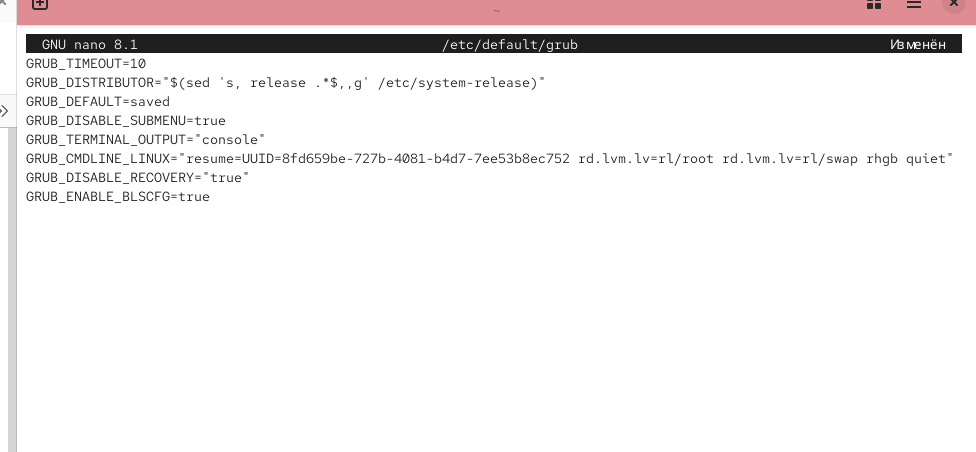
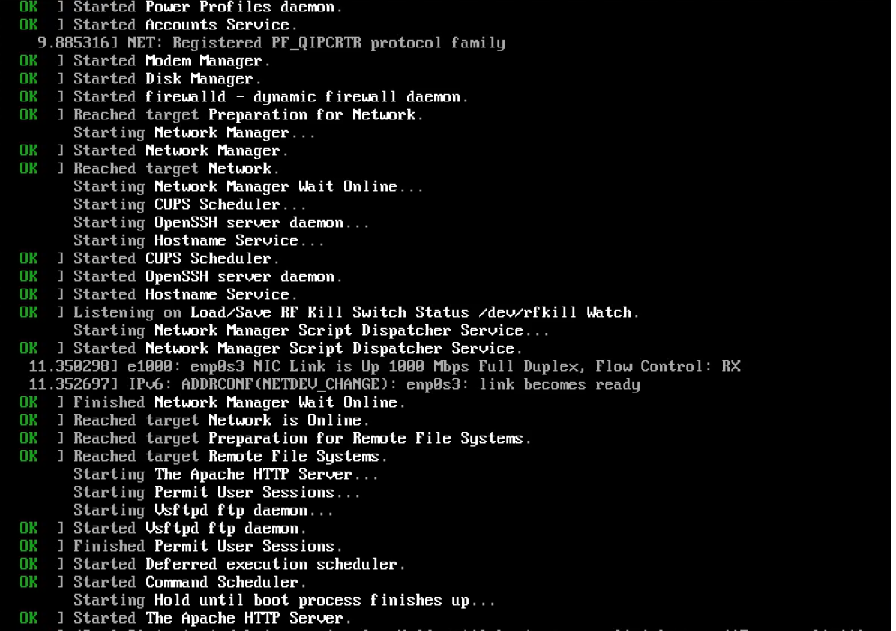
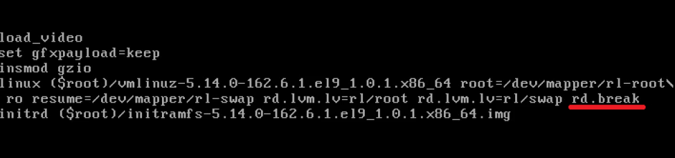

---
## Front matter
lang: ru-RU
title: Лабораторная работа №11
subtitle: Управление загрузкой системы
author:
  - Сидорова А.В.
institute:
  - Российский университет дружбы народов, Москва, Россия

## i18n babel
babel-lang: russian
babel-otherlangs: english

## Formatting pdf
toc: false
toc-title: Содержание
slide_level: 2
aspectratio: 169
section-titles: true
theme: metropolis
header-includes:
 - \metroset{progressbar=frametitle,sectionpage=progressbar,numbering=fraction}
---

# Информация

## Докладчик

:::::::::::::: {.columns align=center}
::: {.column width="70%"}

  * Сидорова Арина Валерьевна
  * студентка НПИбд-02-24
  * ст.б. 1132242912
  * Российский университет дружбы народов

:::
::::::::::::::

# Вводная часть

## Актуальность

Управление загрузчиком системы является критически важным навыком для системного администратора, позволяющим настраивать параметры загрузки, восстанавливать систему при сбоях и решать проблемы с доступом.

## Объект и предмет исследования

### Объект исследования

-  Загрузчик операционной системы GRUB2 в Linux.

### Предмет исследования

-  Механизмы настройки и управления процессом загрузки системы, методы восстановления доступа и устранения неполадок.

## Цели и задачи

**Цель:**
Получить практические навыки работы с загрузчиком системы GRUB2, включая настройку параметров загрузки и устранение неполадок.

**Задачи:**

1. Освоить модификацию параметров GRUB2 через конфигурационные файлы.
2. Научиться использовать режимы восстановления системы (rescue.target и emergency.target).
3. Получить навыки сброса пароля root через изменение параметров загрузки.
4. Изучить процесс применения изменений в конфигурации GRUB2.

# Выполнение лабораторной работы

## Модификация параметров GRUB2

## В файле /etc/default/grub устанавливаем параметр отображения меню загрузки в течение 10 секунд:

GRUB_TIMEOUT=10

Сохраняем изменения в файле и закрываем редактор.  

{#fig:001 width=70%}

## Записываем изменения в GRUB2, вводя в командной строке:

grub2-mkconfig > /boot/grub2/grub.cfg
или
grub2-mkconfig -o /boot/grub2/grub.cfg 

{#fig:002 width=70%}

##  Перезагружаем систему и убеждаемся, что при загрузке видим прокрутку загрузочных сообщений. 

Если не наблюдаем меню GRUB, то в файле /etc/default/grub удаляем из строки указания параметров запуска ядра системы GRUB_CMDLINE_LINUX параметры rhgb и quiet, которые отвечают за показ графической заставки при запуске системы (для дистрибутивов, основанных на Red Hat), скрывая процесс загрузки от пользователя. Сохраняем изменения в файле и закрываем редактор. Записываем изменения в GRUB2.  

{#fig:003 width=70%}

## Устранение неполадок

## Запускаем (перегружаем) систему. Как только появляется меню GRUB, выбираем строку с текущей версией ядра в меню и нажимаем e для редактирования.

Прокручиваем вниз до строки, начинающейся с linux ($root)/vmlinuz-. Эта строка загружает ядро системы. В конце этой строки вводим:
systemd.unit=rescue.target
и удаляем опции rhgb и quiet из этой строки, если они там есть. 

{#fig:004 width=70%}

## Нажимаем Ctrl + x для продолжения процесса загрузки.

Вводим пароль пользователя root при появлении запроса. 

{#fig:005 width=70%}

Смотрим список всех файлов модулей, которые загружены в настоящее время:
systemctl list-units

Можем видеть, что загружена базовая системная среда.

## Смотрим задействованные переменные среды оболочки:

systemctl show-environment

Перегружаем систему, используя команду:
systemctl reboot

Как только отображается меню GRUB, ещё раз нажимаем e на строке с текущей версией ядра, чтобы войти в режим редактора. В конце строки, загружающей ядро, вводим:
systemd.unit=emergency.target
и удаляем опции rhgb и quiet из этой строки, если они там есть.

Нажимаем Ctrl + x для продолжения процесса загрузки.

Вводим пароль пользователя root при появлении запроса.

## После успешного входа в систему смотрим список всех загруженных файлов модулей:

systemctl list-units

Обращаем внимание, что количество загружаемых файлов модулей уменьшилось до минимума.

## Перегружаем систему, используя команду:

systemctl reboot 

{#fig:006 width=70%}

## Сброс пароля root

Обычный сценарий для администратора Linux заключается в том, что пароль root отсутствует. Если это происходит, нам необходимо сбросить его. Единственный способ сделать это — загрузить систему в минимальном режиме, который позволяет войти в систему без ввода пароля. Для этого выполняем следующие действия.

Запускаем (перегружаем) компьютер. Когда отображается меню GRUB, выбираем в меню строку с текущей версией ядра системы и нажимаем e, чтобы войти в режим редактора. В конце строки, загружающей ядро, вводим:
rd.break
и удаляем опции rhgb и quiet из этой строки, если они там есть. 

{#fig:007 width=70%}

Нажимаем Ctrl + x для продолжения процесса загрузки.

## Этап загрузки системы останавливается в момент загрузки initramfs, непосредственно перед монтированием корневой файловой системы в каталоге /.

Чтобы получить доступ к системному образу для чтения и записи, набираем:
mount -o remount,rw /sysroot

Делаем содержимое каталога /sysimage новым корневым каталогом, набирая:
chroot /sysroot

## Теперь можем ввести команду задания пароля:

passwd
и установить новый пароль для пользователя root. 

{#fig:008 width=70%}

## Перезагружаем систему с помощью команды reboot -f 

и входим в систему с изменённым паролем для пользователя root. Опция -f (--force) означает принудительную немедленную остановку, выключение или перезагрузку. При указании один раз это приводит к немедленному, но чистому завершению работы системным менеджером. Если указано дважды, это приводит к немедленному завершению работы без обращения к системному менеджеру.

# Результаты

- Настроен параметр времени отображения меню загрузки GRUB2.
- Освоено применение изменений через команду grub2-mkconfig.
- Выполнен вход в режимы rescue.target и emergency.target для диагностики системы.
- Отработан метод сброса пароля root через параметр rd.break.
- Получены навыки работы с конфигурационными файлами /etc/default/grub и /boot/grub2/grub.cfg.
