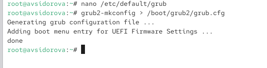
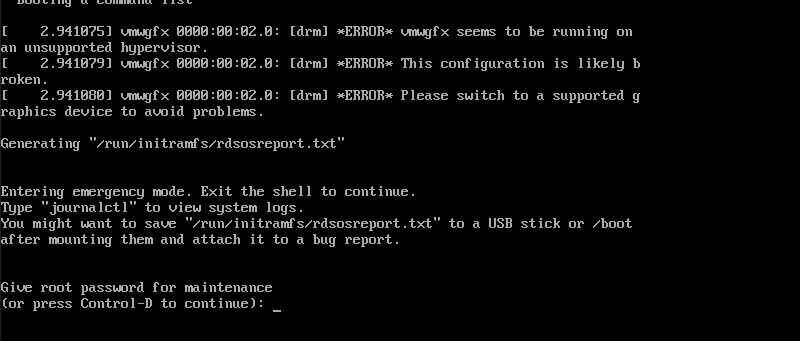
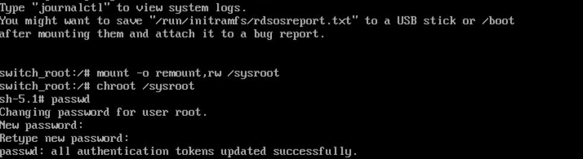

p---
## Front matter
title: "Отчет по лабораторной работе №11"
subtitle: "Управление загрузкой системы"
author: "Сидорова Арина Валерьевна"

## Generic otions
lang: ru-RU
toc-title: "Содержание"

## Bibliography
bibliography: bib/cite.bib
csl: pandoc/csl/gost-r-7-0-5-2008-numeric.csl

## Pdf output format
toc: true # Table of contents
toc-depth: 2
lof: true # List of figures
fontsize: 12pt
linestretch: 1.5
papersize: a4
documentclass: scrreprt
## I18n polyglossia
polyglossia-lang:
  name: russian
  options:
	- spelling=modern
	- babelshorthands=true
polyglossia-otherlangs:
  name: english
## I18n babel
babel-lang: russian
babel-otherlangs: english
## Fonts
mainfont: PT Serif
romanfont: PT Serif
sansfont: PT Sans
monofont: PT Mono
mainfontoptions: Ligatures=TeX
romanfontoptions: Ligatures=TeX
sansfontoptions: Ligatures=TeX,Scale=MatchLowercase
monofontoptions: Scale=MatchLowercase,Scale=0.9
## Biblatex
biblatex: true
biblio-style: "gost-numeric"
biblatexoptions:
  - parentracker=true
  - backend=biber
  - hyperref=auto
  - language=auto
  - autolang=other*
  - citestyle=gost-numeric
## Pandoc-crossref LaTeX customization
figureTitle: "Рис."
tableTitle: "Таблица"
listingTitle: "Листинг"
lofTitle: "Список иллюстраций"
lolTitle: "Листинги"
## Misc options
indent: true
header-includes:
  - \usepackage{indentfirst}
  - \usepackage{float} # keep figures where there are in the text
  - \floatplacement{figure}{H} # keep figures where there are in the text
---

# Цель работы

Получить практические навыки работы с загрузчиком системы GRUB2, включая настройку параметров загрузки и устранение неполадок

# Выполнение лабораторной работы

## Модификация параметров GRUB2

Запускаем терминал и получаем полномочия администратора:
su -

В файле /etc/default/grub устанавливаем параметр отображения меню загрузки в течение 10 секунд:
GRUB_TIMEOUT=10

Сохраняем изменения в файле и закрываем редактор. (рис. [-@fig:001]) 

{#fig:001 width=70%}

Записываем изменения в GRUB2, вводя в командной строке:
grub2-mkconfig > /boot/grub2/grub.cfg
или
grub2-mkconfig -o /boot/grub2/grub.cfg (рис. [-@fig:002]) 

{#fig:002 width=70%}

Перезагружаем систему и убеждаемся, что при загрузке видим прокрутку загрузочных сообщений. Если не наблюдаем меню GRUB, то в файле /etc/default/grub удаляем из строки указания параметров запуска ядра системы GRUB_CMDLINE_LINUX параметры rhgb и quiet, которые отвечают за показ графической заставки при запуске системы (для дистрибутивов, основанных на Red Hat), скрывая процесс загрузки от пользователя. Сохраняем изменения в файле и закрываем редактор. Записываем изменения в GRUB2. (рис. [-@fig:003]) 

{#fig:003 width=70%}

## Устранение неполадок

Запускаем (перегружаем) систему. Как только появляется меню GRUB, выбираем строку с текущей версией ядра в меню и нажимаем e для редактирования.

Прокручиваем вниз до строки, начинающейся с linux ($root)/vmlinuz-. Эта строка загружает ядро системы. В конце этой строки вводим:
systemd.unit=rescue.target
и удаляем опции rhgb и quiet из этой строки, если они там есть. (рис. [-@fig:004]) 

{#fig:004 width=70%}

Нажимаем Ctrl + x для продолжения процесса загрузки.

Вводим пароль пользователя root при появлении запроса. (рис. [-@fig:005]) 

{#fig:005 width=70%}

Смотрим список всех файлов модулей, которые загружены в настоящее время:
systemctl list-units

Можем видеть, что загружена базовая системная среда.

Смотрим задействованные переменные среды оболочки:
systemctl show-environment

Перегружаем систему, используя команду:
systemctl reboot

Как только отображается меню GRUB, ещё раз нажимаем e на строке с текущей версией ядра, чтобы войти в режим редактора. В конце строки, загружающей ядро, вводим:
systemd.unit=emergency.target
и удаляем опции rhgb и quiet из этой строки, если они там есть.

Нажимаем Ctrl + x для продолжения процесса загрузки.

Вводим пароль пользователя root при появлении запроса.

После успешного входа в систему смотрим список всех загруженных файлов модулей:
systemctl list-units

Обращаем внимание, что количество загружаемых файлов модулей уменьшилось до минимума.

Перегружаем систему, используя команду:
systemctl reboot (рис. [-@fig:006]) 

{#fig:006 width=70%}

## Сброс пароля root

Обычный сценарий для администратора Linux заключается в том, что пароль root отсутствует. Если это происходит, нам необходимо сбросить его. Единственный способ сделать это — загрузить систему в минимальном режиме, который позволяет войти в систему без ввода пароля. Для этого выполняем следующие действия.

Запускаем (перегружаем) компьютер. Когда отображается меню GRUB, выбираем в меню строку с текущей версией ядра системы и нажимаем e, чтобы войти в режим редактора. В конце строки, загружающей ядро, вводим:
rd.break
и удаляем опции rhgb и quiet из этой строки, если они там есть. (рис. [-@fig:007]) 

{#fig:007 width=70%}

Нажимаем Ctrl + x для продолжения процесса загрузки.

Этап загрузки системы останавливается в момент загрузки initramfs, непосредственно перед монтированием корневой файловой системы в каталоге /.

Чтобы получить доступ к системному образу для чтения и записи, набираем:
mount -o remount,rw /sysroot

Делаем содержимое каталога /sysimage новым корневым каталогом, набирая:
chroot /sysroot

Теперь можем ввести команду задания пароля:
passwd
и установить новый пароль для пользователя root. (рис. [-@fig:008]) 

{#fig:008 width=70%}

Поскольку на этом очень раннем этапе загрузки SELinux ещё не активирован, то тип контекста SELinux для файла /etc/shadow будет испорчен. Если перезагружаемся в этот момент, то никто не сможет войти в систему. Поэтому мы должны убедиться, что тип контекста установлен правильно. Чтобы сделать это, на этом этапе мы должны загрузить политику SELinux с помощью команды:
load_policy -i

Теперь можем вручную установить правильный тип контекста для /etc/shadow. Для этого вводим:
chcon -t shadow_t /etc/shadow

Перезагружаем систему с помощью команды reboot -f и входим в систему с изменённым паролем для пользователя root. Опция -f (--force) означает принудительную немедленную остановку, выключение или перезагрузку. При указании один раз это приводит к немедленному, но чистому завершению работы системным менеджером. Если указано дважды, это приводит к немедленному завершению работы без обращения к системному менеджеру.

# Ответы на контрольные вопросы

Ответы на контрольные вопросы:
1. /etc/default/grub
2. /boot/grub2/grub.cfg
3. grub2-mkconfig -o /boot/grub2/grub.cfg

# Выводы

- Настроен параметр времени отображения меню загрузки GRUB2.
- Освоено применение изменений через команду grub2-mkconfig.
- Выполнен вход в режимы rescue.target и emergency.target для диагностики системы.
- Отработан метод сброса пароля root через параметр rd.break.
- Получены навыки работы с конфигурационными файлами /etc/default/grub и /boot/grub2/grub.cfg.

