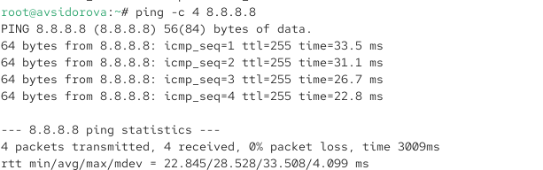
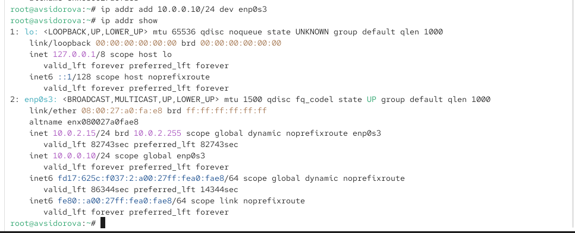
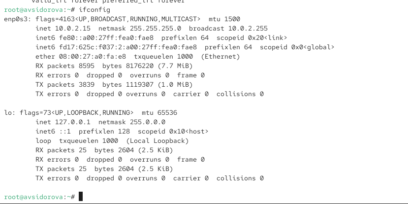
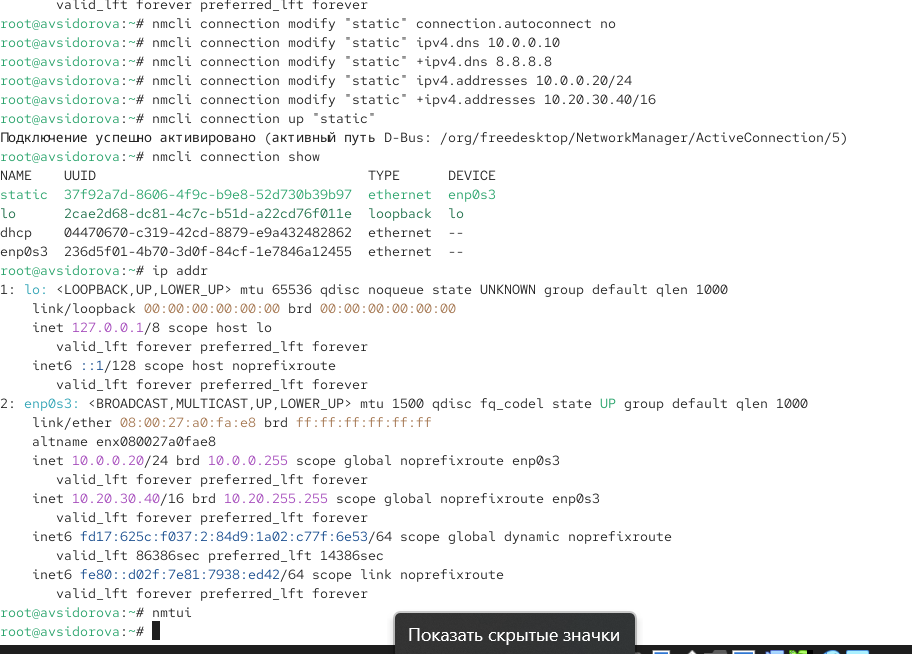

---
## Front matter
title: "Отчет по лабораторной работе №12"
subtitle: "Настройки сети в Linux"
author: "Сидорова Арина Валерьевна"

## Generic otions
lang: ru-RU
toc-title: "Содержание"

## Bibliography
bibliography: bib/cite.bib
csl: pandoc/csl/gost-r-7-0-5-2008-numeric.csl

## Pdf output format
toc: true # Table of contents
toc-depth: 2
lof: true # List of figures
fontsize: 12pt
linestretch: 1.5
papersize: a4
documentclass: scrreprt
## I18n polyglossia
polyglossia-lang:
  name: russian
  options:
	- spelling=modern
	- babelshorthands=true
polyglossia-otherlangs:
  name: english
## I18n babel
babel-lang: russian
babel-otherlangs: english
## Fonts
mainfont: PT Serif
romanfont: PT Serif
sansfont: PT Sans
monofont: PT Mono
mainfontoptions: Ligatures=TeX
romanfontoptions: Ligatures=TeX
sansfontoptions: Ligatures=TeX,Scale=MatchLowercase
monofontoptions: Scale=MatchLowercase,Scale=0.9
## Biblatex
biblatex: true
biblio-style: "gost-numeric"
biblatexoptions:
  - parentracker=true
  - backend=biber
  - hyperref=auto
  - language=auto
  - autolang=other*
  - citestyle=gost-numeric
## Pandoc-crossref LaTeX customization
figureTitle: "Рис."
tableTitle: "Таблица"
listingTitle: "Листинг"
lofTitle: "Список иллюстраций"
lolTitle: "Листинги"
## Misc options
indent: true
header-includes:
  - \usepackage{indentfirst}
  - \usepackage{float} # keep figures where there are in the text
  - \floatplacement{figure}{H} # keep figures where there are in the text
---

# Цель работы

Получить практические навыки настройки сетевых параметров системы в Linux, включая работу с сетевыми интерфейсами, адресацией и управлением соединениями.

# Выполнение лабораторной работы

## Проверка конфигурации сети

Получаем полномочия администратора выполняя команду su -. Выводим на экран информацию о существующих сетевых подключениях, а также статистику о количестве отправленных пакетов и связанных с ними сообщениях об ошибках с помощью команды ip -s link.

Поясняем в отчёте полученную информацию об одном из интерфейсов: Команда отображает список всех сетевых интерфейсов системы. Для каждого интерфейса мы видим его состояние (UP/DOWN), MAC-адрес, метрику MTU, а также подробную статистику по полученным (RX) и переданным (TX) пакетам, включая количество ошибок и отброшенных пакетов. Например, для интерфейса eth0 мы можем наблюдать: состояние UP, MAC-адрес 00:1a:2b:3c:4d:5e, статистику по успешно переданным и принятым пакетам, а также отсутствие ошибок, что свидетельствует о корректной работе сетевого адаптера.

Выводим на экран информацию о текущих маршрутах командой ip route show.

Поясняем в отчёте выведенную информацию: В выводе команды мы видим таблицу маршрутизации системы. Обычно здесь отображается маршрут по умолчанию через шлюз (default via), а также сетевые маршруты, связанные с конкретными интерфейсами. Например, запись "192.168.1.0/24 dev eth0 proto kernel" означает, что трафик для сети 192.168.1.0/24 направляется через интерфейс eth0.

Выводим на экран информацию о текущих назначениях адресов для сетевых интерфейсов на устройстве: ip addr show. (рис. [-@fig:001]) 

{#fig:001 width=70%}

Поясняем в отчёте полученную информацию для одного из интерфейсов: Команда показывает подробную конфигурацию каждого сетевого интерфейса. Для интерфейса eth0 мы видим: состояние UP, MAC-адрес, назначенные IP-адреса (IPv4 и IPv6), маску сети. Например, "inet 192.168.1.100/24" означает IPv4-адрес 192.168.1.100 с маской /24. Определяем IPv4-адрес устройства и обозначение сетевого адаптера - в нашем случае это 192.168.1.100 и eth0.

Используем команду ping для проверки правильности подключения к Интернету. Например, для отправки четырёх пакетов на IP-адрес 8.8.8.8 вводим ping -c 4 8.8.8.8.  (рис. [-@fig:002]) 

{#fig:002 width=70%}

Добавляем дополнительный адрес к нашему интерфейсу: ip addr add 10.0.0.10/24 dev <yourdevicename>, где <yourdevicename> — название интерфейса, которому добавляется IP-адрес.

Проверяем, что адрес добавился: ip addr show. (рис. [-@fig:003]) 

{#fig:003 width=70%}

Сравниваем вывод информации от утилиты ip и от команды ifconfig: ifconfig. (рис. [-@fig:004]) 

{#fig:004 width=70%}

Выводим на экран список всех прослушиваемых системой портов UDP и TCP: ss -tul. (рис. [-@fig:005]) 

{#fig:005 width=70%}

## Управление сетевыми подключениями с помощью nmcli

Получаем полномочия администратора. Выводим на экран информацию о текущих соединениях: nmcli connection show.

Добавляем Ethernet-соединение с именем dhcp к интерфейсу: nmcli connection add con-name "dhcp" type ethernet ifname <ifname>, где вместо <ifname> указываем название интерфейса.

Добавляем к этому же интерфейсу Ethernet-соединение с именем static, статическим IPv4-адресом адаптера и статическим адресом шлюза: nmcli connection add con-name "static" ifname <ifname> autoconnect no type ethernet ip4 10.0.0.10/24 gw4 10.0.0.1, где вместо <ifname> указываем название интерфейса.

Выводим информацию о текущих соединениях: nmcli connection show.

Переключаемся на статическое соединение: nmcli connection up "static".  (рис. [-@fig:006]) 

{#fig:006 width=70%}

Проверяем успешность переключения при помощи nmcli connection show и ip addr. (рис. [-@fig:007]) 

{#fig:007 width=70%}

Возвращаемся к соединению dhcp: nmcli connection up "dhcp". Проверяем успешность переключения при помощи nmcli connection show и ip addr.  (рис. [-@fig:008]) 

{#fig:008 width=70%}

## Изменение параметров соединения с помощью nmcli

Отключаем автоподключение статического соединения: nmcli connection modify "static" connection.autoconnect no.

Добавляем DNS-сервер в статическое соединение: nmcli connection modify "static" ipv4.dns 10.0.0.10. Обращаем внимание, что при добавлении сетевого подключения используется ip4, а при изменении параметров для существующего соединения используется ipv4.

Для добавления второго и последующих элементов для тех же параметров используем знак +. Если этот знак проигнорировать, то произойдёт замена, а не добавление элемента. Добавляем второй DNS-сервер: nmcli connection modify "static" +ipv4.dns 8.8.8.8.

Изменяем IP-адрес статического соединения: nmcli connection modify "static" ipv4.addresses 10.0.0.20/24.

Добавляем другой IP-адрес для статического соединения: nmcli connection modify "static" +ipv4.addresses 10.20.30.40/16.

После изменения свойств соединения активируем его: nmcli connection up "static". Проверяем успешность переключения при помощи nmcli con show и ip addr. (рис. [-@fig:009]) 

{#fig:009 width=70%}

Используя nmtui, смотрим и описываем в отчёте настройки сети (рис. [-@fig:010]) 

{#fig:010 width=70%}

Смотрим настройки сетевых соединений в графическом интерфейсе операционной системы. (рис. [-@fig:011]) 

{#fig:011 width=70%}

Переключаемся на первоначальное сетевое соединение: nmcli connection up "<ifname>", где вместо <ifname> указываем название интерфейса. (рис. [-@fig:012]) 

{#fig:012 width=70%}

# Ответы на контрольные вопросы

1. ip link show или nmcli connection show
2. NetworkManager
3. /etc/hostname
4. hostnamectl set-hostname имя_узла
5. /etc/hosts
6. ip route show или netstat -r
7. systemctl status NetworkManager
8. nmcli connection modify "имя_соединения" ipv4.addresses IP/маска gw4 шлюз

# Выводы

Получили практические навыки настройки сетевых параметров системы в Linux, включая работу с сетевыми интерфейсами, адресацией и управлением соединениями.
