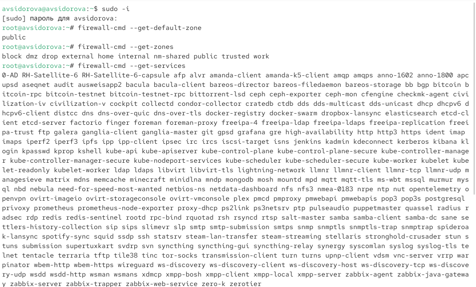
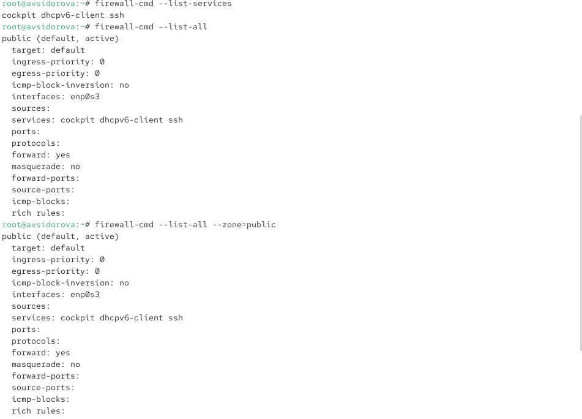
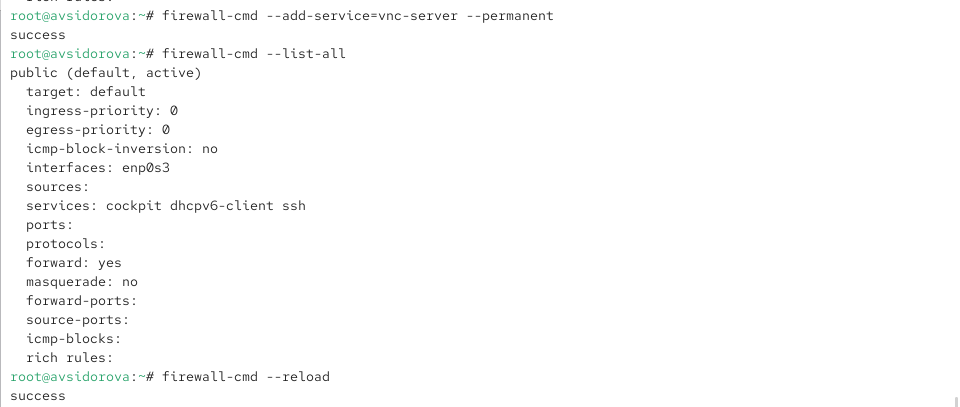
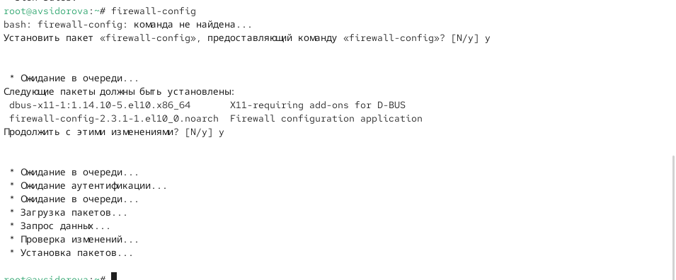
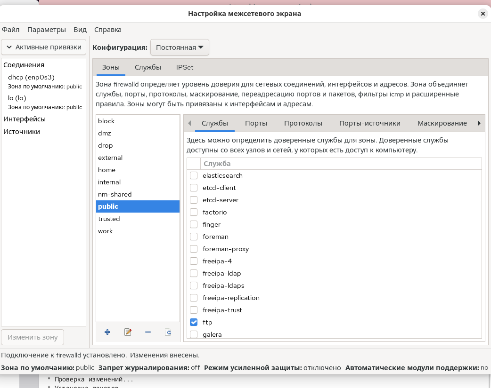
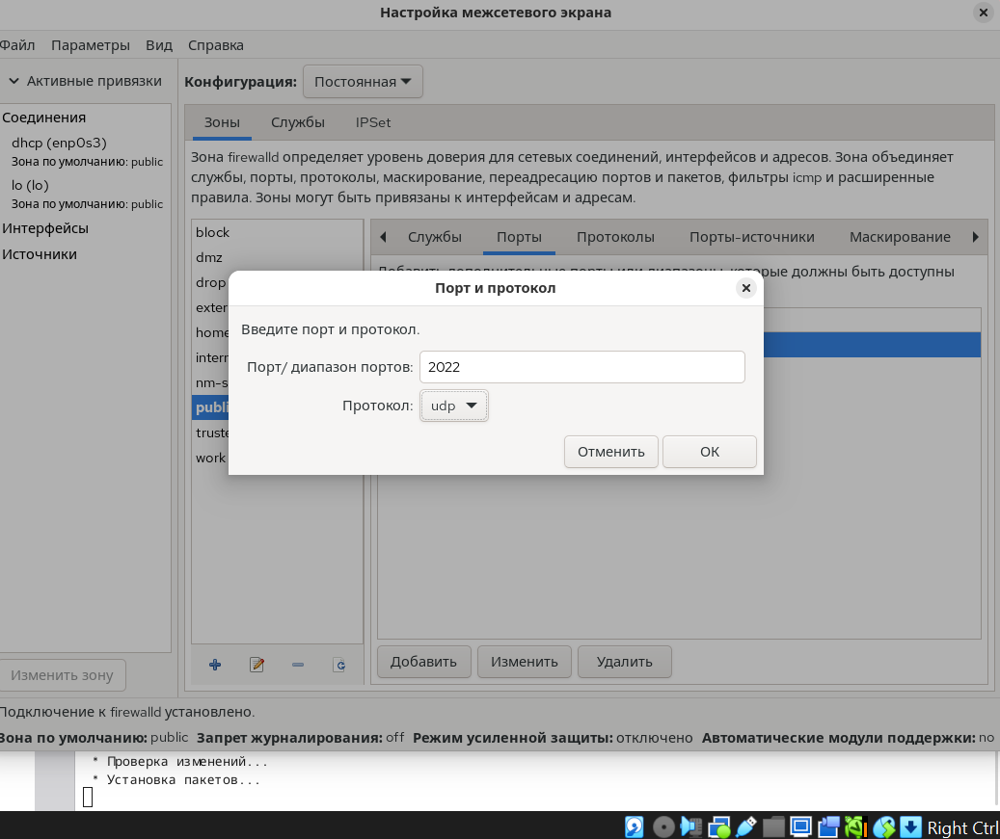
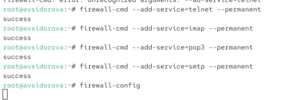

---
## Front matter
lang: ru-RU
title: Лабораторная работа №13
subtitle: Фильтр пакетов
author:
  - Сидорова А.В.
institute:
  - Российский университет дружбы народов, Москва, Россия

## i18n babel
babel-lang: russian
babel-otherlangs: english

## Formatting pdf
toc: false
toc-title: Содержание
slide_level: 2
aspectratio: 169
section-titles: true
theme: metropolis
header-includes:
 - \metroset{progressbar=frametitle,sectionpage=progressbar,numbering=fraction}
---

# Информация

## Докладчик

:::::::::::::: {.columns align=center}
::: {.column width="70%"}

  * Сидорова Арина Валерьевна
  * студентка НПИбд-02-24
  * ст.б. 1132242912
  * Российский университет дружбы народов

:::
::::::::::::::

# Вводная часть

## Актуальность

Настройка пакетного фильтра (брандмауэра) является критически важным аспектом безопасности операционной системы, позволяющим контролировать сетевой трафик, защищать систему от несанкционированного доступа и управлять сетевыми службами

## Объект и предмет исследования

### Объект исследования

-  Система управления брандмауэром firewalld в операционной системе Linux.

### Предмет исследования

-  Механизмы настройки правил фильтрации сетевых пакетов, управление зонами безопасности и службами.

## Цели и задачи

**Цель:**
Получить практические навыки настройки пакетного фильтра в Linux с использованием firewalld.

**Задачи:**

1. Освоить управление брандмауэром через утилиту firewall-cmd.
2. Научиться работать с графическим интерфейсом firewall-config.
3. Изучить концепцию зон безопасности и их настройку.
4. Получить навыки добавления служб и портов в конфигурацию брандмауэра.

# Выполнение лабораторной работы

## Управление брандмауэром с помощью firewall-cmd

## Получаем полномочия администратора выполняя команду su -. 

Определяем текущую зону по умолчанию введя firewall-cmd --get-default-zone. 
Определяем доступные зоны введя firewall-cmd --get-zones. 
Смотрим службы доступные на нашем компьютере используя firewall-cmd --get-services 

{#fig:001 width=70%}

## Определяем доступные службы в текущей зоне firewall-cmd --list-services. 

Сравниваем результаты вывода информации при использовании команды firewall-cmd --list-all и команды firewall-cmd --list-all --zone=public. 

{#fig:002 width=70%}

## Добавляем сервер VNC в конфигурацию брандмауэра firewall-cmd --add-service=vnc-server. Проверяем добавился ли vnc-server в конфигурацию firewall-cmd --list-all. 

Перезапускаем службу firewalld systemctl restart firewalld. 

{#fig:003 width=70%}

## Проверяем есть ли vnc-server в конфигурации firewall-cmd --list-all. 

{#fig:004 width=70%}

##  Служба vnc-server больше не указана потому что предыдущие изменения без параметра --permanent были временными и потерялись после перезагрузки службы.

Добавляем службу vnc-server ещё раз но на этот раз делаем её постоянной используя команду firewall-cmd --add-service=vnc-server --permanent. 

Проверяем наличие vnc-server в конфигурации firewall-cmd --list-all. Видим что VNC-сервер не указан поскольку службы которые были добавлены в конфигурацию на диске автоматически не добавляются в конфигурацию времени выполнения. Перезагружаем конфигурацию firewalld и просматриваем конфигурацию времени выполнения firewall-cmd --reload 

{#fig:005 width=70%}

## затем firewall-cmd --list-all. Добавляем в конфигурацию межсетевого экрана порт 2022 протокола TCP firewall-cmd --add-port=2022/tcp --permanent затем перезагружаем конфигурацию firewalld firewall-cmd --reload. Проверяем что порт добавлен в конфигурацию firewall-cmd --list-all. 

{#fig:006 width=70%}

## Управление брандмауэром с помощью firewall-config

Открываем терминал и под учётной записью своего пользователя запускаем интерфейс GUI firewall-config командой firewall-config. Если служба отсутствует то система предложит её установить.  

{#fig:007 width=70%}

## Также при запуске потребуется ввести пароль пользователя с полномочиями управления этой службой. Нажимаем выпадающее меню рядом с параметром Configuration открываем раскрывающийся список и выбираем Permanent это позволит сделать постоянными все изменения которые вносим при конфигурировании. 

Выбираем зону public и отмечаем службы http https и ftp чтобы включить их.

{#fig:008 width=70%} 

{#fig:009 width=70%}

## Выбираем вкладку Ports и на этой вкладке нажимаем Add вводим порт 2022 и протокол udp нажимаем OK чтобы добавить их в список. 

{#fig:010 width=70%}

## Закрываем утилиту firewall-config. В окне терминала вводим firewall-cmd --list-all обращаем внимание что изменения которые только что внесли ещё не вступили в силу это связано с тем что мы настроили их как постоянные изменения а не как изменения времени выполнения. Перегружаем конфигурацию firewall-cmd firewall-cmd --reload и список доступных сервисов firewall-cmd --list-all видим что изменения были применены. 

{#fig:011 width=70%}

## Самостоятельная работа

## Создаем конфигурацию межсетевого экрана которая позволяет получить доступ к следующим службам telnet imap pop3 smtp. 

{#fig:012 width=70%}

## Делаем это как в командной строке для службы telnet так и в графическом интерфейсе для служб imap pop3 smtp. 

{#fig:013 width=70%} 

## Убеждаемся что конфигурация является постоянной и будет активирована после перезагрузки компьютера.

{#fig:014 width=70%}

# Результаты

- Освоены основные команды firewall-cmd для управления зонами и службами.
- Настроено добавление службы VNC-server и порта 2022/tcp в конфигурацию.
- Изучена разница между временными и постоянными изменениями правил.
- Освоена работа с графическим интерфейсом firewall-config.
- Выполнена самостоятельная работа по настройке доступа к службам telnet, imap, pop3, smtp.
