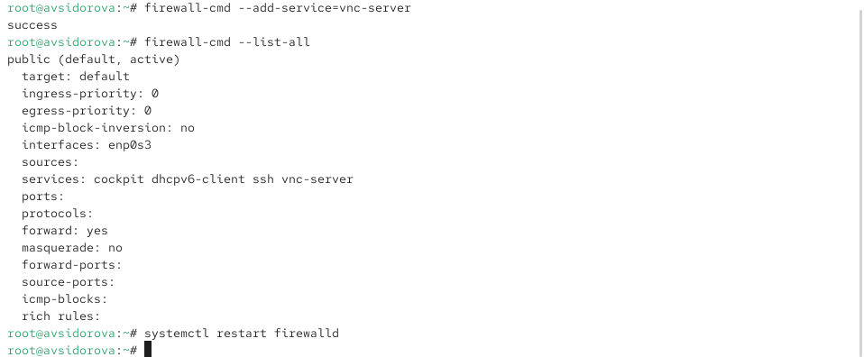
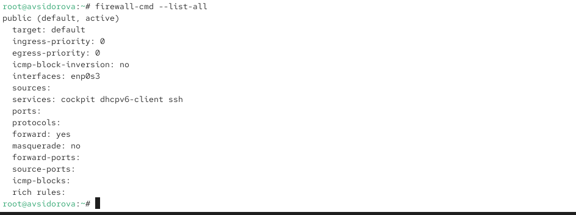
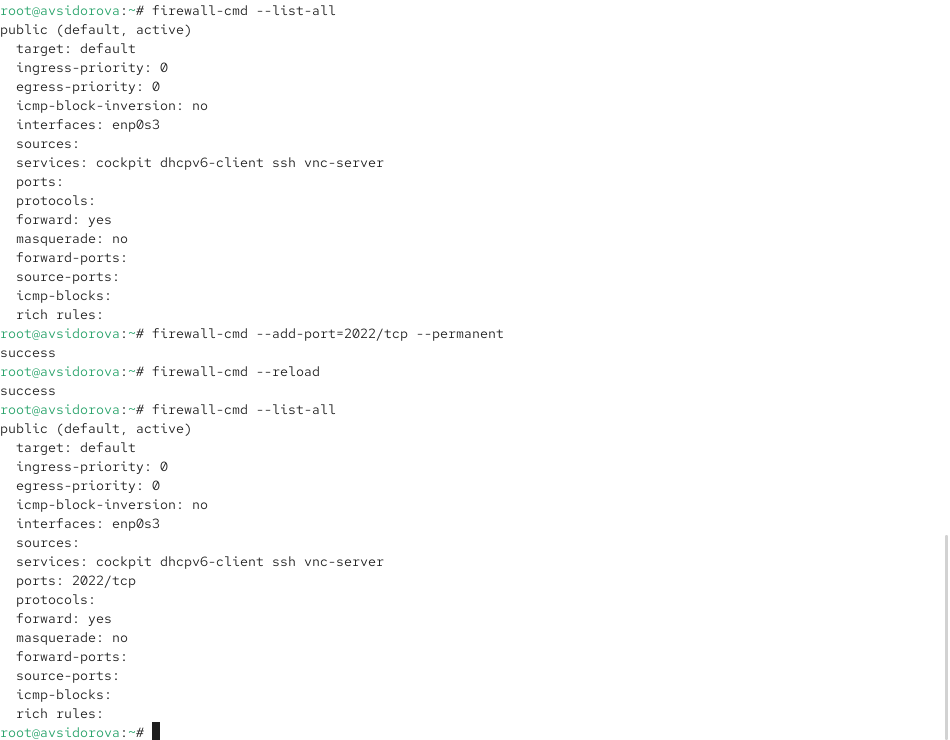
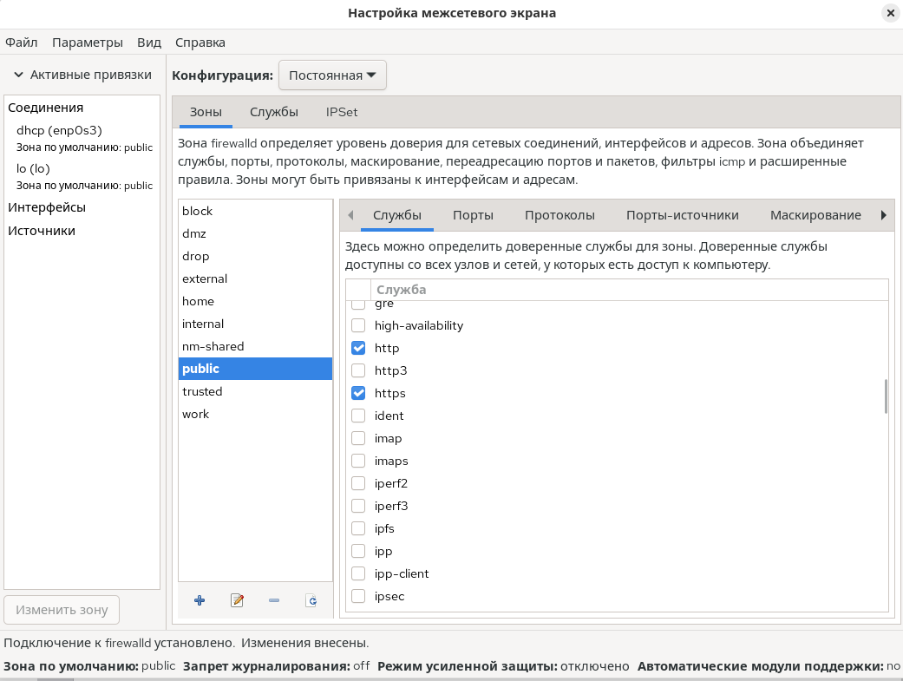
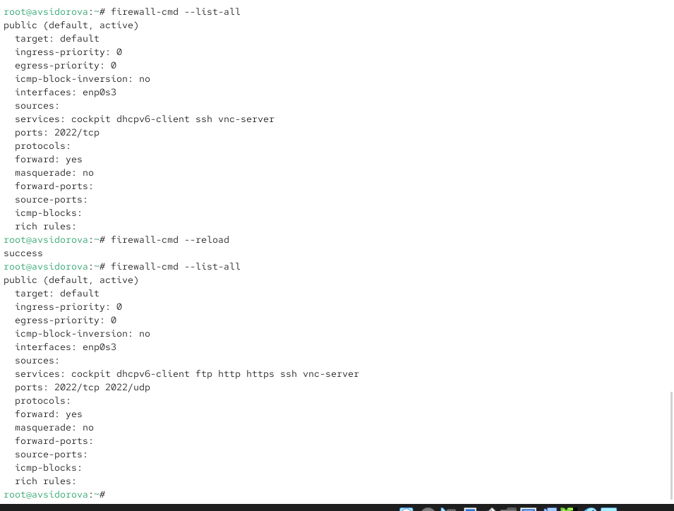
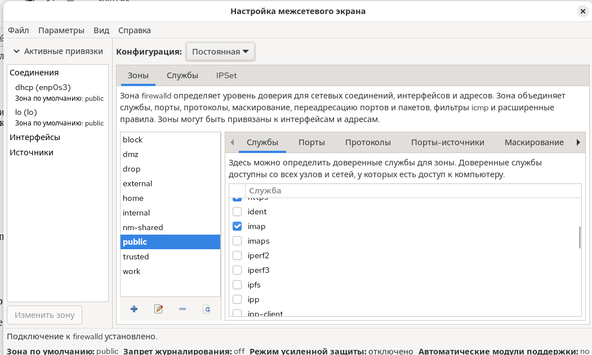
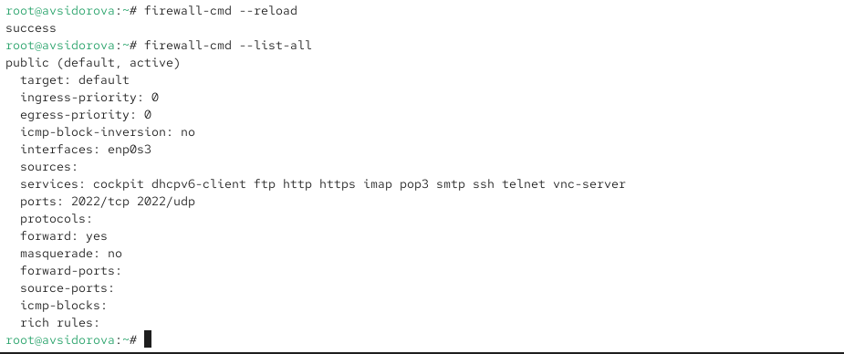

---
## Front matter
title: "Отчет по лабораторной работе №13"
subtitle: "Фильтр пакетов"
author: "Сидорова Арина Валерьевна"

## Generic otions
lang: ru-RU
toc-title: "Содержание"

## Bibliography
bibliography: bib/cite.bib
csl: pandoc/csl/gost-r-7-0-5-2008-numeric.csl

## Pdf output format
toc: true # Table of contents
toc-depth: 2
lof: true # List of figures
fontsize: 12pt
linestretch: 1.5
papersize: a4
documentclass: scrreprt
## I18n polyglossia
polyglossia-lang:
  name: russian
  options:
	- spelling=modern
	- babelshorthands=true
polyglossia-otherlangs:
  name: english
## I18n babel
babel-lang: russian
babel-otherlangs: english
## Fonts
mainfont: PT Serif
romanfont: PT Serif
sansfont: PT Sans
monofont: PT Mono
mainfontoptions: Ligatures=TeX
romanfontoptions: Ligatures=TeX
sansfontoptions: Ligatures=TeX,Scale=MatchLowercase
monofontoptions: Scale=MatchLowercase,Scale=0.9
## Biblatex
biblatex: true
biblio-style: "gost-numeric"
biblatexoptions:
  - parentracker=true
  - backend=biber
  - hyperref=auto
  - language=auto
  - autolang=other*
  - citestyle=gost-numeric
## Pandoc-crossref LaTeX customization
figureTitle: "Рис."
tableTitle: "Таблица"
listingTitle: "Листинг"
lofTitle: "Список иллюстраций"
lolTitle: "Листинги"
## Misc options
indent: true
header-includes:
  - \usepackage{indentfirst}
  - \usepackage{float} # keep figures where there are in the text
  - \floatplacement{figure}{H} # keep figures where there are in the text
---

# Цель работы

Получить практические навыки настройки пакетного фильтра в Linux с использованием firewalld

# Выполнение лабораторной работы

## Управление брандмауэром с помощью firewall-cmd

Получаем полномочия администратора выполняя команду su -. 
Определяем текущую зону по умолчанию введя firewall-cmd --get-default-zone. 
Определяем доступные зоны введя firewall-cmd --get-zones. 
Смотрим службы доступные на нашем компьютере используя firewall-cmd --get-services (рис. [-@fig:001]) 

{#fig:001 width=70%}

Определяем доступные службы в текущей зоне firewall-cmd --list-services. 
Сравниваем результаты вывода информации при использовании команды firewall-cmd --list-all и команды firewall-cmd --list-all --zone=public. (рис. [-@fig:002]) 

{#fig:002 width=70%}

Добавляем сервер VNC в конфигурацию брандмауэра firewall-cmd --add-service=vnc-server. Проверяем добавился ли vnc-server в конфигурацию firewall-cmd --list-all. 
Перезапускаем службу firewalld systemctl restart firewalld. (рис. [-@fig:003]) 

{#fig:003 width=70%}

Проверяем есть ли vnc-server в конфигурации firewall-cmd --list-all.(рис. [-@fig:004]) 

{#fig:004 width=70%}

 Служба vnc-server больше не указана потому что предыдущие изменения без параметра --permanent были временными и потерялись после перезагрузки службы.

Добавляем службу vnc-server ещё раз но на этот раз делаем её постоянной используя команду firewall-cmd --add-service=vnc-server --permanent. 

Проверяем наличие vnc-server в конфигурации firewall-cmd --list-all. Видим что VNC-сервер не указан поскольку службы которые были добавлены в конфигурацию на диске автоматически не добавляются в конфигурацию времени выполнения. Перезагружаем конфигурацию firewalld и просматриваем конфигурацию времени выполнения firewall-cmd --reload (рис. [-@fig:005]) 

{#fig:005 width=70%}

затем firewall-cmd --list-all. Добавляем в конфигурацию межсетевого экрана порт 2022 протокола TCP firewall-cmd --add-port=2022/tcp --permanent затем перезагружаем конфигурацию firewalld firewall-cmd --reload. Проверяем что порт добавлен в конфигурацию firewall-cmd --list-all. (рис. [-@fig:006]) 

{#fig:006 width=70%}

## Управление брандмауэром с помощью firewall-config

Открываем терминал и под учётной записью своего пользователя запускаем интерфейс GUI firewall-config командой firewall-config. Если служба отсутствует то система предложит её установить. (рис. [-@fig:007]) 

{#fig:007 width=70%}

Также при запуске потребуется ввести пароль пользователя с полномочиями управления этой службой. Нажимаем выпадающее меню рядом с параметром Configuration открываем раскрывающийся список и выбираем Permanent это позволит сделать постоянными все изменения которые вносим при конфигурировании. 

Выбираем зону public и отмечаем службы http https и ftp чтобы включить их.(рис. [-@fig:008]) (рис. [-@fig:009]) 

{#fig:008 width=70%} 

{#fig:009 width=70%}

Выбираем вкладку Ports и на этой вкладке нажимаем Add вводим порт 2022 и протокол udp нажимаем OK чтобы добавить их в список. (рис. [-@fig:010]) 

{#fig:010 width=70%}

Закрываем утилиту firewall-config. В окне терминала вводим firewall-cmd --list-all обращаем внимание что изменения которые только что внесли ещё не вступили в силу это связано с тем что мы настроили их как постоянные изменения а не как изменения времени выполнения. Перегружаем конфигурацию firewall-cmd firewall-cmd --reload и список доступных сервисов firewall-cmd --list-all видим что изменения были применены. (рис. [-@fig:011]) 

{#fig:011 width=70%}

## Самостоятельная работа

Создаем конфигурацию межсетевого экрана которая позволяет получить доступ к следующим службам telnet imap pop3 smtp. (рис. [-@fig:012]) 

{#fig:012 width=70%}

Делаем это как в командной строке для службы telnet так и в графическом интерфейсе для служб imap pop3 smtp. (рис. [-@fig:013]) 

{#fig:013 width=70%} 

Убеждаемся что конфигурация является постоянной и будет активирована после перезагрузки компьютера.(рис. [-@fig:014]) 

{#fig:014 width=70%}

# Ответы на контрольные вопросы

1. firewalld
2. firewall-cmd --add-port=2355/udp
3. firewall-cmd --list-all-zones
4. firewall-cmd --remove-service=vnc-server
5. firewall-cmd --reload
6. firewall-cmd --list-all
7. firewall-cmd --zone=public --add-interface=enol
8. В зону по умолчанию (обычно public)

# Выводы

Получили практические навыки настройки пакетного фильтра в Linux с использованием firewalld
