---
## Front matter
lang: ru-RU
title: Лабораторная работа №14
subtitle: Партиции, файловые системы, монтирование
author:
  - Сидорова А.В.
institute:
  - Российский университет дружбы народов, Москва, Россия

## i18n babel
babel-lang: russian
babel-otherlangs: english

## Formatting pdf
toc: false
toc-title: Содержание
slide_level: 2
aspectratio: 169
section-titles: true
theme: metropolis
header-includes:
 - \metroset{progressbar=frametitle,sectionpage=progressbar,numbering=fraction}
---

# Информация

## Докладчик

:::::::::::::: {.columns align=center}
::: {.column width="70%"}

  * Сидорова Арина Валерьевна
  * студентка НПИбд-02-24
  * ст.б. 1132242912
  * Российский университет дружбы народов

:::
::::::::::::::

# Вводная часть

## Актуальность

Управление разделами диска, создание файловых систем и их монтирование являются фундаментальными навыками системного администратора, необходимыми для организации хранения данных, настройки систем и обеспечения их работоспособности.

## Объект и предмет исследования

### Объект исследования

-  Дисковые разделы и файловые системы в операционной системе Linux.

### Предмет исследования

- Инструменты и методы создания разделов, форматирования файловых систем и управления их монтированием.

## Цели и задачи

**Цель:**
Получить практические навыки работы с разделами диска, файловыми системами и их монтированием в операционной системе Linux.

**Задачи:**

1. Освоить создание разделов диска с использованием утилит fdisk (MBR) и gdisk (GPT).
2. Научиться создавать и форматировать файловые системы (XFS, EXT4, swap).
3. Получить навыки ручного и автоматического монтирования файловых систем.
4. Изучить работу с файлом /etc/fstab для настройки автоматического монтирования.

# Выполнение лабораторной работы

## Создание виртуальных носителей

## Добавляем к нашей виртуальной машине два диска размером 512 MB. 

Для добавления диска в VirtualBox для виртуальной машины нажимаем в меню Настроить, выбираем Носители, затем на контроллере SATA нажимаем «Добавить жёсткий диск». В открывшемся окне нажимаем «Создать образ диска», в следующем окне выбираем VDI и нажимаем Далее, затем отмечаем «Динамический виртуальный жёсткий диск» и нажимаем Далее, указываем месторасположение диска и его название (disk1.vdi или disk2.vdi), а также его размер — 512 MB, нажимаем [Создать]. В окне выбора жёсткого диска встаём на обозначение созданного диска и нажимаем [Выбрать]. Для добавления второго диска размером 512 MB к контроллеру SATA повторяем указанные выше действия. 

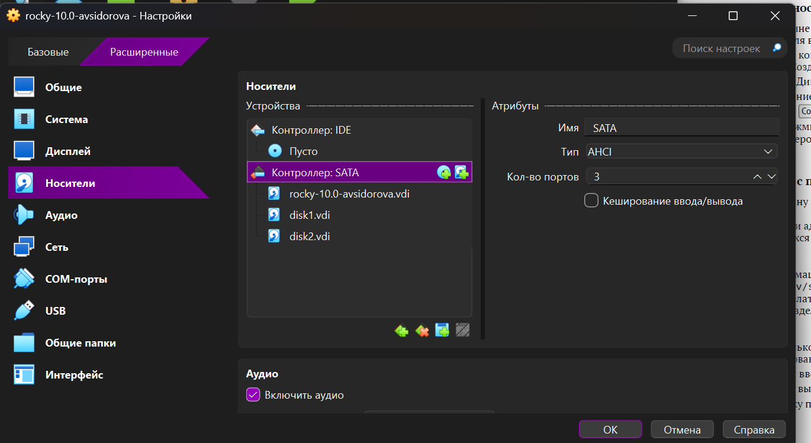{#fig:001 width=70%}

## Создание разделов MBR с помощью fdisk

Запускаем нашу виртуальную машину с добавленными дополнительными дисками disk1 и disk2. В командной строке с полномочиями администратора с помощью fdisk смотрим перечень разделов на всех имеющихся в системе устройствах жёстких дисков: su - затем fdisk --list. 

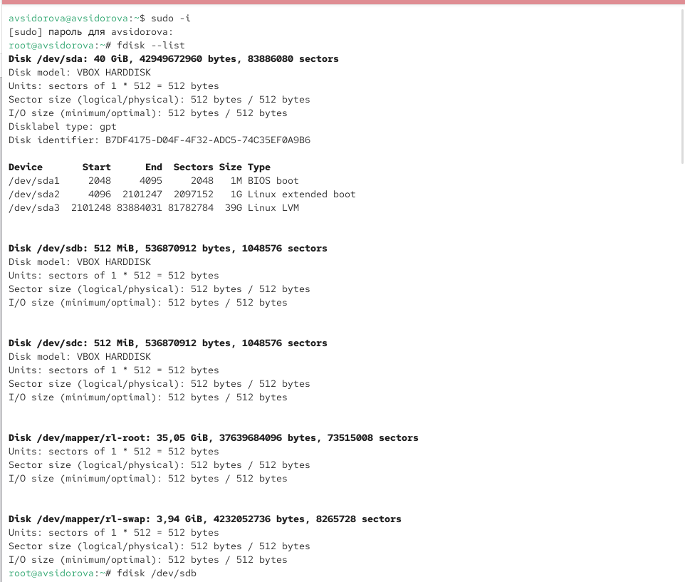{#fig:002 width=70%}

## В списке должна отразиться информация о добавленных дисках размером 512 MB, 

в частности название разделов: /dev/sdb и /dev/sdc. Предположим, что необходимо сделать разметку диска /dev/sdb с помощью утилиты fdisk (изменяем название раздела, если необходимо, в соответствии с нашим оборудованием): fdisk /dev/sdb. 

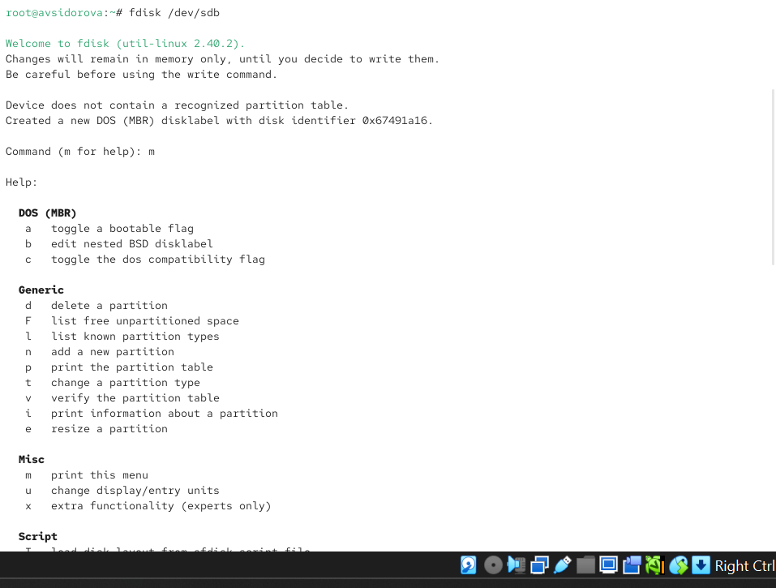{#fig:003 width=70%}

## Изменения останутся в памяти только до тех пор, пока мы не решим их записать. 

Будем внимательны перед использованием команды записи. Утилита fdisk записывает изменения на диск только при вводе команды w. Если допустили ошибку и хотите выйти, то нажимаем q для выхода из fdisk без записи изменений. Вводим m, чтобы получить справку по командам. Прежде чем делать что-либо, рекомендуется проверить, сколько дискового пространства у нас есть. Нажимаем p, чтобы просмотреть текущее распределение пространства диска. Обращаем внимание на общее количество секторов и последний сектор, который в настоящее время используется. Если последний раздел не заканчивается в последнем секторе, то у нас есть свободное место для создания нового раздела. Вводим n, чтобы добавить новый раздел. Выбираем p, чтобы создать основной раздел. Принимаем номер раздела, который предлагается. Указываем первый сектор на диске, с которого начнётся новый раздел. По умолчанию предлагается первый доступный сектор, нажимаем Enter для подтверждения выбора. Указываем последний сектор, которым будет завершён раздел. fdisk /dev/sdb. 

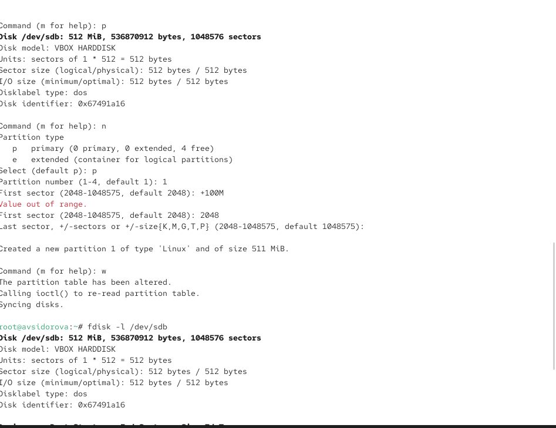{#fig:004 width=70%}

## По умолчанию предлагается последний сектор, доступный на диске. 

Если согласимся с предложенным по умолчанию вариантом, то после этого упражнения у нас не останется свободного места на диске для создания дополнительных разделов или логических томов. Поэтому мы должны использовать другой последний сектор, остановившись на одном из следующих вариантов: вводим номер последнего сектора, который хотим использовать; вводим +номер, чтобы создать раздел, размер которого составляет определённое количество секторов; вводим +номер (K, M, G), чтобы указать размер, который хотим назначить разделу в KiB, MiB или GiB. Например, вводим +100M, чтобы создать раздел на 100 MiB. На этом этапе можно определить тип раздела. По умолчанию используется тип раздела Linux. Если хотим, чтобы раздел имел какой-либо другой тип, используем для изменения t. Нас интересуют следующие типы разделов: 82: Linux swap; 83: Linux; 8e: Linux LVM. fdisk /dev/sdb. 

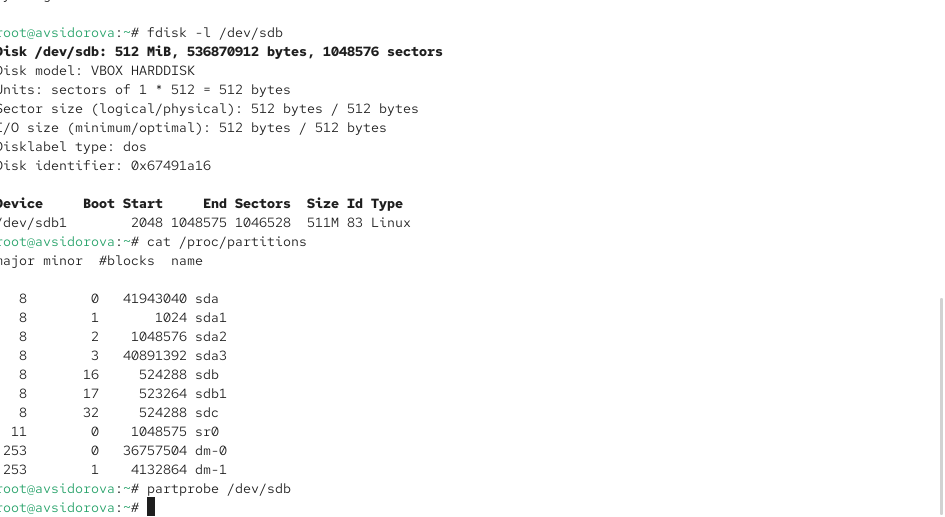{#fig:005 width=70%}

## Нажимаем Enter, чтобы принять тип раздела по умолчанию 83. 

Нажимаем w, чтобы записать изменения на диск и выйти из fdisk. Таблица разделов находится только в памяти ядра. Сравниваем вывод команды fdisk -l /dev/sdb с выводом команды cat /proc/partitions. Описываем разницу. Записываем изменения в таблицу разделов ядра: partprobe /dev/sdb.

## Создание логических разделов

В терминале с полномочиями администратора запускаем fdisk /dev/sdb. Вводим n, чтобы добавить новый раздел. Вводим e, чтобы создать расширенный раздел. Если расширенный раздел — четвёртый раздел, который мы записываем в MBR, он также будет последним разделом, который можно добавить в MBR. По этой причине он должен заполнить всю оставшуюся часть жёсткого диска компьютера.fdisk /dev/sdb. 

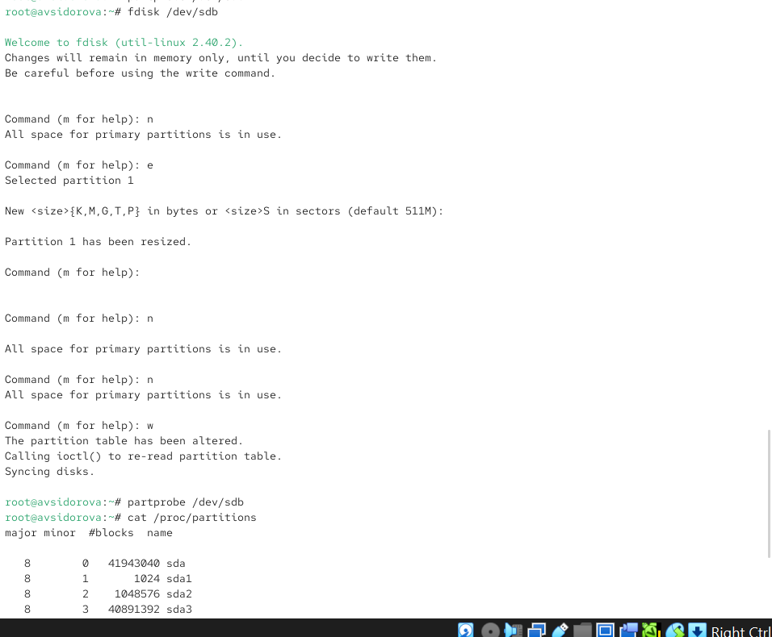{#fig:006 width=70%}

## Нажимаем Enter, чтобы принять первый сектор по умолчанию и снова нажимаем Enter, когда fdisk запросит последний сектор. 

Теперь, когда расширенный раздел создан, мы можем создать в нём логический раздел. Из интерфейса fdisk снова нажимаем n. Утилита сообщит, что нет свободных первичных разделов и по умолчанию предложит добавить логический раздел с номером 5. Нажимаем Enter, чтобы принять выбор первого сектора в качестве сектора по умолчанию. На вопрос о последнем секторе вводим +101M (или любой другой размер, который хотим использовать). После создания логического раздела вводим w, чтобы записать изменения на диск и выйти из fdisk. Чтобы завершить процедуру и обновить таблицу разделов, вводим partprobe /dev/sdb. Новый раздел теперь готов к использованию. Просматриваем информацию о добавленных разделах: cat /proc/partitions и fdisk --list /dev/sdb.
 fdisk /dev/sdb. 

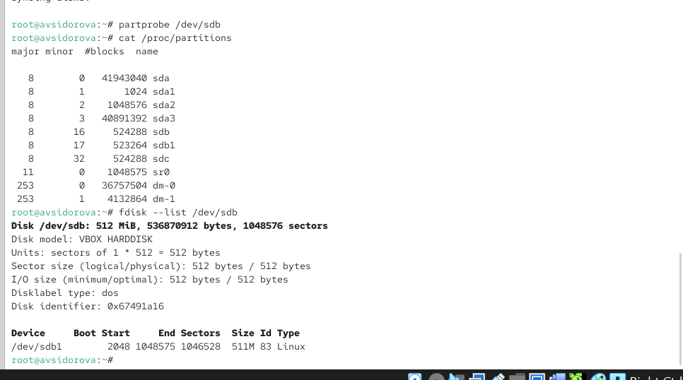{#fig:007 width=70%}

## Форматирование файловой системы XFS

В терминале с полномочиями администратора для диска dev/sdb1 создаём файловую систему XFS: mkfs.xfs /dev/sdb1. Для установки метки файловой системы в xfsdisk используем команду xfs_admin -l xfsdisk /dev/sdb1. 

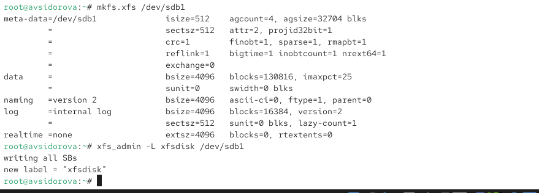{#fig:008 width=70%}

## Форматирование файловой системы EXT4

В терминале с полномочиями администратора для диска dev/sdb5 создаём файловую систему EXT4: mkfs.ext4 /dev/sdb5. Для установки метки файловой системы в ext4disk используем команду tune2fs -l ext4disk /dev/sdb5. Для установки параметров монтирования по умолчанию для файловой системы используем команду tune2fs -o acl.user_xattr /dev/sdb5. В данном случае включены списки контроля доступа и расширенные атрибуты пользователя. 

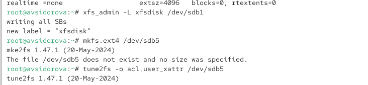{#fig:009 width=70%}

## Ручное монтирование файловых систем

Для ручной установки файловой системы используется команда mount. Чтобы отключить смонтированную файловую систему, используется команда umount. Получаем полномочия администратора. Для создания точки монтирования для раздела вводим mkdir -p /mnt/tmp. Чтобы смонтировать файловую систему, используем следующую команду mount /dev/sdb5 /mnt/tmp. Для проверки корректности монтирования раздела вводим: mount. Чтобы отмонтировать раздел, можно использовать umount либо с именем устройства, либо с именем точки монтирования. Таким образом, обе следующие команды будут работать: umount /dev/sdb5 или umount /mnt/tmp. Проверяем, что раздел отмонтирован: mount. 

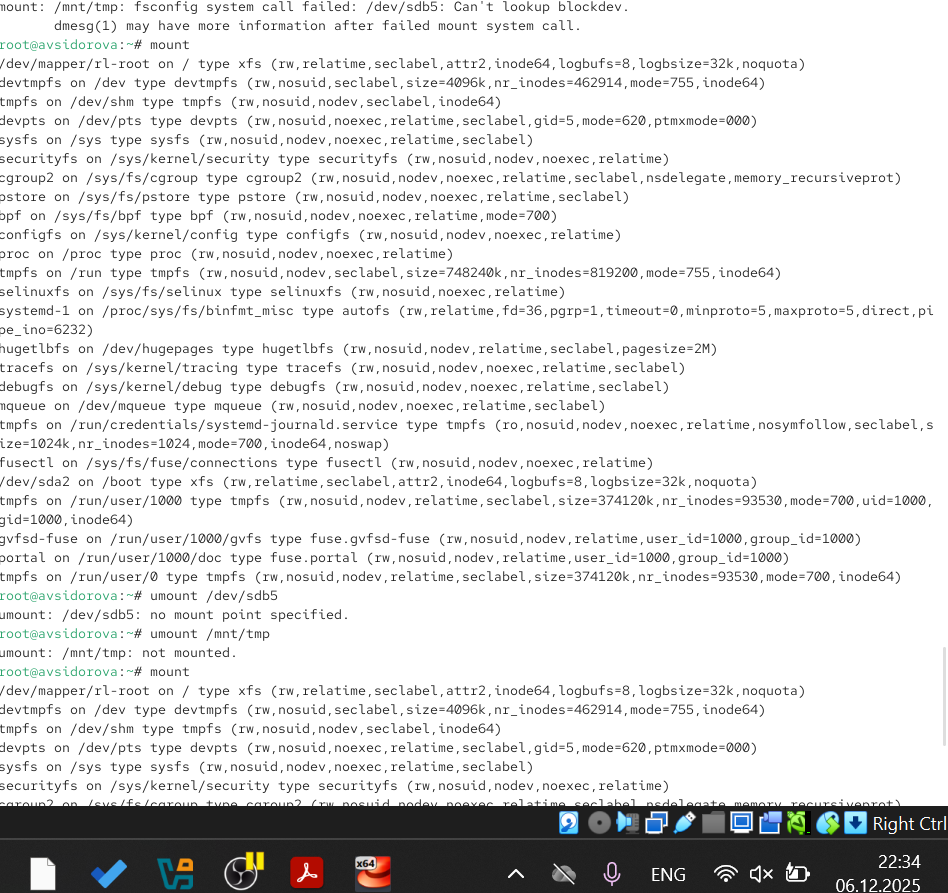{#fig:010 width=70%}

## Монтирование разделов с помощью /etc/fstab

В этом упражнении требуется подмонтировать отформатированный раздел XFS /dev/sdb1, который был создан в предыдущих упражнениях. Получаем полномочия администратора. Создаём точку монтирования для раздела XFS /dev/sdb1: mkdir -p /mnt/data. Смотрим информацию об идентификаторах блочных устройств (UUID): blkid. Эта утилита позволяет определить тип файловой системы блочного устройства (TYPE), его идентификатор (UUID) и метку тома (LABEL). UUID представляет собой 16-байтный (128-битный) номер. В каноническом представлении UUID отображается в виде числа в шестнадцатеричной системе счисления, разделённого дефисами на пять групп в формате 8-4-4-4-12. Такое представление занимает 36 символов. Вводим blkid /dev/sdb1 и затем используем мышь, чтобы скопировать значение идентификатора UUID для устройства /dev/sdb1. Открываем файл /etc/fstab на редактирование и добавляем следующую строку: UUID=значение_идентификатора /mnt/data xfs defaults 1 2. Перед попыткой автоматического монтирования при перезагрузке рекомендуется проверить конфигурацию. Следующая команда монтирует всё, что указано в /etc/fstab: mount -a. Проверяем, что раздел примонтирован правильно: df -h. 

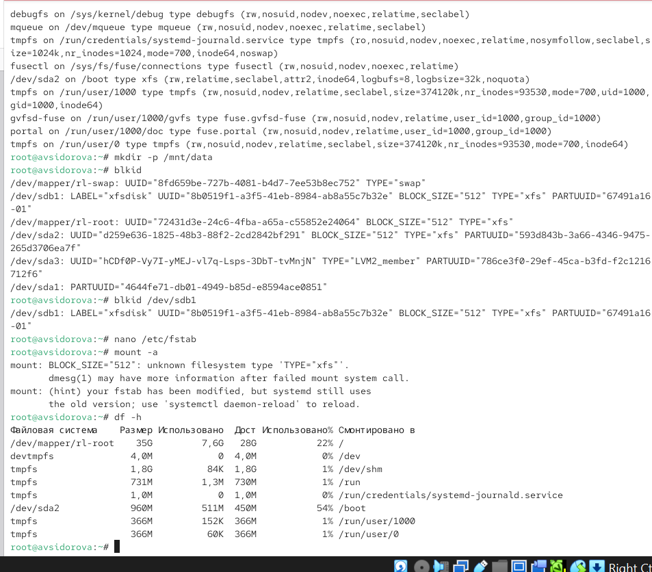{#fig:011 width=70%}

# Результаты

- Созданы виртуальные диски и выполнена их разметка с помощью fdisk и gdisk.
- Сформированы разделы MBR (основные, расширенные, логические) и GPT.
- Отформатированы разделы в файловые системы XFS и EXT4, создан раздел подкачки.
- Освоено ручное монтирование и размонтирование файловых систем командой mount/umount.
- Настроено автоматическое монтирование через файл /etc/fstab с использованием UUID.
- Выполнена самостоятельная работа по настройке GPT-разделов и их автоматическому монтированию.

