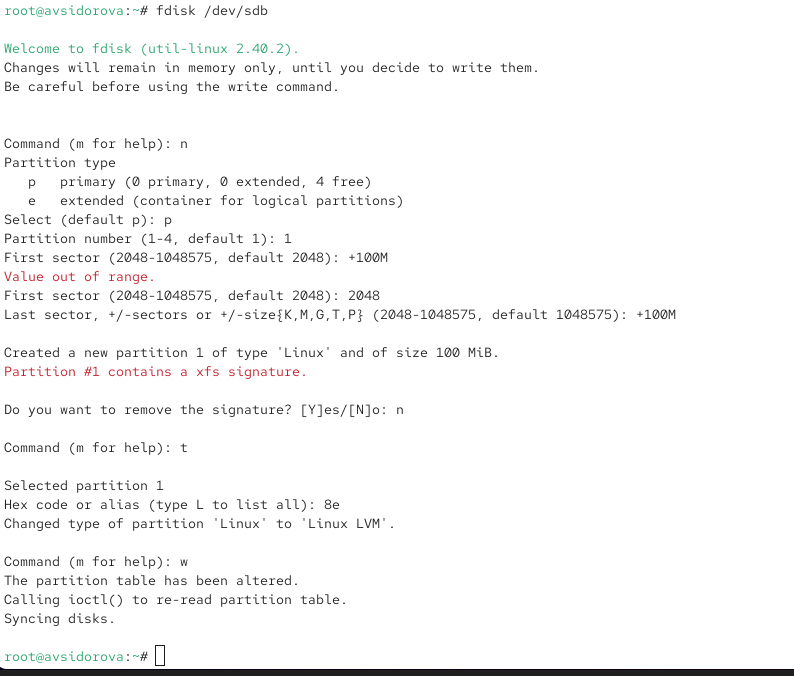
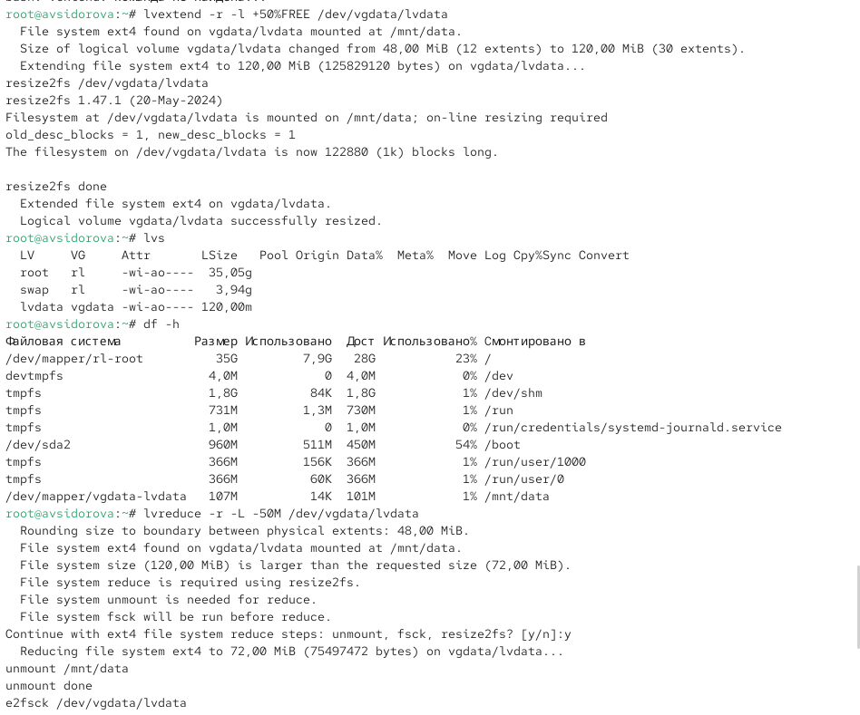
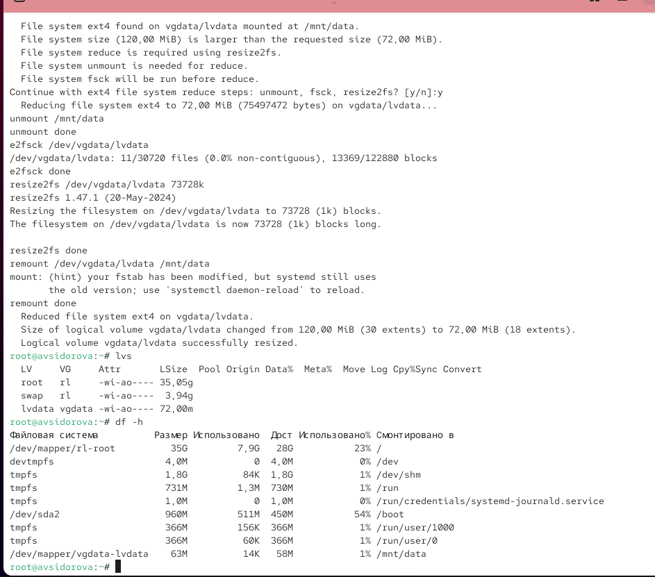

---
## Front matter
lang: ru-RU
title: Лабораторная работа №15
subtitle: Управление логическими томами
author:
  - Сидорова А.В.
institute:
  - Российский университет дружбы народов, Москва, Россия

## i18n babel
babel-lang: russian
babel-otherlangs: english

## Formatting pdf
toc: false
toc-title: Содержание
slide_level: 2
aspectratio: 169
section-titles: true
theme: metropolis
header-includes:
 - \metroset{progressbar=frametitle,sectionpage=progressbar,numbering=fraction}
---

# Информация

## Докладчик

:::::::::::::: {.columns align=center}
::: {.column width="70%"}

  * Сидорова Арина Валерьевна
  * студентка НПИбд-02-24
  * ст.б. 1132242912
  * Российский университет дружбы народов

:::
::::::::::::::

# Вводная часть

## Актуальность

Управление логическими томами (LVM) является продвинутым и гибким механизмом управления дисковым пространством, позволяющим динамически изменять размеры томов, создавать моментальные снимки и повышать отказоустойчивость систем хранения данных.

## Объект и предмет исследования

### Объект исследования

-  Система управления логическими томами (LVM) в операционной системе Linux.

### Предмет исследования

- Механизмы создания и управления физическими томами, группами томов и логическими томами, а также операции изменения их размеров.

## Цели и задачи

**Цель:**
 Получить практические навыки работы с системой управления логическими томами (LVM) в операционной системе Linux.

**Задачи:**

1. Освоить создание физических томов (PV) на основе дисковых разделов.
2. Научиться создавать группы томов (VG) и логические тома (LV).
3. Получить навыки изменения размера логических томов и расширения файловых систем.
4. Изучить добавление и удаление физических томов в группе томов.

# Выполнение лабораторной работы

## Создание физического тома

## В этом упражнении создаем физические тома. Для этого нам нужен жёсткий диск со свободным дисковым пространством. Если мы успешно выполнили предыдущую работу и в системе подмонтированы диски /dev/sdb и /dev/sdc, то их отмонтируем чтобы использовать для выполнения заданий этой лабораторной работы. 

В терминале с полномочиями администратора в файле /etc/fstab удаляем или комментируем строки автомонтирования /mnt/data и /mnt/data-ext. Отмонтируем /mnt/data и /mnt/data-ext выполняя команды umount /mnt/data и umount /mnt/data-ext. С помощью команды mount без параметров убеждаемся что диски /dev/sdb и /dev/sdc не подмонтированы. 

## С помощью fdisk делаем новую разметку для /dev/sdb и /dev/sdc удалив ранее созданные партиции. В терминале с полномочиями администратора вводим fdisk /dev/sdb. Вводим p для просмотра текущей разметки дискового пространства. Затем для удаления всех имеющихся партиций на диске достаточно создать новую пустую таблицу DOS-партиции используя команду o. Убеждаемся что партиции удалены введя p. Сохраняем изменения введя w. 

{#fig:001 width=70%}

## Записываем изменения в таблицу разделов ядра командой partprobe /dev/sdb. Просматриваем информацию о разделах выполняя команды cat /proc/partitions и fdisk --list /dev/sdb.  

{#fig:002 width=70%}

##  Вводим fdisk /dev/sdb. Вводим n чтобы создать новый раздел. Выбираем p чтобы сделать его основным разделом и используем номер раздела который предлагается по умолчанию. Если мы используем чистое устройство это будет номер раздела 1. Нажимаем Enter при запросе для первого сектора и вводим +100M чтобы выбрать последний сектор.

Вернувшись в приглашение fdisk вводим t чтобы изменить тип раздела. Поскольку существует только один раздел fdisk не спрашивает какой раздел использовать. Программа запрашивает тип раздела который мы хотим использовать. Выбираем 8e. Затем нажимаем w чтобы записать изменения на диск и выйти из fdisk. (

{#fig:003 width=70%}

## Чтобы обновить таблицу разделов вводим partprobe /dev/sdb. Теперь когда раздел создан мы должны указать его как физический том LVM. Для этого вводим pvcreate /dev/sdb1 с учётом наименования дисков в нашей системе. Теперь вводим pvs чтобы убедиться что физический том создан успешно. 

Обращаем внимание что в этом списке уже существует другой физический том так как RHEL по умолчанию использует LVM для организации хранилища.

{#fig:004 width=70%}

## Создание группы томов и логических томов

## Продолжаем работу над созданным физическим томом и назначаем его группе томов. Затем требуется добавить логический том из этой группы томов. В терминале с полномочиями администратора проверяем доступность физических томов в системе выполняя команду pvs. Мы должны увидеть созданный нами физический том /dev/sdb1. 

Создаем группу томов с присвоенным ей физическим томом выполняя команду vgcreate vgdata /dev/sdb1. Убеждаемся что группа томов была создана успешно выполняя команду vgs. Затем вводим pvs и обращаем внимание что теперь эта команда показывает имя физических томов с именами групп томов которым они назначены. Вводим lvcreate -n lvdata -l 50%FREE vgdata. Это создаст логический том LVM с именем lvdata который будет использовать 50% доступного дискового пространства в группе томов vgdata. Для проверки успешного добавления тома вводим lvs. На этом этапе мы готовы создать файловую систему поверх логического тома. Для этого вводим mkfs.ext4 /dev/vgdata/lvdata. 

## Чтобы создать папку на которую можно смонтировать том вводим mkdir -p /mnt/data. Добавляем следующую строку в /etc/fstab: /dev/vgdata/lvdata /mnt/data ext4 defaults 1 2. Проверяем монтируется ли файловая система выполняя команды mount -a и mount | grep /mnt. 

{#fig:005 width=70%}

## Изменение размера логических томов

##  Мы создали физический том группу томов и логический том. В этом упражнении требуется увеличить размер логического тома и файловой системы. 

В терминале с полномочиями администратора вводим pvs и vgs чтобы отобразить текущую конфигурацию физических томов и группы томов. С помощью fdisk добавляем раздел /dev/sdb2 размером 100 М. Задаем тип раздела 8e. Создаем физический том выполняя команду pvcreate /dev/sdb2. Расширяем vgdata выполняя команду vgextend vgdata /dev/sdb2. 

## Проверяем что размер доступной группы томов увеличен выполняя команду vgs. Проверяем текущий размер логического тома lvdata выполняя команду lvs. Проверяем текущий размер файловой системы на lvdata выполняя команду df -h. 

{#fig:006 width=70%}

## Увеличиваем lvdata на 50% оставшегося доступного дискового пространства в группе томов выполняя команду lvextend -r -l +50%FREE /dev/vgdata/lvdata. Убеждаемся что добавленное дисковое пространство стало доступным выполняя команды lvs и df -h. Уменьшаем размер lvdata на 50 МБ выполняя команду lvreduce -r -L -50M /dev/vgdata/lvdata. 

{#fig:007 width=70%}

## Обращаем внимание что при этом том временно размонтируется. Убеждаемся в успешном изменении дискового пространства выполняя команды lvs и df -h. 

{#fig:008 width=70%}

# Результаты

- Созданы физические тома с помощью pvcreate.
- Образована группа томов vgdata с использованием vgcreate.
- Создан логический том lvdata в группе томов с помощью lvcreate.
- Отформатирован логический том в файловую систему ext4 и настроено его автоматическое монтирование через /etc/fstab.
- Расширена группа томов путем добавления нового физического тома командой vgextend.
- Увеличена и уменьшена размерность логического тома с одновременным изменением размера файловой системы (опция -r).
- Освоены команды мониторинга состояния LVM: pvs, vgs, lvs.

