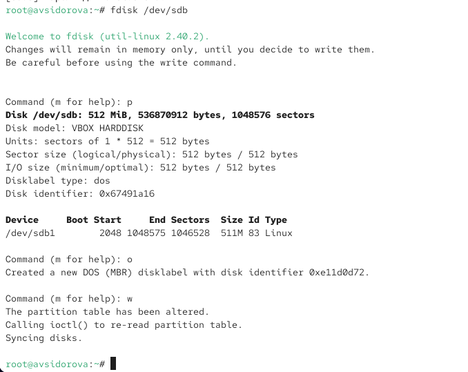
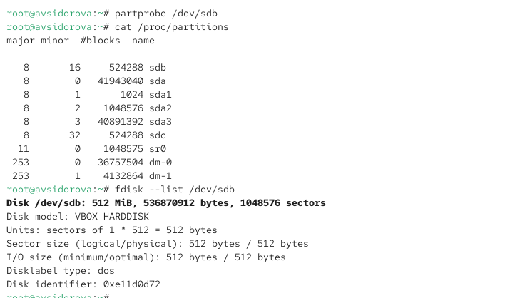
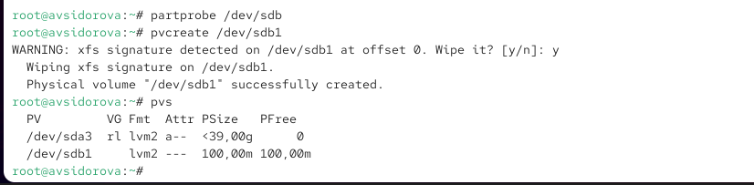
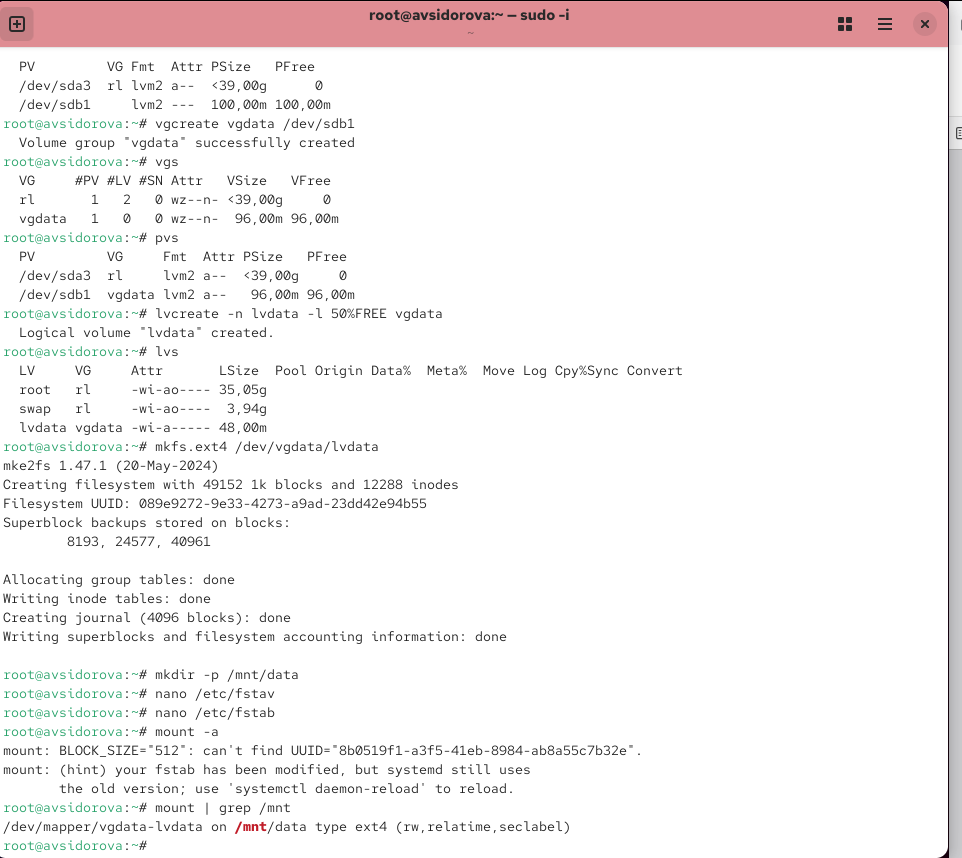
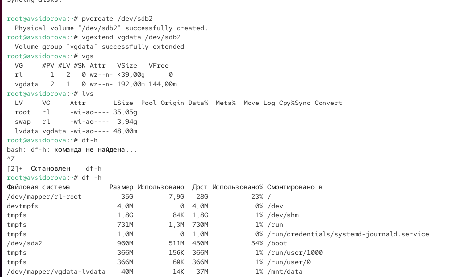

---
## Front matter
title: "Отчет по лабораторной работе №15"
subtitle: "Управление логическими томами"
author: "Сидорова Арина Валерьевна"

## Generic otions
lang: ru-RU
toc-title: "Содержание"

## Bibliography
bibliography: bib/cite.bib
csl: pandoc/csl/gost-r-7-0-5-2008-numeric.csl

## Pdf output format
toc: true # Table of contents
toc-depth: 2
lof: true # List of figures
fontsize: 12pt
linestretch: 1.5
papersize: a4
documentclass: scrreprt
## I18n polyglossia
polyglossia-lang:
  name: russian
  options:
	- spelling=modern
	- babelshorthands=true
polyglossia-otherlangs:
  name: english
## I18n babel
babel-lang: russian
babel-otherlangs: english
## Fonts
mainfont: PT Serif
romanfont: PT Serif
sansfont: PT Sans
monofont: PT Mono
mainfontoptions: Ligatures=TeX
romanfontoptions: Ligatures=TeX
sansfontoptions: Ligatures=TeX,Scale=MatchLowercase
monofontoptions: Scale=MatchLowercase,Scale=0.9
## Biblatex
biblatex: true
biblio-style: "gost-numeric"
biblatexoptions:
  - parentracker=true
  - backend=biber
  - hyperref=auto
  - language=auto
  - autolang=other*
  - citestyle=gost-numeric
## Pandoc-crossref LaTeX customization
figureTitle: "Рис."
tableTitle: "Таблица"
listingTitle: "Листинг"
lofTitle: "Список иллюстраций"
lolTitle: "Листинги"
## Misc options
indent: true
header-includes:
  - \usepackage{indentfirst}
  - \usepackage{float} # keep figures where there are in the text
  - \floatplacement{figure}{H} # keep figures where there are in the text
---

# Цель работы

Получить практические навыки работы с системой управления логическими томами (LVM) в операционной системе Linux.

# Выполнение лабораторной работы 

## Создание физического тома

В этом упражнении создаем физические тома. Для этого нам нужен жёсткий диск со свободным дисковым пространством. Если мы успешно выполнили предыдущую работу и в системе подмонтированы диски /dev/sdb и /dev/sdc, то их отмонтируем чтобы использовать для выполнения заданий этой лабораторной работы. В терминале с полномочиями администратора в файле /etc/fstab удаляем или комментируем строки автомонтирования /mnt/data и /mnt/data-ext. Отмонтируем /mnt/data и /mnt/data-ext выполняя команды umount /mnt/data и umount /mnt/data-ext. С помощью команды mount без параметров убеждаемся что диски /dev/sdb и /dev/sdc не подмонтированы. С помощью fdisk делаем новую разметку для /dev/sdb и /dev/sdc удалив ранее созданные партиции. В терминале с полномочиями администратора вводим fdisk /dev/sdb. Вводим p для просмотра текущей разметки дискового пространства. Затем для удаления всех имеющихся партиций на диске достаточно создать новую пустую таблицу DOS-партиции используя команду o. Убеждаемся что партиции удалены введя p. Сохраняем изменения введя w. (рис. [-@fig:001]) 

{#fig:001 width=70%}

Записываем изменения в таблицу разделов ядра командой partprobe /dev/sdb. Просматриваем информацию о разделах выполняя команды cat /proc/partitions и fdisk --list /dev/sdb.  (рис. [-@fig:002]) 

{#fig:002 width=70%}

Вместо использования существующих дополнительных дисков можно добавить в VirtualBox к виртуальной машине ещё один диск размером 512 MiB. Итак предполагаем в виртуальной машине добавлен диск /dev/sdb. В терминале с полномочиями администратора с помощью fdisk создаем основной раздел с типом LVM. Вводим fdisk /dev/sdb. Вводим n чтобы создать новый раздел. Выбираем p чтобы сделать его основным разделом и используем номер раздела который предлагается по умолчанию. Если мы используем чистое устройство это будет номер раздела 1. Нажимаем Enter при запросе для первого сектора и вводим +100M чтобы выбрать последний сектор. Вернувшись в приглашение fdisk вводим t чтобы изменить тип раздела. Поскольку существует только один раздел fdisk не спрашивает какой раздел использовать. Программа запрашивает тип раздела который мы хотим использовать. Выбираем 8e. Затем нажимаем w чтобы записать изменения на диск и выйти из fdisk. (рис. [-@fig:003]) 

{#fig:003 width=70%}

Чтобы обновить таблицу разделов вводим partprobe /dev/sdb. Теперь когда раздел создан мы должны указать его как физический том LVM. Для этого вводим pvcreate /dev/sdb1 с учётом наименования дисков в нашей системе. Теперь вводим pvs чтобы убедиться что физический том создан успешно. Обращаем внимание что в этом списке уже существует другой физический том так как RHEL по умолчанию использует LVM для организации хранилища.(рис. [-@fig:004]) 

{#fig:004 width=70%}

## Создание группы томов и логических томов

Продолжаем работу над созданным физическим томом и назначаем его группе томов. Затем требуется добавить логический том из этой группы томов. В терминале с полномочиями администратора проверяем доступность физических томов в системе выполняя команду pvs. Мы должны увидеть созданный нами физический том /dev/sdb1. Создаем группу томов с присвоенным ей физическим томом выполняя команду vgcreate vgdata /dev/sdb1. Убеждаемся что группа томов была создана успешно выполняя команду vgs. Затем вводим pvs и обращаем внимание что теперь эта команда показывает имя физических томов с именами групп томов которым они назначены. Вводим lvcreate -n lvdata -l 50%FREE vgdata. Это создаст логический том LVM с именем lvdata который будет использовать 50% доступного дискового пространства в группе томов vgdata. Для проверки успешного добавления тома вводим lvs. На этом этапе мы готовы создать файловую систему поверх логического тома. Для этого вводим mkfs.ext4 /dev/vgdata/lvdata. Чтобы создать папку на которую можно смонтировать том вводим mkdir -p /mnt/data. Добавляем следующую строку в /etc/fstab: /dev/vgdata/lvdata /mnt/data ext4 defaults 1 2. Проверяем монтируется ли файловая система выполняя команды mount -a и mount | grep /mnt. (рис. [-@fig:005]) 

{#fig:005 width=70%}

## Изменение размера логических томов

Мы создали физический том группу томов и логический том. В этом упражнении требуется увеличить размер логического тома и файловой системы. В терминале с полномочиями администратора вводим pvs и vgs чтобы отобразить текущую конфигурацию физических томов и группы томов. С помощью fdisk добавляем раздел /dev/sdb2 размером 100 М. Задаем тип раздела 8e. Создаем физический том выполняя команду pvcreate /dev/sdb2. Расширяем vgdata выполняя команду vgextend vgdata /dev/sdb2. Проверяем что размер доступной группы томов увеличен выполняя команду vgs. Проверяем текущий размер логического тома lvdata выполняя команду lvs. Проверяем текущий размер файловой системы на lvdata выполняя команду df -h. (рис. [-@fig:006]) 

{#fig:006 width=70%}

Увеличиваем lvdata на 50% оставшегося доступного дискового пространства в группе томов выполняя команду lvextend -r -l +50%FREE /dev/vgdata/lvdata. Убеждаемся что добавленное дисковое пространство стало доступным выполняя команды lvs и df -h. Уменьшаем размер lvdata на 50 МБ выполняя команду lvreduce -r -L -50M /dev/vgdata/lvdata. (рис. [-@fig:007]) 

{#fig:007 width=70%}

Обращаем внимание что при этом том временно размонтируется. Убеждаемся в успешном изменении дискового пространства выполняя команды lvs и df -h. (рис. [-@fig:008]) 

{#fig:008 width=70%}

## Самостоятельная работа

Создаем логический том lvgroup размером 200 МБ. Отформатируем его в файловой системе XFS и смонтируем его постоянно на /mnt/groups. Перезагружаем виртуальную машину чтобы убедиться что устройство подключается. После перезагрузки добавляем ещё 150 МБ к тому lvgroup. Убеждаемся что размер файловой системы также изменится при изменении размера тома. Убеждаемся что расширение тома выполнено успешно.

# Ответы на контрольные вопросы

1. 8e00 (Linux LVM в GPT)
2. vgcreate -s 4M vggroup /dev/sdb5
3. pvs
4. Создать физический том: pvcreate /dev/sdd, затем добавить в группу: vgextend группа /dev/sdd
5. lvcreate -n lvvol1 -L 6M группа_томов
6. lvextend -L +100M /dev/группа_томов/lvvol1
7. Добавить новый физический диск/раздел в группу томов (vgextend)
8. -r (например, lvextend -r -L +размер)
9. lvs или lvdisplay
10. fsck /dev/vgdata/lvdata

# Выводы

Получили практические навыки работы с системой управления логическими томами (LVM) в операционной системе Linux.
